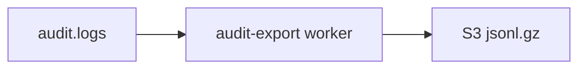

# Audit log export

**Status:** implemented (daily BullMQ worker → S3 NDJSON gzip).

---

## Architecture

| Component | Location |
| --------- | -------- |
| Worker | `src/domains/audit/workers/audit-export.worker.ts` |
| Processor | `src/domains/audit/workers/audit-export.processor.ts` |
| Schedule | `AUDIT_EXPORT_CRON` (default `15 2 * * *`) via `scheduler.ts` |



## Object layout

Per organization and UTC date:

| Object | Key pattern |
| ------ | ----------- |
| Data | `s3://{bucket}/{prefix}/organization_id={id}/dt=YYYY-MM-DD/part-{uuid}.jsonl.gz` |
| Manifest | `s3://{bucket}/{prefix}/organization_id={id}/dt=YYYY-MM-DD/manifest.json` |

- **Data format:** gzip-compressed NDJSON (one JSON object per line)
- **Data metadata:** `format=ndjson`, `schema_version=1`, `export_date`, `row_count`, `sha256` (hex digest of the gzip bytes)
- **Manifest:** JSON with `schema_version`, `export_date`, `organization_id`, and `objects[]` (`key`, `row_count`, `sha256`, `format`, `content_type`)
- **Idempotency:** skips org+date when `manifest.json` already exists (`HeadObject` on manifest key)

## Environment

| Variable | Purpose |
| -------- | ------- |
| `AUDIT_EXPORT_ENABLED` | `true` to run exports (requires `S3_BUCKET`) |
| `AUDIT_EXPORT_S3_PREFIX` | Key prefix (default `audit/export`) |
| `AUDIT_EXPORT_BATCH_SIZE` | Cursor batch size (default `5000`) |
| `AUDIT_EXPORT_CRON` | BullMQ repeatable cron |

## Retention

- Hot store: `audit-retention` worker deletes rows after `AUDIT_RETENTION_DAYS`
- Export runs for the **previous UTC calendar day** before hot delete for that range
- See [data-lifecycle-deletion.md](../data/data-lifecycle-deletion.md)

## SIEM ingest (Splunk, Datadog, and similar)

The worker does **not** push directly to a SIEM. Ingest is **pull-based from S3**:

1. **Enable export:** `AUDIT_EXPORT_ENABLED=true` and `S3_BUCKET` set; worker registered in `bootstrap.ts`; repeatable job `daily-audit-export` in `scheduler.ts` (default cron `15 2 * * *` UTC).
2. **Daily objects:** After each run, expect one or more keys per organization under  
   `s3://{bucket}/{AUDIT_EXPORT_S3_PREFIX}/organization_id={id}/dt=YYYY-MM-DD/part-{uuid}.jsonl.gz`.
3. **Splunk:** S3 input or SQS notification → decompress gzip → treat as **NDJSON** (`sourcetype` `_json` or `json_no_timestamp`). Map fields from each line (`action`, `organization_id`, `actor_user_id`, `created_at`, …).
4. **Datadog:** S3 log forwarder or Lambda → **gzip** + **NDJSON** pipeline; use object metadata `format=ndjson` and `export_date` for partitioning.
5. **Operational verification:** Confirm yesterday’s `dt=` prefix exists in the bucket after the cron window; verify `manifest.json` `sha256` matches the gzip object; spot-check NDJSON lines. Local helper (no Splunk required):

   ```bash
   node tooling/audit/verify-export-ndjson.mjs path/to/part-uuid.jsonl.gz
   ```

   Production SIEM connector wiring remains an ops step outside this repo.

**Out of scope for v1 (explicit deferrals):** Apache Parquet, per-org HTTPS webhook push, admin presigned download (`audit:export` permission). NDJSON gzip + manifest + tests satisfy operational accept criteria.

## Related

- [`src/domains/audit/audit.overview.md`](../../../src/domains/audit/audit.overview.md) — audit domain invariants (append-only, best-effort writes, actor-scoped RLS, read-restricted)
- [`src/PATTERNS.md`](../../../src/PATTERNS.md) § Audit Emission — the cross-cutting pattern that funnels writes through `recordAuditEvent`
