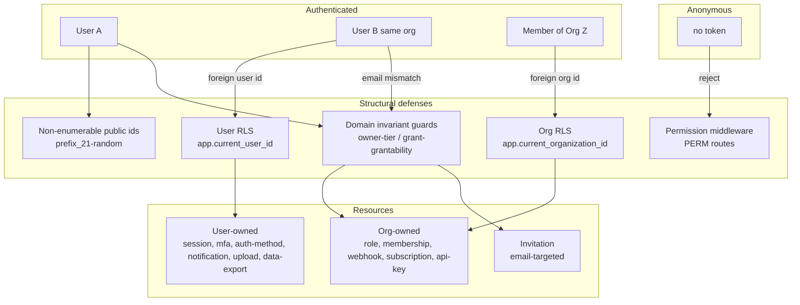

# Authorization testing plan (BOLA / BFLA / BOPLA)

> **Status:** DRAFT — for review. Created 2026-06-15.
> **Goal:** establish an enterprise-grade, day‑0 **authorization** test baseline that proves no actor can read or mutate a resource they do not own or are not permitted to act on, and that this property **cannot silently regress**.

Broken Object Level Authorization (**BOLA**, OWASP `API1:2023`) is the #1 API security risk and the cause of most authenticated API breaches. It is invisible to single-session scanners: the attacker is fully authenticated, the request is well-formed, and the server returns `200 OK` — the only thing wrong is *whose* data came back. This plan makes authorization a **first-class, catalog-driven, regression-gated** test surface rather than a property we hope each repository remembers to enforce.

**Key context for reviewers:** an audit of the current code (June 2026) found **zero live authorization bugs** — every path enforces ownership / tier / grant rules today. The work below is therefore about converting *correct-today* into *provably-correct-and-cannot-regress*, and about closing the **systematic-coverage** gap (no single gate guarantees every route carries an authorization assertion). This is a hardening baseline, not a bug fix.

---

## 1. Objectives and scope

### 1.1 Objectives

1. **Prove ownership isolation** — no authenticated principal can access another principal's object (cross-user *and* cross-organization) on any route.
2. **Prove function-level gating** — no principal can invoke a function they lack the permission/role for.
3. **Prove business-logic invariants** — tier rules (owner protection), grant-grantability ("you may only grant what you hold"), and last-resource guards hold under attack.
4. **Prove no silent regression** — every mutating / by-id route is *required by CI* to declare an authorization model and carry at least one negative-authorization assertion. A new route with no declared model **fails the build**.
5. **Day‑0 completeness** — the baseline covers 100% of the current route catalog at launch, not incrementally.

### 1.2 In scope

- OWASP `API1:2023` BOLA (object-level), `API5:2023` BFLA (function-level), `API3:2023` BOPLA (property-level / mass assignment), with `API2:2023` Broken Authentication as the foundation layer.
- All HTTP methods (`GET`/`POST`/`PUT`/`PATCH`/`DELETE`), including multi-step / stateful flows.
- Both **read** and **write** verification — writes use a **Setup → Attack → Verify** pattern that reads state back from Postgres to prove the mutation did *not* land (not merely that a `2xx`/`4xx` was returned).

### 1.3 Out of scope (tracked in §9 residual risk)

- **Black-box testing of deployed infrastructure** (gateway / reverse-proxy / WAF / env-specific JWT+CORS). In-process `fastify.inject` tests cannot see these. Optional external layer in §9.2.
- **Endpoint discovery** of undocumented/shadow routes. Mitigated by the existing `routes:catalog:check` gate (catalog must match registered routes).
- DoS / rate-limit (`API4`), SSRF (`API7`) — covered by existing dedicated suites (`rate-limit/`, `webhook-ssrf.security.test.ts`); referenced here for completeness only.

---

## 2. Threat model

### 2.1 Principals (actors)

| Principal | How it authenticates | Trust |
| --------- | -------------------- | ----- |
| **Anonymous** | none | untrusted |
| **Authenticated user** | JWT (RS256), `userId` = `user.public_id` claim | trusted as *themselves only* |
| **Org member (role R)** | JWT + active `org` claim + role-derived permission set | trusted for *that org*, *those permissions* |
| **Org owner** | member whose `user_id == organization.owner_user_id` | highest org tier; protected |
| **Global admin / super_admin** | JWT `role` claim | platform-wide; `ROLE:`-gated routes only |
| **API-key principal** | `X-Api-Key` (no acting user) | org-scoped, **no** permission-grant capability (fail-closed) |
| **Attacker variants** | another user *same org*; a member of *another org*; a lower-tier member; a token with a forged/foreign `org` claim | the test adversaries |

### 2.2 Trust boundaries and structural defenses



**Defense-in-depth summary:** three structural layers already close the *naive* attack surface — (1) public ids are unguessable (`generatePublicId`), so ID-increment IDOR is impossible; (2) org-scoped RLS makes cross-tenant rows invisible at the DB layer; (3) user-scoped RLS + `(public_id, user_id)` filters scope user-owned resources. Permission middleware + domain guards add function-level and invariant enforcement. **This plan tests that all five layers hold and stay holding.**

---

## 3. Attack taxonomy — real-world cases mapped to core-be

Each row is a real attack pattern, its applicability here, the structural defense, and the residual that this plan's tests must assert.

| # | Attack pattern (real world) | core-be applicability | Structural defense | Test residual to assert |
| - | --------------------------- | --------------------- | ------------------ | ----------------------- |
| 1 | **Sequential ID increment** (`/trips/5501→5502`) | None — ids are `prefix_<21 rand>` | Non-enumerable public ids | N/A (assert no integer ids leak in serializers) |
| 2 | **Cross-tenant object read** (org A reads org B) | All org-owned by-id routes | Org RLS → 404 | Foreign-org id under attacker's claim → `404` |
| 3 | **Cross-user object read/write, same org** (user B reads user A's upload/notification/session/export) | All user-owned by-id routes | User RLS + `(public_id,user_id)` filter | User B → user A's object → `404`; **write verified no state change** |
| 4 | **Mass assignment / privilege via body** (`PATCH /users/me {role:"admin"}`) | `PATCH /users/me`, membership/role bodies | Strict DTOs (unknown key → 400) | Inject privileged field → ignored / `400`; role unchanged in DB |
| 5 | **Stateful workflow abuse** (own cart at step 1, foreign at step 3) | upload create→confirm; subscription create→cancel; invitation create→accept | per-step ownership re-check | Cross-principal id at *each* step → reject |
| 6 | **Nested-object exposure** (authorized parent leaks unauthorized children) | list/detail serializers with nested arrays | serializer scoping | Nested ids belong only to caller's scope |
| 7 | **Function-level escalation** (member calls admin function) | every `PERM:` and `ROLE:` route | permission middleware | Without perm → `403`; with perm → not `403` |
| 8 | **Vertical tier violation** (admin suspends/removes the **owner**) | `PATCH`/`DELETE /memberships/:id`, `leave`, `transfer-ownership` | domain guards | `ownerMembershipCannotBeModified` / `ownerCannotBeRemoved` / `onlyOwnerCanTransfer` / `ownerCannotLeave` → `403` |
| 9 | **Grant-what-you-don't-hold** (role:manage grants `organization:delete` they lack) | `PUT roles/:id/permissions`, `POST roles`, `POST invitations`, api-key scopes | `assertCallerCanGrantPermissionCodes` | Over-grant → `403 cannotGrantPermissionNotHeld`; union (add+remove) enforced |
| 10 | **Token / claim forgery** (mint token with foreign `org`) | all org-scoped routes | membership re-check on `org` claim | Foreign `org` claim → `403` (no membership) |
| 11 | **JWT tampering / alg confusion** | all authed routes | RS256 verify | Tampered/`alg:none`/wrong-key → `401` |
| 12 | **Email-targeted resource hijack** (accept an invite addressed to someone else) | `POST invitations/:id/{accept,decline}` | email-match guard | Caller email ≠ invite email → `403` |
| 13 | **API-key escalation** (key grants perms) | api-key principal on grant paths | fail-closed (no acting user) | Key cannot grant → `403` |

---

## 4. Current state — what is already covered

The audit confirms a mature posture. This baseline **builds on** it; it does not replace it.

### 4.1 Structural defenses (in production code)

| Defense | Mechanism | Evidence |
| ------- | --------- | -------- |
| Non-enumerable ids | `generatePublicId(entity)` → `prefix_<21 [a-z0-9]>` | `shared/utils/identity/public-id.util.ts` |
| Org isolation | FORCE RLS on `app.current_organization_id`; org resolved from JWT `org` claim only | `migrations/00000000000000_init.sql`, tenant middleware |
| User isolation | `withUserDatabaseContext` (`app.current_user_id`) + `(public_id, user_id)` repo filters | `auth-method`, `auth-mfa`, `notification`, `upload`, `user-data-export` services |
| Function gating | permission middleware on every `PERM:` route | `shared/middlewares/` + route registration |
| Tier guards | `ownerMembershipCannotBeModified`, `ownerCannotBeRemoved`, `ownerCannotLeave`, `onlyOwnerCanTransfer` | `membership.service.ts` (tagged `sec-new-T1`) |
| Grant-grantability | `assertCallerCanGrantPermissionCodes` (union of add+remove; API-key fail-closed) | `permission/assert-grantable-permissions.util.ts` |
| Owner-role protection | owner's role permissions cannot be stripped | `member-role-permission.service.owner-role-guard.unit.test.ts` |

### 4.2 Existing tests (regression value already banked)

| Concern | Test |
| ------- | ---- |
| Cross-tenant BOLA (by-id) | `security/rls/bola-cross-tenant.security.test.ts` |
| Tenant isolation / RLS matrix | `security/rls/{tenant-isolation,rls-matrix,worker-tenant-isolation}.security.test.ts` |
| BFLA function gating (auto-loaded from catalog) | `security/infrastructure/permission-route-matrix.security.test.ts` |
| Privilege escalation (no-perm, cross-org, super_admin) | `security/auth/privilege-escalation.security.test.ts` |
| Grant-grantability | `tenancy/.../membership.service.grantable-permissions.unit.test.ts` |
| Mass assignment (BOPLA write) | `security/input/mass-assignment.security.test.ts` |
| Field leakage (BOPLA read) | `security/infrastructure/sensitive-field-leakage.security.test.ts` |
| Auth / JWT / session | `security/auth/{jwt-attacks,jwt-security,auth-enforcement,session-invalidation,mfa-security}.security.test.ts` |
| Upload user isolation (repo) | `upload/__tests__/unit/upload.repository.user-isolation.db.unit.test.ts` |

**Coverage characterization:** layers 1–2 (cross-org BOLA, function gating) are *systematically* covered (the permission matrix is auto-loaded from `docs/routes.txt`). Layer 3 (cross-user BOLA, tier/grant invariants) is covered by **hand-written unit/integration tests** — excellent, but their *existence per route is not enforced*, and most assert at the service layer rather than end-to-end through the HTTP route.

---

## 5. Gap analysis — what we will add

Three deltas, in priority order.

### 5.1 Delta A — Cross-user object-ownership matrix (BOLA, layer 3)

The 12 `AUTH`-only, resource-id-in-path routes are protected today but lack an **end-to-end, catalog-driven** cross-user regression net. The unscoped `findByPublicId` sits next to the scoped `findByPublicIdForUser` in several repos — a future edit could silently downgrade ownership with no failing test.

### 5.2 Delta B — Invariant / tier matrix (BFLA+, layer 3)

Tenancy tier and grant invariants need **end-to-end** assertions (HTTP → controller → service), and the `AUTH`-only tenancy routes (`transfer-ownership`, `leave`) fall outside the permission matrix entirely.

### 5.3 Delta C — Enforcement: declarative authorization model + ratchet

A new route can today be added with no authorization test. We close this with a **declared authorization model per route** (mirroring the existing `route-success-statuses.json` pattern) plus a CI gate: every mutating / by-id route must have a model entry, and an uncovered-route budget ratchets to `0`.

### 5.4 Delta D — Static gate (cheap belt-and-suspenders)

A global test banning the unscoped `findByPublicId` from user-scoped service code paths, forcing the `…ForUser` variant — catches the downgrade at author-time, before tests run.

---

## 6. Coverage matrix — route × attacker → expected

`✅` covered today · `🟡` partial (service-layer only) · `➕` to add in this baseline. Owner model: `user` = user-scoped · `org` = org-scoped · `email` = invite email-match · `tier` = owner-tier · `grant` = grant-grantability.

### 6.1 Class A — user-owned object ownership (Delta A)

| Method / route | Owner | Attacker | Expected | Guard today | Action |
| -------------- | ----- | -------- | -------- | ----------- | ------ |
| `DELETE /auth/me/auth-methods/:auth_method_id` | user | user B | 404 | `findByPublicIdForUser` + user-RLS | ➕ e2e |
| `DELETE /auth/me/sessions/:session_id` | user | user B | 404 | `revoke(publicId,userId)` | ➕ e2e |
| `DELETE /auth/mfa/:mfa_method_id` | user | user B | 404 | user-RLS + serialized | ➕ e2e |
| `GET /notify/notifications/:notification_id` | user | user B | 404 | `findByPublicIdForUser` | ➕ e2e |
| `DELETE /notify/notifications/:notification_id` | user | user B | 404 + no delete | `deleteByPublicIdForUser` | ➕ e2e + verify |
| `PATCH /notify/notifications/:notification_id/read` | user | user B | 404 + unread | `markRead(publicId,userId)` | ➕ e2e + verify |
| `GET /uploads/:upload_id` | user | user B | 404 | `findByPublicIdForUser` + user-RLS | ➕ e2e |
| `DELETE /uploads/:upload_id` | user | user B | 404 + row intact | `softDelete(publicId,userId)` | ➕ e2e + verify |
| `POST /uploads/:upload_id/confirm` | user | user B | 404 + still PENDING | app-check `row.user_id` | ➕ e2e + verify |
| `GET /users/me/data-export/:export_id` | user | user B | 404 | `(public_id,user_id)` + user-RLS | ➕ e2e |
| `POST /tenancy/invitations/:invitation_id/accept` | email | wrong email | 403 + no membership | email-match | ➕ e2e + verify |
| `POST /tenancy/invitations/:invitation_id/decline` | email | wrong email | 403 | `declineOwnInvitationOnly` | ➕ e2e |

### 6.2 Class B — invariant / tier (Delta B)

| Method / route | Model | Attacker | Expected | Guard today | Action |
| -------------- | ----- | -------- | -------- | ----------- | ------ |
| `POST /tenancy/organization/transfer-ownership` | tier | non-owner member | 403 + owner unchanged | `onlyOwnerCanTransfer` | ➕ e2e + verify |
| `POST /tenancy/organization/leave` | tier | owner | 403 | `ownerCannotLeave` | ➕ e2e |
| `PATCH /tenancy/organization/memberships/:membership_id` | tier | admin targeting owner | 403 + owner unchanged | `ownerMembershipCannotBeModified` | 🟡→➕ e2e |
| `DELETE /tenancy/organization/memberships/:membership_id` | tier | admin targeting owner | 403 + owner intact | `ownerCannotBeRemoved` | 🟡→➕ e2e |
| `PUT /tenancy/organization/roles/:role_id/permissions` | grant | `role:manage` over-grants | 403 + role unchanged | `assertCallerCanGrant…` | 🟡→➕ e2e + verify |
| `POST /tenancy/organization/roles` | grant | over-grant on create | 403 | `assertCallerCanGrant…` | 🟡→➕ e2e |
| `POST /tenancy/organization/invitations` | grant | invite with role > caller holds | 403 | grant-grantability | 🟡→➕ e2e |
| `POST` / `PATCH /tenancy/organization/api-keys[/:api_key_id]` | grant | key scope > caller holds | 403 | grant-grantability | 🟡→➕ e2e |

### 6.3 Class C — cross-org BOLA (already systematic; assert breadth)

All `PERM:` by-id routes (`role`, `membership`, `webhook`, `subscription`, `api_key`, `notification-policy`): org B's id under attacker's org-A claim → `404`/`403`. ✅ pattern proven in `bola-cross-tenant`; matrix extends to **every** by-id `PERM:` route via the catalog.

### 6.4 Class D / E / F — already covered (regression-guard only)

- **D (function gating):** `permission-route-matrix` — auto-loaded, every `PERM:` route. ✅
- **E (auth/claim/JWT):** `privilege-escalation`, `jwt-attacks`, claim-swap cases. ✅ (➕ add explicit "foreign `org` claim → 403" to the matrix for completeness)
- **F (BOPLA):** `mass-assignment`, `sensitive-field-leakage`. ✅

---

## 7. Test architecture

### 7.1 Engine — declarative + catalog-driven

The matrix is **data-driven** so new routes are covered (or flagged) automatically — the same philosophy as the existing permission matrix.

```text
tooling/openapi/route-catalog/route-authorization-model.json   ← NEW: per-route ownership model
  {
    "DELETE /api/v1/uploads/:upload_id":            { "model": "user",  "verifyNoMutation": true },
    "POST /api/v1/tenancy/organization/transfer-ownership": { "model": "tier:owner" },
    "PUT  /api/v1/tenancy/organization/roles/:role_id/permissions": { "model": "grant", "verifyNoMutation": true },
    ...
  }
```

- A loader (sibling to `loadOrganizationPermissionRoutesFromCatalog`) reads `docs/routes.txt` + this model file.
- The matrix iterates routes, builds the **attacker** principal for the declared model, injects via `fastify.inject`, and asserts the expected status.
- For `verifyNoMutation: true`, the test reads the row back through a factory/repository and asserts it is unchanged (**white-box Setup → Attack → Verify**).

### 7.2 Per-model attacker construction

| Model | Setup | Attack | Verify |
| ----- | ----- | ------ | ------ |
| `user` | create resource owned by **User A** | inject as **User B** (same org + a member of another org) | row still present / unchanged |
| `email` | create invite for `a@x.com` | inject as `b@x.com` | no membership created |
| `tier:owner` | org with owner O + admin Adm (`membership:manage`) | Adm attacks O / O attacks self-leave | owner row + `owner_user_id` unchanged |
| `grant` | caller with `role:manage` but **missing** code C | attempt to grant C | role permission set unchanged |
| `org` (Class C) | resource in org B | attacker scoped to org A claim | n/a (404) |

### 7.3 File layout

```text
src/tests/security/authz/
  authz-matrix.security.test.ts          # engine: iterates route-authorization-model.json
  object-ownership.security.test.ts      # Class A bespoke cases needing rich setup
  tier-and-grant.security.test.ts        # Class B bespoke cases
src/tests/global/
  authz-model-coverage.global.test.ts    # ratchet: every mutating/by-id route has a model entry
  no-unscoped-find-by-public-id.global.test.ts   # Delta D static gate
tooling/openapi/route-catalog/route-authorization-model.json
tooling/authz-coverage/authz-coverage-budget.json   # uncovered-route ratchet → 0
```

Reuses existing helpers: `createTestUser`, `createTestOrganization`, `createMembership`, `createRoleWithPermissions`, `generateTestToken`, `injectAuthenticated`, `cleanupDatabase`, `PARAM_NAME_TO_ENTITY`, `publicIdPlaceholderFor`.

---

## 8. CI gates — enforced by construction

| Gate | What it enforces | Where |
| ---- | ---------------- | ----- |
| `validate:route-authorization-model` (NEW) | every mutating / by-id route in `docs/routes.txt` has a model entry; no orphan entries | `ci:quality`, pre-commit |
| `authz-matrix.security.test.ts` (NEW) | the actual attacker assertions pass | `pnpm test` / `test:security` |
| `authz-model-coverage` budget ratchet (NEW) | count of routes without a negative-authz assertion may only **decrease** (target `0`) | `pnpm test` post-run, like `route-success-coverage-budget.json` |
| static `findByPublicId` ban (NEW) | unscoped fetch not used in user-scoped service paths | `test:global` |
| `routes:catalog:check` (EXISTING) | catalog matches registered routes (no shadow routes escape the model) | `ci:local` |

**Net effect:** after this baseline, adding a route without declaring and asserting its authorization model **fails CI**. That is the day‑0 enterprise guarantee.

---

## 9. Residual risk

### 9.1 What in-process tests cannot prove

| Residual | Why | Mitigation |
| -------- | --- | ---------- |
| Gateway / proxy / WAF authz | `fastify.inject` bypasses the deployed edge | deferred: deployed-edge / DAST review (out of scope for this matrix) |
| Env-specific JWT/CORS config | tests run with test config | staging smoke + `production-hardening` review |
| Shadow / undocumented endpoints | matrix only tests catalog routes | `routes:catalog:check` + periodic discovery scan (deferred) |

---

## 10. Phased delivery (the day‑0 baseline)

| Phase | Deliverable | Exit criteria |
| ----- | ----------- | ------------- |
| **0 — Audit sign-off** | confirm ownership enforcement on all by-id/mutating routes incl. billing + notify sweep | every route classified; zero unexplained gaps |
| **1 — Engine + model file** | `route-authorization-model.json`, loader, `validate:route-authorization-model` | gate green; 100% routes modelled |
| **2 — Class A (BOLA)** | `object-ownership.security.test.ts` + matrix cases | all 12 user-owned routes assert cross-user + cross-org |
| **3 — Class B (tier/grant)** | `tier-and-grant.security.test.ts` e2e | owner-tier + grant-grantability asserted end-to-end |
| **4 — Enforcement** | coverage ratchet budget + `findByPublicId` static gate | uncovered budget = 0; static gate green |

Phases 0–4 are the **day‑0 enterprise baseline**.

---

## 11. Definition of done

- [ ] Every mutating / by-id route in `docs/routes.txt` has a `route-authorization-model.json` entry (CI-enforced).
- [ ] Every Class A route asserts cross-user **and** cross-org isolation end-to-end; writes verify no state change.
- [ ] Every Class B route asserts its tier / grant invariant end-to-end.
- [ ] `permission-route-matrix` (BFLA) and `bola-cross-tenant` (cross-org) remain green and now extend to **all** `PERM:` by-id routes.
- [ ] Uncovered-route budget = `0`; static `findByPublicId` ban green.
- [ ] Adding a new route without a model + assertion **fails CI** (verified with a deliberate red test).
- [ ] Plan wired into `docs/README.md` index; `src/tests/security/OVERVIEW.md` updated (via `docs-maintainer` / `overview-doc-maintainer`).

---

## 12. References

- `docs/reference/security/route-flow-audit-remediation.md` — prior route/authorization audit.
- `docs/reference/security/csrf-and-session-cookies.md` — session/refresh trust model.
- `docs/routes.txt` — canonical route catalog (access-control annotated).
- `tooling/openapi/route-catalog/route-success-statuses.json` — pattern this plan mirrors.
- OWASP API Security Top 10 (2023): `API1` BOLA, `API2` Broken Auth, `API3` BOPLA, `API5` BFLA.
