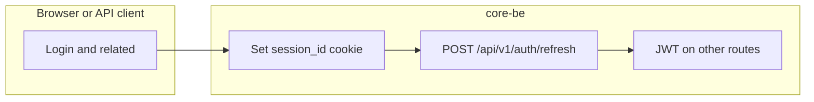
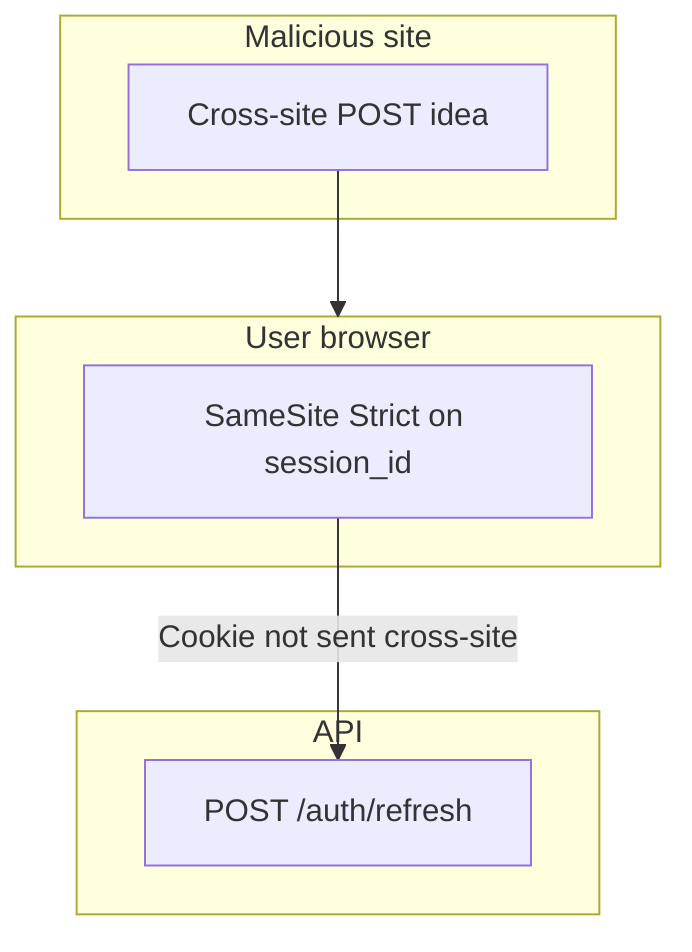

# CSRF and session cookies

core-be uses **JWT Bearer tokens** for most authenticated API calls and an **httpOnly session cookie** only for **refreshing** those tokens. This page describes how that split affects **cross-site request forgery (CSRF)** and what to do if cookie rules change.

---

## Request flow

---

## Session cookies

### `session_id` (httpOnly)

| Attribute    | Value                | Purpose                                                                                                         |
| ------------ | -------------------- | --------------------------------------------------------------------------------------------------------------- |
| **Name**     | `session_id`         | Opaque session public identifier (not signed in cookie layer).                                                  |
| **Path**     | `/api/v1/auth`       | Cookie is sent only to auth routes, not the whole API.                                                          |
| **HttpOnly** | `true`               | JavaScript cannot read the value (mitigates XSS token theft).                                                   |
| **Secure**   | `true` in production | Cookie is sent only over HTTPS in production.                                                                   |
| **SameSite** | `Strict`             | Cookie is **not** sent on cross-site subrequests (primary CSRF mitigation for browser-driven abuse of refresh). |

### `csrf_token` (double-submit, readable by SPA)

| Attribute    | Value                | Purpose                                                                                                         |
| ------------ | -------------------- | --------------------------------------------------------------------------------------------------------------- |
| **Name**     | `csrf_token`         | Random token mirrored by the SPA into `X-CSRF-Token` on cookie-auth routes in production when `Origin` is absent. |
| **Path**     | `/api/v1/auth`       | Same scope as `session_id`.                                                                                     |
| **HttpOnly** | `false`              | SPA reads the value and sends it as `X-CSRF-Token` (double-submit pattern).                                     |
| **Secure**   | `true` in production | Sent only over HTTPS in production/staging.                                                                     |
| **SameSite** | `Strict`             | Not sent on cross-site requests.                                                                                |

Implementation: [`src/domains/auth/auth.http.util.ts`](../../../src/domains/auth/auth.http.util.ts) (`getSessionCookieOptions`, `getCsrfCookieOptions`, `SESSION_COOKIE_NAME`, `CSRF_COOKIE_NAME`).

Routes that set or clear the cookie include login, magic-link verify, OAuth callback, MFA challenge completion, and logout (clear). **`POST /api/v1/auth/refresh`** reads the cookie and returns a new access token.

---

## CSRF threat model

| Credential                    | Typical CSRF risk               | Why                                                                                                                                                                                                           |
| ----------------------------- | ------------------------------- | ------------------------------------------------------------------------------------------------------------------------------------------------------------------------------------------------------------- |
| **`Authorization: Bearer …`** | Low for classic CSRF            | Malicious sites do not automatically attach arbitrary `Authorization` headers on cross-origin requests the way they do with cookies.                                                                          |
| **`session_id` cookie**       | Mitigated for cross-site misuse | **`SameSite=Strict`** prevents the browser from including this cookie on cross-site requests in modern browsers, which blocks the usual “evil.com submits a hidden form to your API” pattern against refresh. |

**CORS:** [`src/shared/middlewares/security/cors.middleware.ts`](../../../src/shared/middlewares/security/cors.middleware.ts) uses **`credentials: true`** and an **`ALLOWED_ORIGINS`** allowlist (required in production). That aligns credentialed browser calls with known frontend origins.

**Defense in depth:** When **`ALLOWED_ORIGINS`** is non-empty, **`POST /api/v1/auth/refresh`** requires a trusted source origin:

| Client signal | Rule |
| ------------- | ---- |
| **`Origin` present** | Must match the allowlist (takes precedence over `Referer`). |
| **`Origin` absent (production)** | **`X-CSRF-Token`** header must match the **`csrf_token`** cookie (timing-safe compare). **`Referer` is not accepted** in production. |
| **`Origin` absent (non-production)** | Parse **`Referer`** as a URL; its origin must match the allowlist. Malformed `Referer` → **403**. |
| **Both absent** | **403** in all environments (not only production). |

Login and other session-establishing routes set both **`session_id`** and **`csrf_token`**. **`POST /api/v1/auth/refresh`** rotates **`csrf_token`** on success. Logout clears both cookies.

See [`src/shared/middlewares/cookie-session-origin.pre-handler.ts`](../../../src/shared/middlewares/cookie-session-origin.pre-handler.ts) (`requireAllowedSourceOriginForCookieSessionRoute`).

---

## When SameSite-only mitigation is not enough

You **must** add an explicit **anti-CSRF mechanism** (for example **double-submit cookie** or **synchronizer token**) on any state-changing route that relies on cookies if you:

- Set **`SameSite=None`** (cross-site or embedded flows that must send the session cookie across sites), or
- Support user agents or modes where `SameSite` behavior is weaker than expected.

Document the new mechanism here and in release notes when that happens.

---

## Local development notes

`SameSite=Strict`, **path scoping**, and **Secure** interact with how you run the SPA and API (different `localhost` ports, HTTP vs HTTPS). If the refresh cookie does not appear or `refresh` returns **401**, verify the browser is sending the cookie to the correct host/path and that **`ALLOWED_ORIGINS`** includes your frontend origin (see [`src/tests/setup.ts`](../../../src/tests/setup.ts) for tests).

---

## Related code

- Frontend integration: [frontend-auth-guide.md](../api/frontend-auth-guide.md) — how a SPA handles refresh + CSRF in practice
- Cookie plugin: [`src/shared/middlewares/session/cookie.middleware.ts`](../../../src/shared/middlewares/session/cookie.middleware.ts)
- CORS: [`src/shared/middlewares/security/cors.middleware.ts`](../../../src/shared/middlewares/security/cors.middleware.ts)
- Refresh route: [`src/domains/auth/auth.routes.ts`](../../../src/domains/auth/auth.routes.ts)
- [`src/domains/auth/sub-domains/auth-session/OVERVIEW.md`](../../../src/domains/auth/sub-domains/auth-session/OVERVIEW.md) — session lifecycle invariants, JWT-per-session rule, retention
- [`src/POLICIES.md`](../../../src/POLICIES.md) — `JWT_*`, `SESSION_*` policy constants
