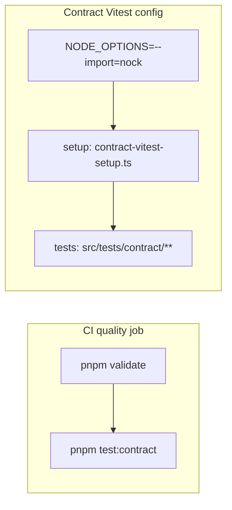

# Outbound contract tests (Stripe, Resend, S3)

Vitest specs under **`src/tests/contract/`** assert our wrappers stay aligned with third-party HTTP behavior using **nock 14** and **curated JSON fixtures**—no real network in CI.

## Commands

| Command                     | Purpose                                                                                                          |
| --------------------------- | ---------------------------------------------------------------------------------------------------------------- |
| `pnpm test:contract`        | Run the contract slice only (`CONTRACT_TESTS_ONLY=true`, dedicated Vitest config, `NODE_OPTIONS=--import=nock`). |
| `pnpm test:contract:record` | Placeholder hook for optional future **record** mode (see script help).                                          |

Default **`pnpm test`** **excludes** `src/tests/contract/**` so the main suite does not require nock preload ordering.

## Runtime wiring

- **`CONTRACT_TESTS_ONLY=true`** (set by the npm script): `src/tests/setup.ts` pins placeholder keys and bucket names; `src/tests/global-setup.ts` skips DB provisioning when only contracts run.
- **`stripe.client`**: Under contract-only test runs, the Stripe SDK uses **`Stripe.createFetchHttpClient`** so requests go through **fetch / undici**, which nock intercepts reliably. The default Node `http` client can **hang** with nock 14 / `@mswjs/interceptors` (upstream: stripe-node#2211, nock#2785).
- **Body matchers**: nock passes **`querystring.parse` objects** for `application/x-www-form-urlencoded` bodies; helpers in **`helpers/stripe-form.ts`** decode strings, buffers, and parsed objects.

## Layout

| Path                 | Role                                                           |
| -------------------- | -------------------------------------------------------------- |
| `*.contract.test.ts` | Specs per integration                                          |
| `fixtures/**`        | Static JSON (request/response shapes)                          |
| `schemas/**`         | Zod contracts for payloads                                     |
| `helpers/`           | Nock isolation, circuit reset, Stripe form/signature utilities |

See **`src/tests/contract/README.md`** for a short developer checklist.

## Related

- [`src/tests/contract/contract.overview.md`](../../../src/tests/contract/contract.overview.md) — suite scope, fixture organisation, dependencies
- [`src/infrastructure/payment/payment.overview.md`](../../../src/infrastructure/payment/payment.overview.md), [`src/infrastructure/mail/mail.overview.md`](../../../src/infrastructure/mail/mail.overview.md), [`src/infrastructure/storage/storage.overview.md`](../../../src/infrastructure/storage/storage.overview.md) — wrappers under test
