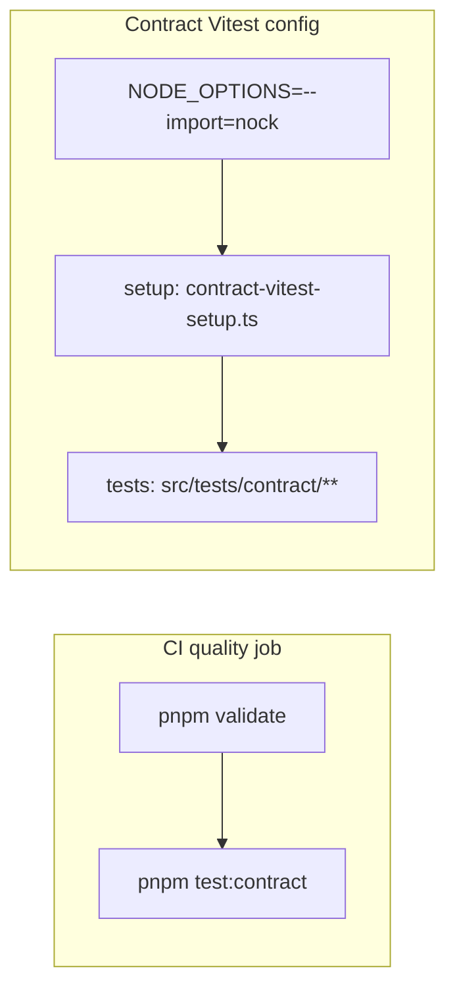

# Outbound contract tests (Stripe, Resend, S3)

Vitest specs under **`src/tests/contract/`** assert our wrappers stay aligned with third-party HTTP behavior using **nock 14** and **curated JSON fixtures**—no real network in CI.

## Commands

| Command                     | Purpose                                                                                                          |
| --------------------------- | ---------------------------------------------------------------------------------------------------------------- |
| `pnpm test:contract`        | Run the contract slice only (`CONTRACT_TESTS_ONLY=true`, dedicated Vitest config, `NODE_OPTIONS=--import=nock`). |
| `pnpm test:contract:live`   | **Opt-in** run against the real sandbox APIs — see [Live mode](#live-mode-real-provider-apis).                   |
| `pnpm test:contract:record` | Placeholder hook for optional future **record** mode (see script help).                                          |

Default **`pnpm test`** **excludes** `src/tests/contract/**` so the main suite does not require nock preload ordering.

## Live mode (real provider APIs)

The offline tier proves **our** side of the contract: the request we build and the way we map a
response. It cannot prove the provider still behaves that way — the fixtures are frozen and the
network is disabled, so a provider changing its API leaves every test green. `pnpm test:contract:live`
closes that gap by calling the same wrappers against the real sandbox endpoints and validating the
responses with the **same Zod contracts** under `schemas/`.

It is excluded from `pnpm test` and from CI. Nothing runs unless you opt in.

### Setup

Set the provider credentials wherever your environment normally injects them — a hosted
environment's variable settings, CI secrets, or your shell — then opt in per provider:

```bash
# Naming a provider is also how you accept its side effects.
CONTRACT_LIVE_PROVIDERS=stripe,s3 pnpm test:contract:live
```

**Injected credentials win here, by design.** For running the *application*, the machine-local env
file deliberately beats the process environment — `load-env-files` layers it on with
`override: true` whenever `NODE_ENV` names a deploy target, and deletes any key written blank in it.
Both behaviours are correct for the app and destructive for a live contract check: a scaffolded
placeholder `sk_test_xxx` silently replaces a real injected key, and a blank `CAPTCHA_SECRET=`
erases an injected secret outright. So `live/live-setup.ts` snapshots the injected provider
credentials before the loader runs and restores them afterwards. Nothing else is affected.

If a live spec appears to authenticate with the wrong account, that snapshot list is the first
place to look.

| Provider | Set in `.env.local` | Side effect of a run | Notes |
| --- | --- | --- | --- |
| **stripe** | `STRIPE_SECRET_KEY=sk_test_…` | Creates and deletes test-mode customers | `sk_live_` is refused outright. Test-mode objects are free and isolated |
| **resend** | `RESEND_API_KEY=re_…`, `EMAIL_FROM_ADDRESS=` (verified domain) | **Sends a real email** | Also set `CONTRACT_LIVE_EMAIL_TO` to a throwaway inbox |
| **s3** | `S3_BUCKET`, `S3_REGION`, `S3_ACCESS_KEY_ID`, `S3_SECRET_ACCESS_KEY` | Writes and deletes objects under `contract-live/` | Use a throwaway bucket, or point `S3_ENDPOINT` at MinIO / LocalStack |
| **turnstile** | `CAPTCHA_SECRET=1x0000000000000000000000000000000AA` | None | Cloudflare's published always-pass testing secret — no account needed. `2x…` always fails, `3x…` returns "already used". `CAPTCHA_PROVIDER` is irrelevant: it gates the middleware, while the verifier reads only the secret |

Prerequisites: Redis reachable (the outbound circuit breaker reads it — `pnpm compose:up`), and
network egress to the provider. No database is needed.

### Safety model

- `CONTRACT_LIVE=true` (set by the script) **and** the provider named in `CONTRACT_LIVE_PROVIDERS`.
  Credential presence alone is deliberately not enough — developer `.env.local` files routinely carry
  placeholder `sk_test_…` values, and gating on presence fired real Stripe calls off one.
- A provider that is not opted in **skips**, it does not fail, so a partial setup is a valid setup.
  Each spec file carries a companion test that reports *why* it skipped.
- Never wired into `pnpm test`, `pnpm ci:local`, or any workflow.

### What it does not do

It does not re-record fixtures. `pnpm test:contract:record` is still a placeholder that prints manual
instructions; refreshing `fixtures/**` from a live run remains a separate piece of work.

## Runtime wiring


```mermaid
flowchart LR
  subgraph ci [CI quality job]
    V[pnpm validate]
    C[pnpm test:contract]
  end
  subgraph vitest [Contract Vitest config]
    N[NODE_OPTIONS=--import=nock]
    S[setup: contract-vitest-setup.ts]
    T[tests: src/tests/contract/**]
  end
  V --> C
  N --> S
  S --> T
```

- **`CONTRACT_TESTS_ONLY=true`** (set by the npm script): `src/tests/setup.ts` pins placeholder keys and bucket names; `src/tests/global-setup.ts` skips DB provisioning when only contracts run.
- **`stripe.client`**: Under contract-only test runs, the Stripe SDK uses **`Stripe.createFetchHttpClient`** so requests go through **fetch / undici**, which nock intercepts reliably. The default Node `http` client can **hang** with nock 14 / `@mswjs/interceptors` (upstream: stripe-node#2211, nock#2785).
- **Body matchers**: nock passes **`querystring.parse` objects** for `application/x-www-form-urlencoded` bodies; helpers in **`helpers/stripe-form.ts`** decode strings, buffers, and parsed objects.

## Layout

| Path                 | Role                                                           |
| -------------------- | -------------------------------------------------------------- |
| `*.contract.test.ts` | Specs per integration                                          |
| `fixtures/**`        | Static JSON (request/response shapes)                          |
| `schemas/**`         | Zod contracts for payloads                                     |
| `helpers/`           | Nock isolation, circuit reset, Stripe form/signature utilities |

See **`src/tests/contract/README.md`** for a short developer checklist.

## Related

- [`src/tests/contract/contract.overview.md`](../../../src/tests/contract/contract.overview.md) — suite scope, fixture organisation, dependencies
- [`src/infrastructure/payment/payment.overview.md`](../../../src/infrastructure/payment/payment.overview.md), [`src/infrastructure/mail/mail.overview.md`](../../../src/infrastructure/mail/mail.overview.md), [`src/infrastructure/storage/storage.overview.md`](../../../src/infrastructure/storage/storage.overview.md) — wrappers under test
