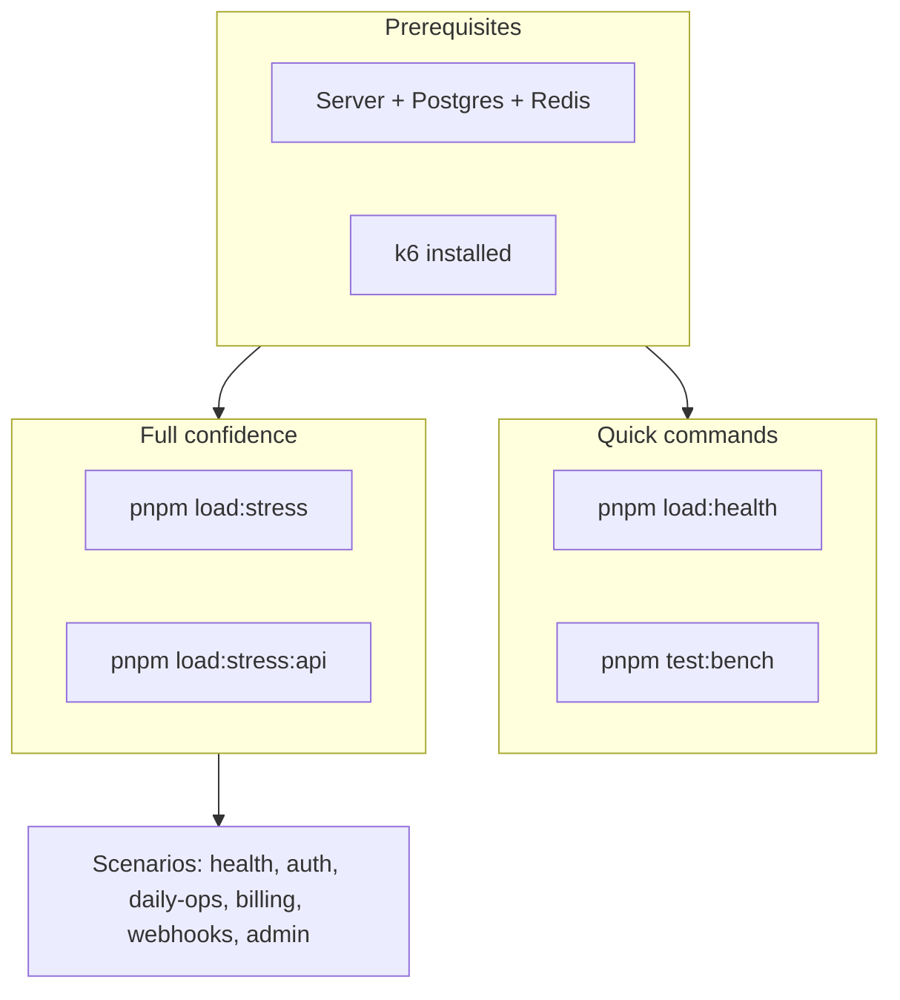

# Load testing

Load tests use [k6](https://k6.io/) and Autocannon. Keep this doc in sync with [src/tests/load/k6/README.md](../../../src/tests/load/k6/README.md).

**Test layout:** Vitest suites (unit, integration, e2e, security, performance) and k6 load assets live under `src/tests/`; domain route tests live under `src/domains/*/__tests__/`. k6 scenarios are in `src/tests/load/k6/` (not Vitest — run via `pnpm load:*`).

---

## Flow overview



Prerequisites → Quick (health, bench) vs Full confidence (stress, stress:api) → Scenarios.

---

## Nightly CI gate (GitHub Actions)

Workflow: [.github/workflows/scheduled-k6-load-slo.yml](../../../.github/workflows/scheduled-k6-load-slo.yml) (`Scheduled k6 API load & SLO`)

Runs **daily at 02:00 UTC** (`cron`) and **on demand** (`workflow_dispatch`). The job starts Postgres and Redis service containers, migrates, runs `pnpm db:seed:full` with `TEST_PASSWORD=DemoPassword123!` (matches the demo user), boots the API with `RATE_LIMIT_MAX=10000`, then runs k6.

| Role                 | Scenarios                                                                     | Job outcome                                                          |
| -------------------- | ----------------------------------------------------------------------------- | -------------------------------------------------------------------- |
| **Gate (must pass)** | `health-stress.js`, `api-stress.js`                                           | Workflow **fails** if any k6 threshold fails                         |
| **Informational**    | `auth-onboarding.js`, `daily-ops.js`, `billing.js`, `webhooks.js`, `admin.js` | `continue-on-error`; failures do not fail the workflow by themselves |

**SLO-style thresholds (k6):** Scenarios define `http_req_duration` percentiles on tagged requests and `http_req_failed` (see each file under `src/tests/load/k6/scenarios/`). The gate enforces:

- **Health stress**: `health/live` p(95)&lt;200ms, p(99)&lt;500ms; `health/ready` p(95)&lt;500ms, p(99)&lt;1000ms; global failure rate &lt;1%.
- **API stress**: Per-route p(95)&lt;500ms for users/me, organizations, notifications, unread-count, and the active-org memberships (`/tenancy/organization/memberships`); global p(95)&lt;500ms and failure rate &lt;1%.

Artifacts (`k6-*.json` summaries and `server.log`) are uploaded for 14 days. Optional email: configure `RESEND_API_KEY` and `LOAD_TEST_RESULT_EMAIL_TO` or `TEST_REPORT_EMAIL_TO`; the workflow invokes `pnpm tool:send-load-test-results-email` with `K6_USE_SUMMARIES=1` (reads gate `k6-*.json` files — no second k6 run).

**Reproduce locally:** `pnpm compose:up`, `pnpm db:migrate`, `TEST_PASSWORD=DemoPassword123! pnpm db:seed:full`, `pnpm dev:loadtest`, then `pnpm tool:load-test-credentials`, export `TEST_TOKEN` / `TEST_ORG_ID`, and run `pnpm load:stress` and `pnpm load:stress:api` (same thresholds as CI).

---

## Full confidence (recommended)

To gain confidence in the **whole system** (not just health endpoints), run both infrastructure stress and API stress:

1. **Health + infra stress** (no auth): `pnpm load:stress`
   - Hits `GET /livez` and `GET /readyz` with up to 100 VUs.

2. **API stress** (authenticated): set credentials, then run `pnpm load:stress:api`
   - Get credentials: `pnpm tool:load-test-credentials` (server up, `pnpm db:seed:full` done).
   - Export and run:

     ```bash
     export TEST_TOKEN="<paste from script>"
     export TEST_ORG_ID="<paste from script>"
     pnpm load:stress:api
     ```

   - Hits: `GET /api/v1/users/me`, `GET /api/v1/tenancy/organizations`, `GET /api/v1/notify/notifications`, `GET /api/v1/notify/notifications/unread-count`, `GET /api/v1/tenancy/organization/memberships` with up to 100 VUs. The active org rides the token's `org` claim, so `TEST_ORG_ID` scopes the token (via `switchToOrganization`) rather than appearing in the path.

3. **Optional — auth flow**: `pnpm load:auth`
   - Stresses login + profile + list orgs (ramping load profile; see thresholds in `src/tests/load/k6/scenarios/auth-onboarding.js`).

If **load:stress** and **load:stress:api** both pass, the system is under load-tested for both infra and main API paths.

### Failure rate and how to handle it

- **Health stress:** Failure rate is typically **0%** (no auth, no rate limit on health).
- **API stress:** You may see a **high failure rate (~95%+)** if the global **rate limit** is hit. The app uses `RATE_LIMIT_MAX` requests per `RATE_LIMIT_WINDOW_MS` (default **100 per 60 seconds per IP**). k6 runs from one IP with 100 VUs, so you can send thousands of requests per minute; after the first 100 in a window, the server returns **429 Too Many Requests**, which k6 counts as failed.

**How to handle:**

1. **For load-test runs only:** Start the server with a higher limit so API stress can complete without 429s:

   ```bash
   pnpm dev:loadtest
   ```

   (Or `RATE_LIMIT_MAX=10000 pnpm dev`.) Then run `pnpm load:stress:api` (with `TEST_TOKEN` and `TEST_ORG_ID`). Do not use a sky-high limit in production.

2. **In production:** Keep `RATE_LIMIT_MAX` at a level that protects the API (e.g. 100–500 per minute per IP, or use Redis-backed per-user limits). The 429 response is correct behavior when the limit is exceeded; clients should back off or use exponential backoff.

   **Per-route limits:** High-risk routes use tighter caps than the global limit (e.g. login, invitations, data export, webhook test delivery). Values live in [`src/shared/middlewares/rate-limit-presets.constants.ts`](../../../src/shared/middlewares/rate-limit-presets.constants.ts). k6 or scripts that hammer those paths may see 429 sooner than the global budget implies.

3. **Optional — longer-lived token for long runs:** JWT from login expires in 15 minutes. For runs under 15 minutes you don't need to change anything. For longer API stress runs, use a token with longer expiry (e.g. from `pnpm tool:admin-token` if your scenario allows admin role, or a dedicated load-test token with extended expiry).

## Prerequisites

- **Server**: Run the API with `pnpm dev` (and optionally `pnpm dev:worker` for background jobs).
- **Postgres + Redis**: Required for auth and org-dependent scenarios. Start with `docker compose up -d` or your own instances.
- **Database**: Migrations applied (`pnpm db:migrate`). For auth and org scenarios, run full seed: `pnpm db:seed:full` (creates demo user `demo@example.com` / `DemoPassword123!` and a demo organization).
- **k6**: Install [k6](https://k6.io/docs/get-started/installation/) for scenario runs.

## Quick commands (no auth)

- **Autocannon** (single endpoint): `pnpm test:bench` — hits `http://localhost:3000/readyz`.
- **k6 health**: `pnpm load:health` — runs `src/tests/load/k6/scenarios/health.js` (`/livez` and `/readyz`). No env vars needed.

## Scenarios (all seven)

### 1. Health

- **File**: `src/tests/load/k6/scenarios/health.js`
- **Auth**: None
- **Env**: Optional `BASE_URL` (default `http://localhost:3000`)
- **Run**: `pnpm load:health` or `k6 run src/tests/load/k6/scenarios/health.js`

### 2. API stress (full confidence)

- **File**: `src/tests/load/k6/scenarios/api-stress.js`
- **Auth**: Bearer token (TEST_TOKEN) + TEST_ORG_ID for memberships
- **Env**: `TEST_TOKEN` (required), `TEST_ORG_ID` (required for memberships). Get via `pnpm tool:load-test-credentials`.
- **Run**: `pnpm load:stress:api` after exporting TEST_TOKEN and TEST_ORG_ID.
- **Routes**: users/me, tenancy/organizations, notify/notifications, notify/notifications/unread-count, tenancy/organization/memberships (active org from the token claim; `TEST_ORG_ID` scopes the token, not the path). Stress profile: 20→50→100 VUs.

### 3. Auth onboarding

- **File**: `src/tests/load/k6/scenarios/auth-onboarding.js`
- **Auth**: Login with email/password, then profile and list organizations
- **Env**: `TEST_EMAIL`, `TEST_PASSWORD` (defaults in script: `test@test.com` / `test-password`). After full seed use: `TEST_EMAIL=demo@example.com` and `TEST_PASSWORD=DemoPassword123!`
- **Run**: `pnpm load:auth` (uses demo credentials by default) or `k6 run src/tests/load/k6/scenarios/auth-onboarding.js`

### 4. Daily ops

- **File**: `src/tests/load/k6/scenarios/daily-ops.js`
- **Auth**: Bearer token scoped to the active org (the `org` claim; scope via `TEST_ORG_ID`)
- **Env**: `TEST_TOKEN` (required), `TEST_ORG_ID` (default `test-org-id`). Use the helper script to get token and org id: `pnpm tool:load-test-credentials` (see below).
- **Run**: `pnpm load:daily-ops` with `TEST_TOKEN` and `TEST_ORG_ID`, or `TEST_TOKEN=<token> TEST_ORG_ID=<org_public_id> k6 run src/tests/load/k6/scenarios/daily-ops.js`

### 5. Billing

- **File**: `src/tests/load/k6/scenarios/billing.js`
- **Auth**: First request (list plans) is public; rest require `TEST_TOKEN` and `TEST_ORG_ID`
- **Env**: `TEST_TOKEN`, `TEST_ORG_ID` (optional; if missing, only list-plans is exercised)
- **Run**: `pnpm load:billing` with `TEST_TOKEN` and `TEST_ORG_ID`, or `TEST_TOKEN=<token> TEST_ORG_ID=<org_public_id> k6 run src/tests/load/k6/scenarios/billing.js`

### 6. Webhooks

- **File**: `src/tests/load/k6/scenarios/webhooks.js`
- **Auth**: Bearer token scoped to the active org (the `org` claim; scope via `TEST_ORG_ID`)
- **Env**: `TEST_TOKEN` (required), `TEST_ORG_ID` (default `test-org-id`)
- **Run**: `pnpm load:webhooks` with `TEST_TOKEN` and `TEST_ORG_ID`, or `TEST_TOKEN=<token> TEST_ORG_ID=<org_public_id> k6 run src/tests/load/k6/scenarios/webhooks.js`

### 7. Admin

- **File**: `src/tests/load/k6/scenarios/admin.js`
- **Auth**: Token with global admin role (e.g. `super_admin`). Normal login issues role `user`; use the admin-token script for load tests.
- **Env**: `ADMIN_TOKEN` (required)
- **Run**: `pnpm load:admin` with `ADMIN_TOKEN`, or `ADMIN_TOKEN=<token> k6 run src/tests/load/k6/scenarios/admin.js`. Obtain token via: `pnpm tool:admin-token` (see below).

### Org-scoped / RLS-heavy (informational, CI nightly)

Org-scoped scenarios resolve the tenant from the token's `org` claim — no org path segment and no
`X-Organization-Id` header. `TEST_ORG_ID` is used to **scope the token** to that org (the helpers
call `switchToOrganization` / `loginScopedToOrganization`), not to build the path.

| File | Env | Routes |
| ---- | --- | ------ |
| `audit-list.js` | `ADMIN_TOKEN` | `GET /api/v1/audit/logs` |
| `org-membership-list.js` | `TEST_TOKEN`, `TEST_ORG_ID` | `GET /api/v1/tenancy/organization/memberships` |
| `member-role-permission-list.js` | `TEST_TOKEN`, `TEST_ORG_ID`, `TEST_ROLE_ID` | `GET /api/v1/tenancy/organization/roles/:role_id/permissions` |
| `notification-policy-crud.js` | `TEST_TOKEN`, `TEST_ORG_ID` | `GET /api/v1/tenancy/organization/notification-policies` |
| `billing-subscriptions-rls.js` | `TEST_TOKEN`, `TEST_ORG_ID`, optional `TEST_SUBSCRIPTION_ID` | `GET /api/v1/billing/subscriptions` |
| `upload-list.js` | `TEST_TOKEN`, optional `TEST_UPLOAD_PUBLIC_ID` | `GET /api/v1/uploads/:id` |
| `user-data-export.js` | `TEST_TOKEN` | `POST /api/v1/users/me/data-export` |

CI runs a subset in the **org-scoped routes** job step (see `scheduled-k6-load-slo.yml`).

### RLS concurrency beyond pool size

- **File**: `src/tests/load/k6/scenarios/rls-concurrency-beyond-pool.js`
- **Auth**: Bearer token scoped to the active org (the `org` claim; scope via `TEST_ORG_ID`)
- **Env**: `TEST_TOKEN`, `TEST_ORG_ID` (required); optional `DATABASE_POOL_MAX` (default `10`), `BEYOND_POOL_FACTOR` (default `4`), `BEYOND_POOL_VUS` (explicit VU override)
- **Run**: `RATE_LIMIT_MAX=10000 pnpm dev` (or `pnpm dev:loadtest`), then `pnpm load:rls-concurrency` with `TEST_TOKEN` and `TEST_ORG_ID`
- **Rate limit**: This scenario drives `DATABASE_POOL_MAX × BEYOND_POOL_FACTOR` VUs (default 40) with a short `sleep`, so it sends far more than the default global limit of `RATE_LIMIT_MAX` (100) requests per `RATE_LIMIT_WINDOW_MS` (60s) per IP. Without raising `RATE_LIMIT_MAX`, k6 will count `429 Too Many Requests` as failures and breach the `http_req_failed < 1%` threshold even when the pool is healthy. Match the server's `DATABASE_POOL_MAX` when overriding it on the k6 side.
- **Purpose**: Validates production-readiness audit item #5 (per-request RLS transaction pinning). It ramps concurrent VUs to `DATABASE_POOL_MAX × BEYOND_POOL_FACTOR` against an org-scoped (RLS) endpoint (`GET .../memberships`) and asserts `http_req_failed` stays below 1%. With `DATABASE_RLS_SCOPED_CONTEXTS=true` the connection checkout is held only for the unit-of-work, so the pool absorbs several multiples of concurrent requests; under the legacy request-pinned model the API would saturate near `DATABASE_POOL_MAX` and later requests would block or fail.
- **CI**: Runs nightly as part of the **org-scoped routes** informational step in `scheduled-k6-load-slo.yml` (seeded full demo data guarantees `TEST_ORG_ID`; the workflow already boots the API with `RATE_LIMIT_MAX=10000`). Pair a manual run with the `database_rls_active_checkouts` / `database_rls_checkout_hold_seconds` metrics from the [resource-limits runbook](../../deployment/runbooks/resource-limits.md) to confirm checkout hold time stays short.

## Obtaining credentials

- **TEST_TOKEN and TEST_ORG_ID**: Run `pnpm tool:load-test-credentials` (with server up and full seed). It logs in as the demo user, lists organizations, and prints `TEST_TOKEN` and `TEST_ORG_ID` for copy-paste.
- **ADMIN_TOKEN**: Run `pnpm tool:admin-token`. It prints a JWT signed with role `super_admin` for load-test use only (no real admin user required in DB).

## Optional env (all scenarios)

- `BASE_URL`: API base URL (default `http://localhost:3000`). k6 reads this as `__ENV.BASE_URL`.
