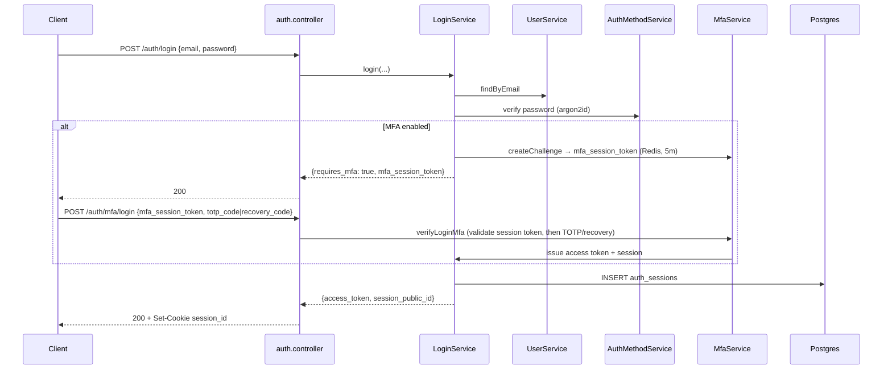
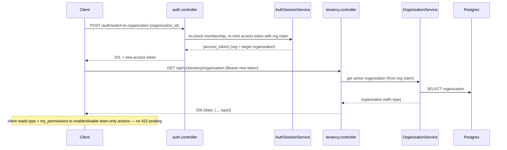
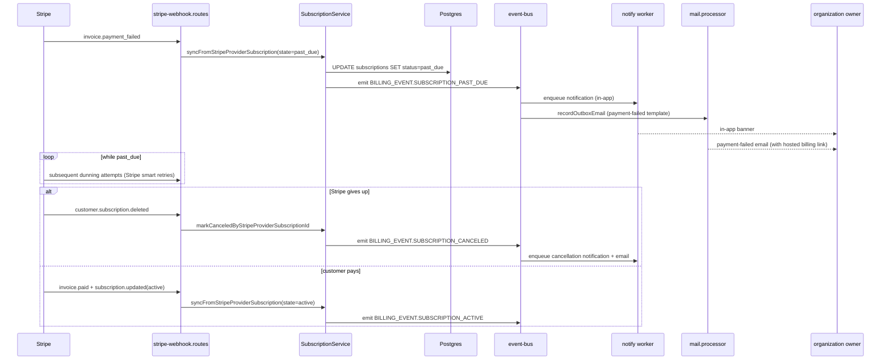

`src/`

# End-to-end feature flows

These are the multi-domain user journeys that touch more than one bounded context. Each flow lists the **trigger**, the **sequence** across domains, the **side effects** the platform produces, and the **failure modes** the platform tolerates.

When a domain `<folder>.overview.md` says **Cross-domain flows: signup-flow, subscription-change-flow**, it is asserting that the domain participates in the journeys documented here. Drift = bug.

> **Client-facing companion:** the sequences below show the **server internals** (services, DB, event bus, mail). For the **frontend** view of the auth journeys — the HTTP-only call sequence, the response body at each step, and how many calls each entry flow takes to land on the dashboard — see [docs/reference/api/frontend-auth-guide.md](docs/reference/api/frontend-auth-guide.md) (kept in step with `signup-flow`, `login-flow`, and the organization-switch flow below).

## signup-flow (unified email verification-code login)

### Trigger

Anonymous user submits an email at the unified login/sign-up form: `POST /api/v1/auth/email/send-code`.
There is no separate sign-up — an unknown email is auto-signed-up on first successful login.

### Sequence

```mermaid
sequenceDiagram
  participant Client
  participant Auth as auth.controller
  participant EL as EmailLoginService
  participant US as UserService
  participant DB as Postgres
  participant Bus as event-bus
  participant Mail as mail.processor
  participant Resend
  Client->>Auth: POST /auth/email/send-code {email}
  Auth->>EL: sendCode({email})
  EL->>US: findByEmail(email)
  US-->>EL: user | null
  alt user does not exist (auto-signup)
    EL->>DB: insert users (passwordless, is_email_verified=false) + auth_methods (EMAIL_CODE), atomic
    Note over EL: post-commit best-effort provisionPersonalOrganization (when enabled)
  end
  Note over EL: new and existing users converge on the same issue-code path
  EL->>DB: invalidateAllForUser (prior EMAIL_CODE codes) + insert verification_tokens (EMAIL_CODE, HMAC(pepper, type:user:code), expires_at = now + 15m)
  EL->>Bus: emit AUTH_EVENT.EMAIL_VERIFICATION_CODE_REQUESTED {email, verification_code, expires_in_minutes}
  Bus->>Mail: recordOutboxEmail (via event handler)
  EL-->>Auth: {messageKey: success:verificationCodeSent, expires_in_minutes: 15}
  Auth-->>Client: 201 (uniform — no account enumeration)
  Mail->>Resend: POST /emails (signed, alphanumeric code)
  Resend-->>Mail: 200
  Client->>Auth: POST /auth/email/login {email, code}
  Auth->>EL: login({email, code})
  EL->>US: findByEmail(email) + per-user attempt cap (Redis)
  EL->>DB: UPDATE verification_tokens SET used_at=NOW() WHERE user_id=$1 AND token_type='EMAIL_CODE' AND token_hash=$2 AND used_at IS NULL RETURNING *
  EL->>DB: invalidateAllForUser (single-use: redeeming one code kills the rest of the live set)
  EL->>DB: UPDATE users SET is_email_verified=true (when not already)
  EL->>DB: INSERT auth_sessions (or, when MFA enrolled, mint mfa_session_token instead — see /auth/mfa/login)
  Note over EL: post-commit best-effort provisionPersonalOrganization on FIRST login (claims a bare invited placeholder created without one; idempotent no-op for a brand-new user already provisioned at send)
  EL-->>Auth: {access_token, session_public_id} | {mfa_required, mfa_session_token}
  Auth-->>Client: 201 + Set-Cookie session_id
```

### Side effects

- `verification_tokens`: a single live code per user — each send invalidates the prior unused codes. Codes are stored only as a keyed, user-scoped HMAC (never plaintext, never bare SHA-256).
- `AUTH_EVENT.EMAIL_VERIFICATION_CODE_REQUESTED` event emitted on the in-process event bus.
- `mail_outbox` row inserted by the event handler (transactional outbox).
- Mail worker delivers via Resend (best-effort; retries via DLQ).
- On login: `auth_sessions` row + JWT issued (RS256, 15-minute access-token TTL); the user's other live codes are invalidated.

### Failure modes

- **Throttle / send cooldown** → uniform success returned to the client (no new code issued, no email). Anti-enumeration: response is identical for known and unknown emails.
- **Disposable email domain** → 400 `errors:disposableEmail`. Not silent because the user can fix it.
- **Mail enqueue failure** → does not fail the HTTP request; mail outbox sweeper retries.
- **Code replay** → atomic `UPDATE ... RETURNING` consumes the code on the first login; the post-consume `invalidateAllForUser` invalidates any other live code, keeping login single-use. Two concurrent `/email/login` requests yield exactly one session.
- **Wrong / expired code, or attempt cap exceeded** → 401 `errors:invalidOrExpiredVerificationCode`.
- **MFA enrolled** → login returns `mfa_required` + `mfa_session_token`; the client completes via `POST /auth/mfa/login`.

## login-flow

### Trigger

Returning user submits credentials: `POST /api/v1/auth/login`.

### Sequence



### Side effects

- Failed-attempt counter persisted on the user row (`users.failed_login_count`, per account). After `MAX_FAILED_LOGIN_ATTEMPTS` (10), the account locks for `ACCOUNT_LOCKOUT_MINUTES` (30 minutes). The lock is evaluated after password verification, so a correct password always bypasses it and clears the counter — the lock only rejects further wrong attempts (no victim-account DoS). Online brute force is bounded by the per-IP + per-email rate limits and CAPTCHA.
- On success: `auth_sessions` row + JWT issued; failed-attempt counter cleared; audit log row written via `audit-emission`.
- On MFA path: `mfa_session_token` written to Redis with `MFA_SESSION_TTL_SECONDS` (5 min).

### Failure modes

- **Wrong password** → 401, generic message; failed-attempt counter incremented.
- **Account locked + wrong password** → `errors:accountLocked` until the lockout window passes; a correct password during the window authenticates and lifts the lock.
- **MFA challenge expired** → 401 `errors:mfaSessionExpired`; client must re-login.
- **Disabled or unverified user** → 401 with the appropriate message key; behavior identical to wrong-password from the client's perspective for non-existent emails (anti-enumeration).

## organization-switch-and-capability-discovery-flow

### Trigger

A signed-in user switches which organization is active — `POST /api/v1/auth/switch-to-organization { organization_id }` (or back to their personal workspace via `POST /api/v1/auth/switch-to-personal`).

### Sequence



### Side effects

- A new access token is minted with the target organization in the `org` claim (the prior token's org is replaced). No DB write to the organization itself.
- Both switch endpoints (`switch-to-organization` / `switch-to-personal`) return the **active-org delta inline** — `{ access_token, active_organization, my_permissions, global_role }` (`AuthMeContextService.getActiveOrganizationContext` post-gate read) — so the client repaints the dashboard for the new org **without** a follow-up `GET /auth/me/context`. The omitted `user` / `organizations[]` are stable across a switch and reused from the client's initial context.
- Serialized organization responses (this `GET`, list, create, patch) carry the org `type` (`PERSONAL` / `TEAM`) but **no** `capabilities` object. Clients derive team-only availability from `type` and gate the action on the caller's `my_permissions`. The personal-vs-team rule is enforced server-side by `assertTeamOrganization` in `src/domains/tenancy/sub-domains/organization/organization-capability.ts`.

### Failure modes

- **Not a member of the target organization** → switch is rejected (the token is not re-minted); the active org is unchanged.
- **Client calls a team-only route on a personal org** → the centralized guard `assertTeamOrganization` rejects with **422** (`unprocessable_entity`), not 409, because the org `type` is immutable and retrying is futile. Clients hide/disable those actions up front from the org `type` + permissions instead of probing for the 422. The team-only routes: `DELETE /api/v1/tenancy/organization`, `POST .../organization/invitations`, `POST .../organization/memberships`, `POST .../organization/transfer-ownership`, `POST .../organization/roles`, and the four subscription mutations `POST /api/v1/billing/subscriptions` (+ `/{subscription_id}/change-plan`, `/cancel`, `/resume`).

## organization-invitation-flow

### Trigger

Organization admin adds a teammate by email: `POST /api/v1/tenancy/organization/memberships {email, role_id, expires_in_days?}` (REQ-1). That single call provisions/finds the user, creates the `INVITED` membership, and issues the invitation — there is no separate "create invitation" route.

### Sequence

```mermaid
sequenceDiagram
  participant Admin as Admin Client
  participant Mem as MembershipService
  participant Usr as UserService
  participant Inv as MemberInvitationService
  participant DB as Postgres (RLS scoped to org)
  participant Bus as event-bus
  participant Mail as mail.processor
  participant Invitee as Invitee Client
  participant Auth as auth (OAuth / email-code)
  Admin->>Mem: POST /organization/memberships {email, role_id}
  Mem->>Usr: findOrCreateInvitedByEmail(email)
  Usr->>DB: resolve by email (SECURITY DEFINER) — else INSERT auth.users (ACTIVE, is_email_verified=false, no auth method)
  Mem->>DB: BEGIN; SET LOCAL app.current_organization_id
  Mem->>DB: privilege-escalation guard; INSERT memberships (status=INVITED)
  Mem->>Inv: createForMembership(...)
  Inv->>DB: INSERT member_invitations (token_hash, expires_at)
  Inv->>Bus: emitStrict MEMBER_INVITATION_EVENT.CREATED {email, raw_token, organization_name, ...}
  Mem->>DB: COMMIT
  Bus->>Mail: recordOutboxEmail (via event handler)
  Mail-->>Invitee: invitation email (raw_token in URL)

  Note over Invitee,Auth: invitee onboards (claims the pre-created user) via email verification-code login or OAuth — find-by-email reuses the row and email-code/OAuth set is_email_verified
  Invitee->>Inv: POST /tenancy/invitations/:invitation_id/accept {token} (authenticated)
  Inv->>Usr: requireUserRecordByPublicId(actingUser) — 403 if email unverified, 403 if email ≠ invitee
  Inv->>DB: BEGIN; SET LOCAL app.current_organization_id
  Inv->>DB: UPDATE member_invitations SET accepted_at=NOW() WHERE token_hash=$1 (atomic, single-use)
  Inv->>DB: UPDATE memberships SET status=ACTIVE, joined_at=NOW() (activateForInvitationAccept)
  Inv->>DB: COMMIT
  Inv-->>Invitee: 201 {invitation}
```

### Side effects

- New invitee → a bare ACTIVE `auth.users` row (`is_email_verified=false`, no auth method), claimed on first onboarding — **email verification-code login** or **OAuth**; an existing address resolves to that account.
- `INVITED` `memberships` row + `member_invitations` row (hashed token; the raw token leaves the platform only via the email payload, parallel to the email verification code).
- `MEMBER_INVITATION_EVENT.CREATED` (emitStrict — a failed outbox write rolls back the whole org transaction) → mail outbox → invitation email.
- Accept requires authentication, a **verified** email, and an email matching the invitee (sec-T4 + follow-up) — so a forwarded invite token alone, or a password-claim that has not yet verified, cannot join the org. On accept the membership is activated (`status=ACTIVE`, `joined_at`) and the member's permission cache invalidated.
- On revoke (`DELETE /organization/invitations/:id`): the invitation is revoked AND the auto-created `INVITED` membership is soft-deleted (no ghost invitee in the members table).

### Failure modes

- **Disposable email** → 400 `errors:disposableEmail`.
- **Already a member (ACTIVE or live INVITED) for that email** → 409 `errors:membershipAlreadyExists`.
- **Personal organization** (single-member) → 422 (team-only route).
- **Token expired / invalid / revoked / already accepted** → `ValidationError` on accept.
- **Token reuse** → the atomic accept consumes the row on first accept; a second attempt fails validation.

## subscription-change-flow

> **Status:** The Stripe → webhook → subscription-state-sync + audit portion is **live**. The notification/email fan-out (`BILLING_EVENT.SUBSCRIPTION_*` emission → `Bus`/`Notify`/`Mail` steps below) is **planned, not yet implemented** — no `BILLING_EVENT` is emitted or consumed in code today.

### Trigger

Two paths:

- **Inbound (authoritative)**: Stripe sends `customer.subscription.updated` → `POST /api/v1/billing/webhook`.
- **User-initiated**: organization admin calls `POST /api/v1/billing/organizations/:id/subscriptions/:subscription_id/change-plan`. The service calls Stripe; the inbound webhook lands shortly after and reconciles state.

State changes always flow Stripe webhook → service → DB → emit event. We never write subscription state to DB without a Stripe-confirmed event behind it.

### Sequence

```mermaid
sequenceDiagram
  participant Stripe
  participant Ingest as stripe-webhook.routes
  participant SWS as StripeWebhookService
  participant Sub as SubscriptionService
  participant DB as Postgres (RLS scoped to org)
  participant Bus as event-bus
  participant Notify as notify worker
  participant Mail as mail.processor

  Stripe->>Ingest: POST /api/v1/billing/webhook (Stripe-Signature)
  Ingest->>SWS: verifySignatureAndPersist (raw body)
  SWS->>DB: insert stripe_webhook_events (status=processing) ON CONFLICT (event_id) DO NOTHING
  alt new event
    SWS->>Sub: syncFromStripeProviderSubscription(provider_id, data, event.created_at)
    Sub->>DB: BEGIN; SET LOCAL app.current_organization_id
    Sub->>DB: UPDATE subscriptions SET ... WHERE provider_subscription_id=$1
    Sub->>DB: COMMIT
    Sub->>Bus: emit BILLING_EVENT.SUBSCRIPTION_UPDATED
    SWS->>DB: UPDATE stripe_webhook_events SET status=processed
  else duplicate event_id
    Note over SWS: insert returns no rows; idempotent no-op
  end
  Ingest-->>Stripe: 200

  Bus->>Notify: notification fan-out (in-app + email)
  Notify->>Mail: recordOutboxEmail + dispatchOutboxEmail
```

### Side effects

- `stripe_webhook_events` row keyed by Stripe `event.id` (idempotent inbound).
- `subscriptions` table updated with the latest Stripe state.
- `BILLING_EVENT.SUBSCRIPTION_UPDATED` (or `_CREATED`, `_CANCELED`) emitted. *(planned — not yet wired)*
- Notification fan-out: in-app notification row + email through the mail outbox. *(planned — depends on the event emission above)*
- Audit log row for the state transition.

### Failure modes

- **Invalid Stripe signature** → 400; Stripe retries.
- **Duplicate `event.id`** → silently no-op (unique constraint); Stripe retries are safe.
- **Stripe API timeout (user-initiated path)** → response surfaces 502; Stripe will eventually send the webhook and the row reconciles. We do not optimistically write state.
- **Worker crash mid-processing** → row stuck in `processing`; reclaim worker (`stripe-webhook-event-reclaim.processor`) restarts it after `STRIPE_WEBHOOK_STUCK_PROCESSING_LEASE_MINUTES` (15 min).
- **Stale event** (timestamp older than current row) → service rejects the update so out-of-order webhooks don't roll state backwards.

## dunning-flow

> **Status:** The Stripe → webhook → `subscriptions.status` transitions + audit are **live**. The `BILLING_EVENT.SUBSCRIPTION_*` emission and the notification/email fan-out (`Bus`/`Notify`/`Mail` steps) are **planned, not yet implemented** — no `BILLING_EVENT` is emitted or consumed in code today.

### Trigger

Stripe sends a billing-failure webhook (`invoice.payment_failed`, `customer.subscription.updated` with `past_due`) → `POST /api/v1/billing/webhook`.

### Sequence



### Side effects

- `subscriptions.status` transitions: `active` → `past_due` (and back, or onward to `canceled`).
- `BILLING_EVENT.SUBSCRIPTION_PAST_DUE` / `..._CANCELED` / `..._ACTIVE` events emitted. *(planned — not yet wired)*
- Notification + email per state transition. *(planned — depends on the event emission above)*
- Audit log row for every state transition.

### Failure modes

- **All standard subscription-change-flow failure modes apply** (signature, duplicate event id, stale events, worker crash).
- **Notification delivery failure** → does not fail webhook processing; webhook delivery worker retries with backoff and lands in DLQ after exhausted retries.
- **Customer ignores the dunning emails** → Stripe-driven cancellation eventually fires; the platform does not unilaterally cancel.
