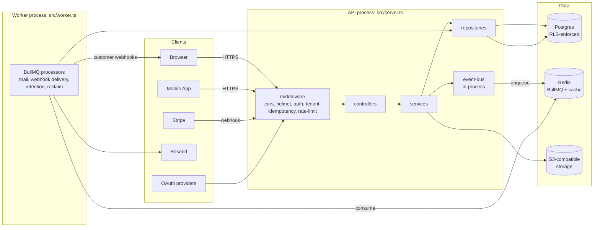

`src/`

# Platform overview

## Purpose

`core-be` is a multi-tenant SaaS backend: a Node.js + Fastify HTTP API plus a separate BullMQ worker process, both speaking to a single Postgres database and a Redis instance. It is the platform's single source of truth for authentication, organization-scoped tenancy, billing (Stripe-backed), notifications (in-app + email + outbound webhooks), audit, and file uploads.

The codebase is organized by **domain** (bounded context) rather than by layer. Each domain owns its routes, services, repositories, schemas, events, and workers. Cross-domain coordination happens at the service layer: a service uses its own domain's repository and calls other domains' **services** only — never another domain's repository or schema. Postgres is the only source of truth — workers are pull-based, idempotent, and may be restarted without coordination.

This document is the **system entry point**. New contributors should read it first, then descend into the domain `OVERVIEW.md` files for the area they're working in. Cross-cutting rules live in [src/PATTERNS.md](src/PATTERNS.md), end-to-end user journeys in [src/FLOWS.md](src/FLOWS.md), and the deliberate business/security trade-offs encoded as constants in [src/POLICIES.md](src/POLICIES.md).

Per-symbol documentation lives directly in TSDoc on each export — IDE hover, [TypeDoc](https://typedoc.org/) (when needed), and `pnpm tsdoc:check` all read it from the source. Routes are documented inline in their Zod `schema.summary` / `schema.description`, which drive [docs/openapi/openapi.json](../docs/openapi/openapi.json).

## Architecture at a glance

- **One TS codebase, two processes**: the API (`pnpm dev` / `pnpm start`) and the worker (`pnpm dev:worker` / `pnpm start:worker`). They share `src/` modulo the entry-point file.
- **Route flow**: HTTP request → middleware → controller → service → repository → Postgres. Controllers are thin; services own intent; repositories own DB access.
- **Event flow**: services emit on the in-process `event-bus` after a successful write; handlers translate events into BullMQ enqueues. Side effects never run synchronously inside the request.
- **Worker flow**: BullMQ processors pull from Redis, write back to Postgres (with RLS context where applicable), and call external services (Resend, Stripe, customer webhooks, S3).

Detailed architectural rules and conventions live in [CLAUDE.md](CLAUDE.md). The infrastructure layer is documented in [src/infrastructure/](src/infrastructure/) and the cross-cutting shared layer in [src/shared/](src/shared/).

## Domains

Bounded contexts live under [src/domains/](src/domains/). Each domain owns its routes (registered under `/api/v1/<domain>`), services, repositories, schemas, events, and workers.

| Domain | Routes | Purpose |
| --- | --- | --- |
| [audit](src/domains/audit/) | `/api/v1/audit` | Append-only audit log of security- and governance-relevant actions (`audit-emission` pattern). Read API is global-admin only. |
| [auth](src/domains/auth/) | `/api/v1/auth` | Authentication: passwords (argon2id), magic links, OAuth, MFA (TOTP), WebAuthn, sessions. Issues short-lived JWTs and Origin-checked session cookies. |
| [billing](src/domains/billing/) | `/api/v1/billing` | Plans, subscriptions, and the Stripe integration. Stripe is authoritative; webhooks reconcile state via the `subscription-change-flow` and `dunning-flow`. |
| [notify](src/domains/notify/) | `/api/v1/notify` | In-app notifications and outbound webhook delivery to customer endpoints (transactional outbox + retries + DLQ). |
| [tenancy](src/domains/tenancy/) | `/api/v1/tenancy` | Organizations, memberships, member roles + permissions, invitations, organization API keys. Owner of `tenant-isolation` enforcement. |
| [upload](src/domains/upload/) | `/api/v1/uploads` | S3-presigned upload + download flow. Two-phase: presign → confirm. |
| [user](src/domains/user/) | `/api/v1/users` | User profile, settings, notification preferences, and GDPR data export. |

Each domain folder above has its own hand-written `OVERVIEW.md` describing its purpose, design decisions, and operational concerns; per-symbol docs live in TSDoc on each export.

## Patterns

These patterns are implemented identically across the codebase. See [src/PATTERNS.md](src/PATTERNS.md) for the full contract of each.

- **`tenant-isolation`** — every read/write under an organization scope is filtered by `organization_id`, with Postgres RLS as defense-in-depth.
- **`audit-emission`** — security- and governance-relevant writes produce a row in `audit_logs.audit_log`; failures never fail the originating request.
- **`idempotency`** — mutating endpoints accept (and some require) an `Idempotency-Key` header backed by a 24 h Redis cache.
- **`soft-delete`** — most user/org-owned tables tombstone with `deleted_at`; immutable ledgers (audit, billing) hard-delete only after retention windows.
- **`rls-context`** — workers and request handlers wrap DB I/O in context helpers that `SET LOCAL app.current_organization_id`. Workers must not import request-scoped DB context.
- **`transactional-outbox`** — outbound side effects (mail, webhook delivery) are written to an outbox table inside the originating transaction and dispatched by a separate worker with at-least-once semantics.

## End-to-end flows

Top user journeys that touch more than one domain. Full sequence diagrams and failure modes in [src/FLOWS.md](src/FLOWS.md).

- **`signup-flow`** — magic-link sign-up across `auth` (verification token, JWT issuance) → `notify`/mail (delivery) → `user` (profile materialization).
- **`login-flow`** — password + optional MFA across `auth` (challenge, lockout) → audit (`audit-emission`).
- **`organization-invitation-flow`** — admin invites teammate across `tenancy` (membership materialization) → `notify`/mail → `auth` (signup-flow for new users).
- **`subscription-change-flow`** — Stripe webhook reconciliation across `billing` (subscription state) → `notify` (in-app + email) → `audit`.
- **`dunning-flow`** — billing-failure handling driven by Stripe across `billing` → `notify` → potentially `subscription-change-flow` to cancellation.

## Policies

Deliberate business, UX, and security trade-offs encoded as constants. Full rationale and consequences-of-change in [src/POLICIES.md](src/POLICIES.md).

- **`MAGIC_LINK_EXPIRES_IN_MINUTES = 15`** — security/UX trade-off on the verification-token replay window.
- **`ACCESS_TOKEN_EXPIRY_SECONDS = 900`** — short JWT lifetime; refresh via Origin-checked session cookie.
- **`MAX_FAILED_LOGIN_ATTEMPTS = 10` / `ACCOUNT_LOCKOUT_MINUTES = 30`** — credential-stuffing deterrent.
- **`IDEMPOTENCY_RESPONSE_CACHE_TTL_SECONDS = 86 400`** — mirrors Stripe's 24 h replay window.
- **`PERMISSION_CACHE_DEFAULT_TTL_SECONDS = 300`** — safety net for cross-process permission-cache invalidation.
- **`STUCK_SENDING_LEASE_MINUTES = 15`** — outbox + Stripe-webhook reclaim window after worker crash.
- **`PAGINATION = { DEFAULT_LIMIT: 25, MAX_LIMIT: 100 }`** — list endpoint defaults; cursor pagination only.
- **`GDPR_EXPORT_MAX_ROWS_PER_TABLE = 1 000`** — bounded export bundle size.

## Tech stack

- **Runtime**: Node.js ≥ 24 (single-process API + single-process worker)
- **HTTP**: [Fastify 5](https://fastify.dev) with `fastify-type-provider-zod`, `@fastify/helmet`, `@fastify/cors`, `@fastify/cookie`, `@fastify/rate-limit`, `@fastify/compress`
- **Validation**: [Zod 4](https://zod.dev) (HTTP DTOs + route schemas)
- **ORM**: [Drizzle 0.45](https://orm.drizzle.team) over the [`postgres` 3.x](https://github.com/porsager/postgres) driver (Postgres 16, RLS-enforced)
- **Cache + queue**: [ioredis 5](https://github.com/redis/ioredis) + [BullMQ 5](https://docs.bullmq.io)
- **Auth**: [jose 6](https://github.com/panva/jose) (RS256 JWT), [argon2id](https://github.com/ranisalt/node-argon2), [otplib](https://github.com/yeojz/otplib) (TOTP), [@simplewebauthn/server](https://simplewebauthn.dev) (WebAuthn)
- **Payments**: [Stripe 22](https://stripe.com)
- **Email**: [Resend 6](https://resend.com)
- **Storage**: AWS SDK v3 S3 (`@aws-sdk/client-s3`, `@aws-sdk/s3-presigned-post`, `@aws-sdk/s3-request-presigner`) — works against any S3-compatible store
- **Observability**: [Pino 10](https://getpino.io), [Sentry 10](https://sentry.io) (errors + tracing + profiling), [OpenTelemetry](https://opentelemetry.io) traces, [prom-client](https://github.com/siimon/prom-client) metrics
- **Resilience**: [opossum](https://nodeshift.dev/opossum/) circuit breakers around Stripe / S3 / Resend
- **i18n**: [i18next 26](https://www.i18next.com) with file-system backend (English + Spanish today)
- **MCP**: [@modelcontextprotocol/sdk](https://github.com/modelcontextprotocol/sdk) (optional dependency, gated by `ENABLE_MCP_SERVER`)
- **Testing**: [Vitest 4](https://vitest.dev), [fast-check](https://fast-check.dev) (property-based), [nock](https://github.com/nock/nock) (contract), [Toxiproxy](https://github.com/Shopify/toxiproxy) (chaos), [k6](https://k6.io) (load), [Stryker](https://stryker-mutator.io) (mutation)
- **Tooling**: [Biome](https://biomejs.dev) (lint + format), [pnpm 11](https://pnpm.io), [tsx](https://tsx.is) for dev runs, [Husky](https://typicode.github.io/husky/) for pre-commit
- **Hosting**: [Railway](https://railway.app); CI on GitHub Actions
