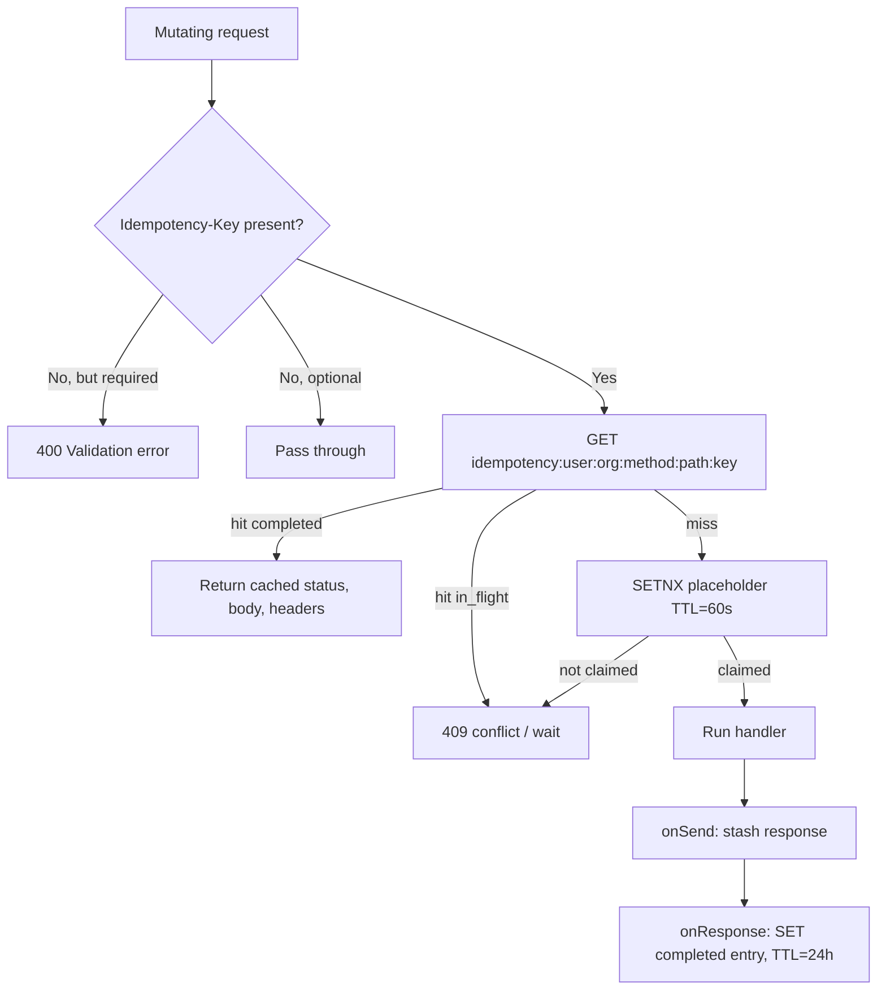
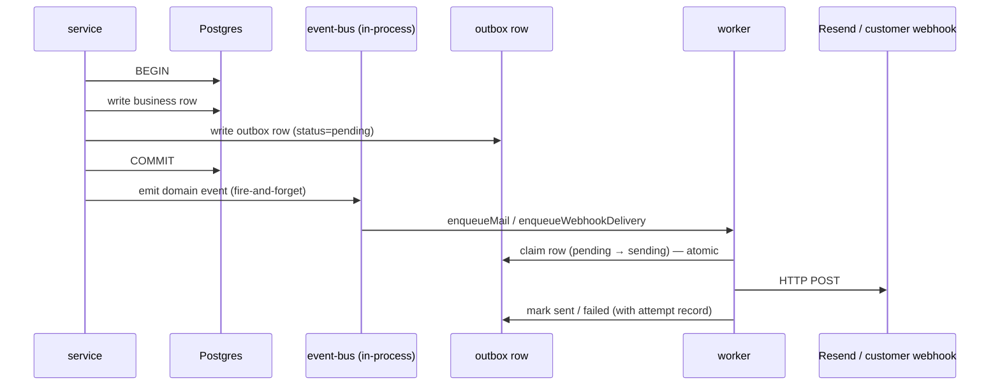

`src/`

# Cross-cutting patterns

These patterns are implemented identically across the codebase. When a domain `OVERVIEW.md` says **Patterns used: tenant-isolation, audit-emission**, it is asserting that domain follows the contract documented here. Drift = bug.

Each entry follows the same shape: **Purpose**, **Where it lives**, **Implementation**, **How to apply**.

## tenant-isolation

### Purpose

Prevent cross-tenant data leaks. Every read and write performed under an organization scope is filtered by `organization_id`, and the database enforces that filter via Row-Level Security as a defense-in-depth layer. A single misplaced query that forgets the filter must not be enough to leak another tenant's rows.

### Where it lives

- HTTP layer: [src/shared/middlewares/tenant/tenant.middleware.ts](src/shared/middlewares/tenant/tenant.middleware.ts) — reads `X-Organization-Id` (or parses `/organizations/:id/` from the URL) and decorates `request.organizationId`. Header and path are cross-checked; mismatch → `400`.
- Database layer: [src/infrastructure/database/contexts/tenant-database.context.ts](src/infrastructure/database/contexts/tenant-database.context.ts) and [organization-database.context.ts](src/infrastructure/database/contexts/organization-database.context.ts) — open a Drizzle transaction and `SET LOCAL app.current_organization_id = $1`. RLS policies on org-scoped tables read that GUC.
- Worker layer: [src/infrastructure/queue/worker-runtime/worker-processor.util.ts](src/infrastructure/queue/worker-runtime/worker-processor.util.ts) — `runTenantScopedWorkerJob` requires `organizationPublicId` in the job payload and wraps the processor body in `withOrganizationContext` so RLS sees the same GUC the HTTP layer would have set.

### Implementation

```mermaid
sequenceDiagram
  participant Client
  participant Mw as tenant.middleware
  participant Svc as service
  participant Ctx as withOrganizationDatabaseContext
  participant DB as Postgres (RLS)
  Client->>Mw: HTTP request with X-Organization-Id
  Mw->>Mw: validate header == path :id
  Mw->>Svc: request.organizationId
  Svc->>Ctx: withOrganizationDatabaseContext(orgId, fn)
  Ctx->>DB: BEGIN; SET LOCAL app.current_organization_id = orgId
  Ctx->>Svc: pinned databaseHandle (transaction)
  Svc->>DB: SELECT/INSERT/UPDATE (RLS filters by org)
  Ctx->>DB: COMMIT
```

The same context is reused if a worker is already running inside one (no nested top-level transaction; no second pool checkout; no lost `SET LOCAL`).

### How to apply

- New tenant-scoped repository: extend `BaseRepository`, scope every query by `organization_id`. Any RLS-eligible table also needs an RLS policy in its migration.
- New tenant-scoped service method: wrap database I/O in `withOrganizationDatabaseContext(organizationPublicId, fn)`. **Network I/O (Stripe, S3, Resend) MUST stay outside** the wrapper to avoid holding a pool checkout across remote round trips — enforced by `pnpm test:global` (`rls-context-network-isolation.global.test.ts`).
- New worker job: use `runTenantScopedWorkerJob`; never call `getRequestDatabase()` from a `*.worker.ts` / `*.processor.ts` (enforced by global tests).
- New endpoint at `/organizations/:id/...`: nothing extra; the middleware infers `organizationId` from the path even if the client omits the header.

## audit-emission

### Purpose

Every security- or governance-relevant write produces a row in `audit_logs.audit_log` so post-hoc investigation always has a non-repudiable trail. Audit failures must never fail the originating request — the user-visible operation is the source of truth and the audit row is best-effort.

### Where it lives

- Domain: [src/domains/audit/](src/domains/audit/) owns the `AuditService.record()` write path.
- Helper: [src/shared/utils/infrastructure/audit-record.util.ts](src/shared/utils/infrastructure/audit-record.util.ts) — `recordAuditEvent(auditService, input, log)` swallows + logs failures so callers don't need a try/catch.
- Request context: [src/shared/utils/infrastructure/audit-request-context.util.ts](src/shared/utils/infrastructure/audit-request-context.util.ts) extracts `actorUserPublicId`, IP, user-agent, and request id from the Fastify request.

### Implementation

1. Service performs its primary write (e.g. `subscription.create`).
2. Controller (or service, where the actor is unambiguous) calls `recordAuditEvent(auditService, { actorUserPublicId, action, resource_type, resource_id, organization_id, ip_address, user_agent, severity, metadata }, request.log)`.
3. `AuditService.record()` resolves the actor's internal `user_id` from the public id, then writes inside `withUserDatabaseContext` so RLS sees the actor's organization scope.
4. Errors are caught and logged at `warn`; the originating request still returns success.

### How to apply

- Adding a security-relevant route: identify the action constant (or add one in [src/domains/audit/audit.types.ts](src/domains/audit/audit.types.ts)), call `recordAuditEvent` after the primary write, populate `metadata` with the diff or operation parameters that future investigators will need.
- Severity defaults to `INFO`. Use `WARNING` for failed-but-recorded actions (e.g. permission denied) and `CRITICAL` for global-admin lifecycle events.

## idempotency

### Purpose

Mutating endpoints (`POST` / `PUT` / `PATCH` / `DELETE`) accept an `Idempotency-Key` header so retries from network errors return the original response instead of executing the operation a second time. For routes marked `idempotencyRequired: true` in their `schema.config`, the header is mandatory.

### Where it lives

- Middleware: [src/shared/middlewares/core/idempotency.middleware.ts](src/shared/middlewares/core/idempotency.middleware.ts).
- Redis: keys live under the `idempotency:` prefix; payload caps at `IDEMPOTENCY_CACHED_BODY_BYTES` (100 KiB); TTL = `IDEMPOTENCY_RESPONSE_CACHE_TTL_SECONDS` (24 h) for completed entries and `IDEMPOTENCY_PLACEHOLDER_TTL_SECONDS` (60 s) for in-flight placeholders.
- Cardinality guard: [src/infrastructure/observability/idempotency-cardinality/](src/infrastructure/observability/idempotency-cardinality/) — bounded SCAN job that warns when the key set exceeds threshold.

### Implementation



Scope key includes `userId` / `organizationId` / `apiKeyPublicId` so two clients can use the same `Idempotency-Key` value without collision.

### How to apply

- Make a route required-idempotent: add `config: { idempotencyRequired: true }` to the route options. The middleware will throw `400` if the header is missing.
- Forward to Stripe: pass the same `Idempotency-Key` to Stripe's API; Stripe honors it for 24 h, matching our TTL.
- Bodies above 100 KiB cannot be replayed; the middleware logs a warning and skips caching. Design endpoints with retry replay in mind to stay under the cap.

## soft-delete

### Purpose

Most user- and organization-owned rows use a `deleted_at TIMESTAMPTZ` column instead of physical `DELETE`. This preserves audit trails, lets retention sweeps run independently of user-facing deletes, and keeps foreign-key references intact while the row is "gone" from the API.

Some tables are deliberately exempt: immutable billing ledgers (audit, ledger entries, invoices) never soft-delete because changing or removing a billing event is a compliance risk. Hard `DELETE` is the right call there only after the retention window passes.

### Where it lives

- Schema definitions: every soft-deletable table declares `deleted_at: timestamp('deleted_at', { withTimezone: true })`.
- Repositories: list/find methods filter `WHERE deleted_at IS NULL` by default; explicit `includeDeleted` flag is opt-in for admin/forensic paths.
- Tombstone retention workers: [src/domains/tenancy/sub-domains/organization/organization-notification-policy/workers/organization-notification-policy-tombstone-retention.processor.ts](src/domains/tenancy/sub-domains/organization/organization-notification-policy/workers/organization-notification-policy-tombstone-retention.processor.ts) and similar — sweep tombstoned rows after a retention window.

### Implementation

1. `service.delete(id)` calls the repository's `softDelete(id)` which sets `deleted_at = NOW()` and emits any associated events.
2. All read paths automatically exclude soft-deleted rows via `WHERE deleted_at IS NULL`. Joins to soft-deleted rows are tested explicitly — the join filter is part of the repository contract.
3. A retention BullMQ job (registered in [src/infrastructure/queue/scheduler.ts](src/infrastructure/queue/scheduler.ts)) periodically hard-deletes tombstones older than the retention window.

### How to apply

- New table: add `deleted_at` unless the table is an immutable ledger. If exempt, document **why** in the schema file.
- New repository: any query that returns user-visible rows must include `eq(table.deleted_at, null)` or use a base helper that does.
- Forensic / admin paths: opt out explicitly via a documented `includeDeleted: true` flag.

## rls-context

### Purpose

Postgres Row-Level Security is the **defense-in-depth** layer for tenant isolation: even if a query forgets `WHERE organization_id = $1`, the database refuses to return rows that don't match the active organization GUC. Workers must obey the same contract — they must not skip RLS just because they're "internal".

### Where it lives

- Context wrappers: [src/infrastructure/database/contexts/](src/infrastructure/database/contexts/) — `withOrganizationContext`, `withGlobalRetentionCleanupDatabaseContext`, `withUserDatabaseContext`, `withSessionRetentionCleanupDatabaseContext`.
- Worker runtime: `runTenantScopedWorkerJob`, `runGlobalRetentionWorkerJob`, `runUserScopedWorkerJob` in [src/infrastructure/queue/worker-runtime/worker-processor.util.ts](src/infrastructure/queue/worker-runtime/worker-processor.util.ts).
- Migration: `migrations/00000000000000_init.sql` (consolidated baseline; defines the `app.global_retention_cleanup` RLS bypass policies) and other RLS-policy migrations under [migrations/](migrations/).

### Implementation

- HTTP requests get RLS via `tenant.middleware` + `organization-rls-transaction.middleware` opening a request-scoped transaction with `SET LOCAL app.current_organization_id = $1`.
- Workers get RLS via `runTenantScopedWorkerJob` which **requires** `organizationPublicId` in the job payload and opens its own `withOrganizationContext` transaction. Workers are forbidden from importing `request-database.context.ts` (enforced by `worker-database-guard.util.ts` and global tests).
- Global-scope workers (cross-org sweeps) use `withGlobalRetentionCleanupDatabaseContext`, which sets a different GUC that RLS policies recognize as "global retention" — strictly limited to retention/cleanup operations.

### How to apply

- New tenant-scoped table: add an RLS policy in its migration. The migration linter (`pnpm db:migrate:lint`) rejects schemas that omit RLS where it's required.
- New worker: pick the right runner (`Tenant`, `Global`, `User`) and pass the right context payload. Don't call `getRequestDatabase()`; don't import from `request-database.context.ts`. The pre-commit `validate:domain` enforces this at the import-graph level.

## transactional-outbox

### Purpose

Outbound side effects (email send, webhook delivery) must not be lost when the originating transaction commits, and must not fire when the originating transaction rolls back. The outbox pattern makes side-effect dispatch a row written inside the same transaction; a separate worker then reads the outbox and performs the side effect with at-least-once semantics.

### Where it lives

- Mail: [src/infrastructure/mail/mail-outbox.schema.ts](src/infrastructure/mail/mail-outbox.schema.ts), [mail-outbox.repository.ts](src/infrastructure/mail/mail-outbox.repository.ts), [workers/mail-outbox-sweeper.processor.ts](src/infrastructure/mail/workers/mail-outbox-sweeper.processor.ts), [workers/mail.processor.ts](src/infrastructure/mail/workers/mail.processor.ts).
- Webhook delivery: [src/domains/notify/sub-domains/webhook/webhook-delivery/webhook-delivery.repository.ts](src/domains/notify/sub-domains/webhook/webhook-delivery/webhook-delivery.repository.ts), [webhook-delivery-attempt.repository.ts](src/domains/notify/sub-domains/webhook/webhook-delivery/webhook-delivery-attempt.repository.ts), [workers/webhook-delivery.worker.ts](src/domains/notify/sub-domains/webhook/webhook-delivery/workers/webhook-delivery.worker.ts).
- Stripe webhook events: [src/domains/billing/sub-domains/stripe-webhook/stripe-webhook-event.repository.ts](src/domains/billing/sub-domains/stripe-webhook/stripe-webhook-event.repository.ts) — inbound webhooks use the same idempotent-claim pattern as the outbox.

### Implementation



- **Atomic claim**: the worker uses an `UPDATE ... WHERE status = 'pending' RETURNING id` to prevent two workers from claiming the same row.
- **Stuck-row reclaim**: the sweeper processor reclaims rows stuck in `sending` for longer than `STUCK_SENDING_LEASE_MINUTES` (15 min) so a crashed worker doesn't strand outbox rows forever.
- **DLQ**: failed deliveries with exhausted retries land in the per-queue `<name>-dlq` registered by [src/infrastructure/queue/dlq/](src/infrastructure/queue/dlq/).

### How to apply

- New outbound side effect: write the row inside the originating transaction, never enqueue from inside the transaction (Redis is not transactional with Postgres). The event-bus emission outside the transaction is the cue for the BullMQ enqueue.
- Inbound webhook receiver (Stripe-shaped): persist the inbound event with `status=processing` keyed on the provider's `event.id`, then run the work; if the same event arrives twice, the unique constraint rejects it. Reclaim leases via `STRIPE_WEBHOOK_STUCK_PROCESSING_LEASE_MINUTES`.

## import-paths

### Purpose

Keep imports stable when files move. Path aliases (`@/`, `@tooling/`) make cross-folder dependencies explicit and grep-friendly; parent-relative paths (`../`) break when folders are reorganized.

### Where it lives

- Rule: [`.cursor/rules/import-paths.mdc`](../.cursor/rules/import-paths.mdc)
- Aliases: [`tsconfig.json`](../tsconfig.json) — `@/*` → `src/*`, `@tooling/*` → `tooling/*`
- CI gate: [`src/tests/global/import-paths.global.test.ts`](tests/global/import-paths.global.test.ts)

### Implementation

- **`src/`**: cross-folder → `@/domains/...`, `@/shared/...`, `@/infrastructure/...`, `@/core/...`. Co-located layers in the same folder may use `./` (e.g. service → `./repository.js`).
- **`tooling/`**: cross-folder → `@tooling/setup/...`, `@tooling/openapi/...`, etc. Same-folder `./` only.
- Always use `.js` extensions in import specifiers (NodeNext).

### How to apply

- New file under `src/` or `tooling/`: import siblings with `./`; import anything outside the folder with the appropriate alias. Never `../`.
- IDE: `.vscode/settings.json` sets `typescript.preferences.importModuleSpecifier: "non-relative"` to match this policy.
