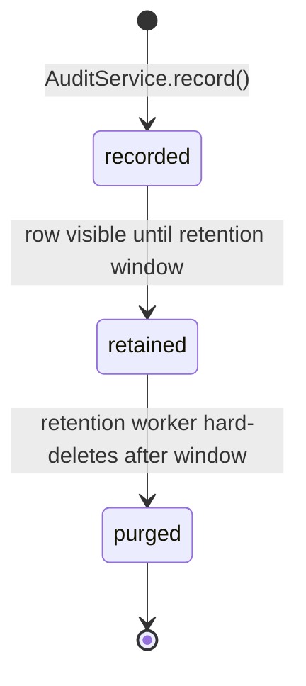

`src/domains/audit/`

# Audit

## Purpose

Append-only audit log of every security- and governance-relevant action that happens on the platform: who did it (actor), what they did (action), to what (resource), from where (IP, user-agent), with what severity, and any structured metadata. The domain owns the canonical write path used by the `audit-emission` cross-cutting pattern, and exposes a global-admin-only read API for forensic and compliance queries.

What it owns:

- The `audit.logs` table, its schema, and its retention policy, plus the `audit.audit_outbox` transactional-outbox table and its drain worker (`audit-outbox-drain`).
- The single `AuditService.record()` write entry-point that all other domains call (directly or through `recordAuditEvent` helper).
- `GET /api/v1/audit/logs` — cross-tenant cursor-paginated listing (global `SUPER_ADMIN` / `ADMIN` only).
- Org-scoped listing is exposed from tenancy as `GET /api/v1/tenancy/organizations/:id/audit-logs` (`audit-log:read`); implemented by `AuditService.listForOrganization`.

What it does not own: deciding **when** to emit an audit event — that's the responsibility of each calling domain. Audit only enforces the shape, the durability, and the read contract.

## Key invariants

- **Append-only**: rows are never updated or deleted by the API. Hard-delete only happens via the retention worker after the retention window passes.
- **Best-effort writes**: an audit failure must not fail the originating HTTP request. Callers go through `recordAuditEvent(auditService, input, log)` from `@/shared/utils/infrastructure/audit-record.util.ts`, which catches and logs failures.
- **Actor-scoped RLS**: writes run inside `withUserDatabaseContext(actorUserPublicId, ...)` so RLS sees the actor's organization scope, not the caller's.
- **Two read paths, two RLS contexts**: org listing runs in `withOrganizationDatabaseContext` (`app.current_organization_id`); global admin listing runs in `withGlobalAdminDatabaseContext` (`app.global_admin = true`) so cross-tenant reads are explicit under FORCE RLS, not table-owner bypass.
- **Global admin gate**: `GET /api/v1/audit/logs` requires global `SUPER_ADMIN` or `ADMIN`. Org path requires `audit-log:read` on the target organization.
- **Severity is a fixed set**: `INFO` (default), `WARNING` (denied/failed actions still worth recording), `CRITICAL` (global-admin lifecycle and security-incident events).
- **Outbox drain isolates poison rows** (sec-r7/M2): the drain processes a claimed batch in one transaction, but each row's `audit.logs` INSERT runs in a nested transaction (a SAVEPOINT). A row whose INSERT errors is rolled back to its savepoint and marked (transient until the `attempt_count` cap, then `FAILED`) while the rest of the batch still commits — a single poison row can no longer abort the batch and re-head the queue forever. After each pass the drain emits `audit.outbox.drain.backlog.stalled` when the oldest still-PENDING row exceeds the stale threshold.

## Sub-domains

`audit` is a flat domain — no `sub-domains/` folder. The single resource lives at the domain root (`audit.service.ts`, `audit.repository.ts`, `audit.routes.ts`, etc.). Per-symbol docs are in TSDoc on each export (use IDE hover or `pnpm tsdoc:check --report`).

## Patterns used

This domain implements the contracts documented in [src/PATTERNS.md](src/PATTERNS.md):

- `audit-emission` — the domain **is** this pattern's owner; other domains call into `AuditService.record()` (or the helper) to participate.
- `tenant-isolation` / `rls-context` — actor-scoped writes run inside the actor's user database context so RLS attributes the row to the correct organization.
- `soft-delete` does **not** apply: audit rows are immutable until retention purges them.

## Cross-domain flows

Every cross-domain flow in [src/FLOWS.md](src/FLOWS.md) emits at least one audit row through this domain:

- `signup-flow`, `login-flow` — identity lifecycle events.
- `organization-invitation-flow` — invitation create/accept/cancel.
- `subscription-change-flow`, `dunning-flow` — billing state transitions.

## Lifecycle

## Events

This domain neither emits nor consumes domain events. Audit is a pure write target — the `event-bus` is upstream of it.

## Failure modes

- **Unknown actor public id** → logged at `warn` (`audit.record.unknownActorUserPublicId`); no row written; originating request is unaffected.
- **DB write failure** → caught by `recordAuditEvent`, logged at `warn`; originating request is unaffected.
- **Read endpoint without global admin role** → 403; no information is leaked about whether the requested filter would have matched any rows.
