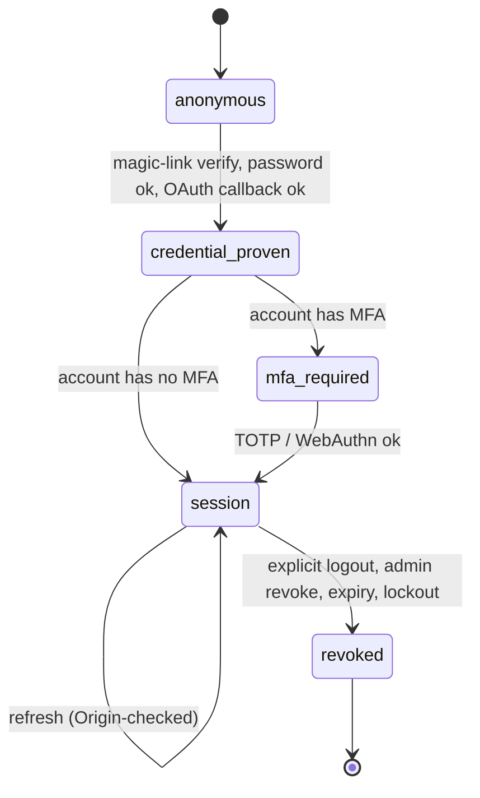

`src/domains/auth/`

# Auth

## Purpose

Owns identity proof and session establishment for the platform. Supports five primary credential types — passwords (argon2id), magic links, OAuth, MFA (TOTP), and WebAuthn — and issues short-lived JWTs (RS256) backed by refreshable session rows. The domain is the source of truth for "who is making this request"; everything authorization-related (organization permissions) lives in [tenancy](src/domains/tenancy/).

What it owns:

- The `auth_*` tables (auth methods, sessions, MFA secrets, WebAuthn credentials, verification tokens).
- All credential verification logic and the failed-attempt + lockout counters.
- JWT issuance + verification (via [src/shared/utils/security/jwt.util.ts](src/shared/utils/security/jwt.util.ts)).
- Origin-checked session cookies (`session_id`) and the refresh path; CSRF model in [docs/reference/security/csrf-and-session-cookies.md](docs/reference/security/csrf-and-session-cookies.md).

What it does not own: user profile (lives in [user](src/domains/user/)), organization permissions (lives in [tenancy/permission](src/domains/tenancy/sub-domains/permission/)), audit (lives in [audit](src/domains/audit/) — auth calls into it).

## Key invariants

- **Anti-enumeration**: magic-link send, password-reset, and login responses are identical for unknown emails as for known ones (silent success for sends, generic-401 for login).
- **One-shot tokens**: every `verification_tokens` row has a single use. Verifies use atomic `UPDATE ... RETURNING` so two concurrent verifies cannot both produce a session. The short-lived Redis handles (MFA session, WebAuthn challenge, OAuth state) are consumed with an atomic `GETDEL` for the same single-use guarantee against a GET-then-DEL race.
- **Active-account gate**: a session is issued only for an `ACTIVE` user. Every issuance path (password login, magic-link verify, OAuth completion, WebAuthn verify, MFA login completion) rejects a non-active account with `errors:accountNotActive` before a JWT or session row is created.
- **Session revocation on state change**: suspending a user (or any admin status change away from `ACTIVE`) revokes all of their sessions; a password reset revokes all sessions; an authenticated password change revokes every session except the caller's current one. Each revoke invalidates the Redis token-validity cache so it takes effect immediately.
- **Hashed-at-rest secrets**: passwords use argon2id; verification tokens, magic-link tokens, password-reset tokens, MFA backup codes, and session JWT hashes are stored as `sha256(raw)` (or argon2 for passwords). Raw secrets leave the platform only via outbound email or to the client at issuance time.
- **Short JWT lifetime**: `ACCESS_TOKEN_EXPIRY_SECONDS = 900` (15 min). Refresh requires the Origin-checked session cookie.
- **Lockout**: `MAX_FAILED_LOGIN_ATTEMPTS = 10` per (email, IP); locks for `ACCOUNT_LOCKOUT_MINUTES = 30`.

## Sub-domains

| Sub-domain | Purpose |
| --- | --- |
| [auth-method](src/domains/auth/sub-domains/auth-method/) | Per-user credential methods. Hosts the magic-link, OAuth, and verification-token implementations as services within the same folder (no separate sub-domain). |
| [auth-session](src/domains/auth/sub-domains/auth-session/) | Session lifecycle: create on successful auth, revoke on logout, list active sessions. Owns the `auth_sessions` table and session retention worker. |
| [auth-mfa](src/domains/auth/sub-domains/auth-mfa/) | TOTP MFA enrolment, challenge, and backup codes. |
| [auth-webauthn](src/domains/auth/sub-domains/auth-webauthn/) | WebAuthn / passkey enrolment and authentication ceremonies via `@simplewebauthn/server`. |
| [mfa](src/domains/auth/sub-domains/mfa/) | MFA-challenge ticket store (Redis). Bridges primary auth and second-factor verification. |

## Patterns used

This domain implements the contracts documented in [src/PATTERNS.md](src/PATTERNS.md):

- `audit-emission` — every credential add/remove, every login (success or failure), every session revoke records a row.
- `idempotency` — magic-link send, password reset, and OAuth callback accept `Idempotency-Key`.
- `transactional-outbox` — auth emails (magic link, password reset, email verification) flow through `event-bus` → mail outbox → `mail.processor`.
- `tenant-isolation` does **not** apply at the auth layer — auth is global. Organization scope is layered on later by `tenancy`.

## Cross-domain flows

- `signup-flow` — magic-link path issuing the user's first session.
- `login-flow` — password (with optional MFA) issuing a session.
- `organization-invitation-flow` — invitee may need to complete `signup-flow` first.

## Lifecycle

## Events

- Emits: `AUTH_EVENT.MAGIC_LINK_REQUESTED`, `AUTH_EVENT.PASSWORD_RESET_REQUESTED`, `AUTH_EVENT.EMAIL_VERIFICATION_REQUESTED` (each handler enqueues mail). All three mail paths fail closed with `503` / `errors:mailNotConfigured` when outbound mail is unavailable.
- Consumes: nothing — auth is upstream.

## External integrations

- **OAuth providers** (Google + others, configured via `OAUTH_*` env). State + PKCE bound by Redis with `OAUTH_STATE_TTL_SECONDS = 600`.
- **Resend** — outbound mail for magic-link, password-reset, email-verification (via `notify` → mail outbox).

## Failure modes

- **Lockout exceeded** → 423; clears after `ACCOUNT_LOCKOUT_MINUTES`.
- **Disposable email blocked** → 400 on send; user gets actionable message.
- **MFA challenge expired** (5 min) → 401, client must restart login.
- **OAuth state mismatch** → 400; CSRF defence engaged.
- **Session token replayed after revocation** → 401; positive cache TTL `SESSION_TOKEN_CACHE_TTL_SECONDS = 60` bounds how long a revoked session can keep working.

## Policy constants

See [src/POLICIES.md](src/POLICIES.md) for the full rationale of each:

- `MAGIC_LINK_EXPIRES_IN_MINUTES = 15`
- `PASSWORD_RESET_EXPIRES_IN_MINUTES = 60`
- `EMAIL_VERIFICATION_EXPIRES_IN_HOURS = 24`
- `ACCESS_TOKEN_EXPIRY_SECONDS = 900`
- `MFA_SESSION_TTL_SECONDS = 300`
- `WEBAUTHN_CHALLENGE_TTL_SECONDS = 300`
- `OAUTH_STATE_TTL_SECONDS = 600`
- `SESSION_TOKEN_CACHE_TTL_SECONDS = 60`
- `MAX_FAILED_LOGIN_ATTEMPTS = 10`
- `ACCOUNT_LOCKOUT_MINUTES = 30`
