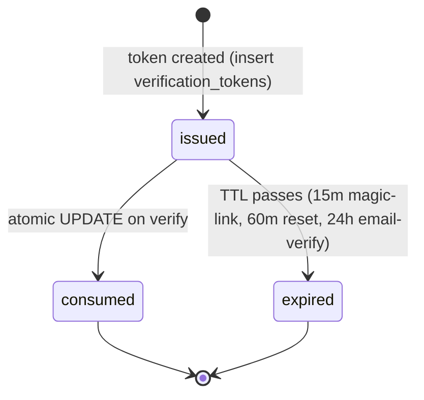

`src/domains/auth/sub-domains/auth-method/`

# Auth method

Parent: [auth](../../OVERVIEW.md)

## Purpose

Per-user credential records and the verification-token / magic-link / OAuth flows that issue or validate them. The sub-domain holds the row that says "user X has a password / OAuth account / magic-link recovery enabled" and the services that produce one-shot verification tokens.

The folder also houses the [magic-link](src/domains/auth/sub-domains/auth-method/) and [oauth](src/domains/auth/sub-domains/auth-method/oauth/) services as **internal modules** (not separate sub-domains) — they're implementation details of how an auth method is exercised, not separate API resources.

## Key invariants

- **One auth method per `(user, method_type[, provider, provider_user_id])`**: enforced by a partial unique index. A user cannot have two Google OAuth links to the same Google account.
- **Hashed-at-rest secrets**: passwords use argon2id; verification-token / magic-link / password-reset tokens are stored as `sha256(raw)`. Raw tokens leave the platform only through outbound email (one-shot) or the OAuth callback URL.
- **One-shot consumption**: every `verification_tokens` row is consumed by an atomic `UPDATE ... SET consumed_at = NOW() WHERE consumed_at IS NULL RETURNING *`. Two concurrent verifies cannot both succeed.
- **Anti-enumeration on send**: magic-link send and password-reset request return identical responses for known and unknown emails. No row inserted, no event emitted, no email sent for unknown emails.

## Lifecycle

## Events

- Emits: `AUTH_EVENT.MAGIC_LINK_REQUESTED`, `AUTH_EVENT.PASSWORD_RESET_REQUESTED`, `AUTH_EVENT.EMAIL_VERIFICATION_REQUESTED`. Each handler enqueues outbound mail through the mail outbox.

## External integrations

- **OAuth providers** — Google + others, configured via `OAUTH_*` env. State + PKCE bound by Redis with `OAUTH_STATE_TTL_SECONDS = 600`.
- **Resend** (indirectly via mail outbox).

## Failure modes

- **Token expired** → 401 `errors:invalidOrExpiredMagicLink` (or matching key for the token type).
- **Token reused** → 401 (atomic consume returned no row).
- **Disposable email blocked on send** → 400 `errors:disposableEmail`.
- **OAuth state mismatch on callback** → 400; CSRF defence engaged.

## Policy constants

- `MAGIC_LINK_EXPIRES_IN_MINUTES = 15`
- `PASSWORD_RESET_EXPIRES_IN_MINUTES = 60`
- `EMAIL_VERIFICATION_EXPIRES_IN_HOURS = 24`
- `OAUTH_STATE_TTL_SECONDS = 600`
