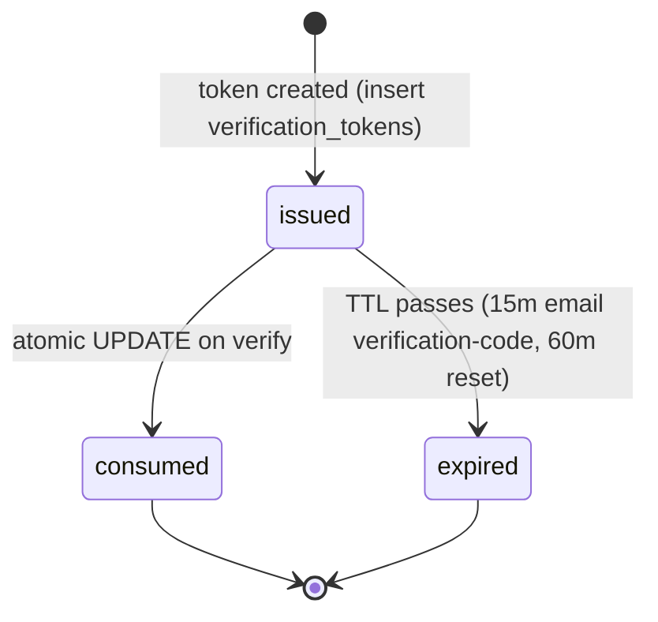

`src/domains/auth/sub-domains/auth-method/`

# Auth method

Parent: [auth](../../auth.overview.md)

## Purpose

Per-user credential records and the verification-token / email verification-code / OAuth flows that issue or validate them. The sub-domain holds the row that says "user X has a password / OAuth account / email verification-code recovery enabled" and the services that produce one-shot verification tokens.

The folder also houses the [email verification-code](src/domains/auth/sub-domains/auth-method/) and [oauth](src/domains/auth/sub-domains/auth-method/oauth/) services as **internal modules** (not separate sub-domains) — they're implementation details of how an auth method is exercised, not separate API resources.

## Key invariants

- **One auth method per `(user, method_type[, provider, provider_user_id])`**: enforced by a partial unique index. A user cannot have two Google OAuth links to the same Google account.
- **Hashed-at-rest secrets**: passwords use argon2id; verification-token / email verification-code / password-reset tokens are stored as `sha256(raw)`. Raw tokens leave the platform only through outbound email (one-shot) or the OAuth callback URL.
- **One-shot, type-scoped consumption**: every `verification_tokens` row is consumed by an atomic `UPDATE ... SET used_at = NOW() WHERE token_hash = $1 AND token_type = $2 AND used_at IS NULL AND expires_at > NOW() RETURNING *`. Two concurrent verifies cannot both succeed, and the `token_type` predicate (sec-r5-L2) means a token replayed against the wrong flow (e.g. a `PASSWORD_RESET` token sent to the email verification-code verify path) never matches — so it is never burned, staying redeemable on its own flow.
- **Single live email verification-code**: each send invalidates the user's prior unused `EMAIL_CODE` codes, so only the most recently emailed code is redeemable (the per-email send cooldown spaces issuance so an in-flight code is not invalidated by a rapid re-request). A successful login additionally invalidates any remaining live codes. Codes are stored as a keyed user-scoped HMAC (never plaintext, never bare sha256).
- **Anti-enumeration on send**: email verification-code send and password-reset request return identical responses for known and unknown emails. No row inserted, no event emitted, no email sent for unknown emails.

## Lifecycle

## Events

- Emits: `AUTH_EVENT.EMAIL_VERIFICATION_CODE_REQUESTED`, `AUTH_EVENT.PASSWORD_RESET_REQUESTED`. Each handler enqueues outbound mail through the mail outbox. Both mail paths fail closed with `503` / `errors:mailNotConfigured` when outbound mail is unavailable.

## External integrations

- **OAuth providers** — Google + others, configured via `OAUTH_*` env. State + PKCE bound by Redis with `OAUTH_STATE_TTL_SECONDS = 600`.
- **Resend** (indirectly via mail outbox).

## Failure modes

- **Token expired** → 401 `errors:invalidOrExpiredVerificationCode` (or matching key for the token type).
- **Token reused** → 401 (atomic consume returned no row).
- **Disposable email blocked on send** → 400 `errors:disposableEmail`.
- **OAuth state mismatch on callback** → 400; CSRF defence engaged.

## Policy constants

- `VERIFICATION_CODE_TTL_MINUTES = 15`
- `PASSWORD_RESET_EXPIRES_IN_MINUTES = 60`
- `OAUTH_STATE_TTL_SECONDS = 600`
