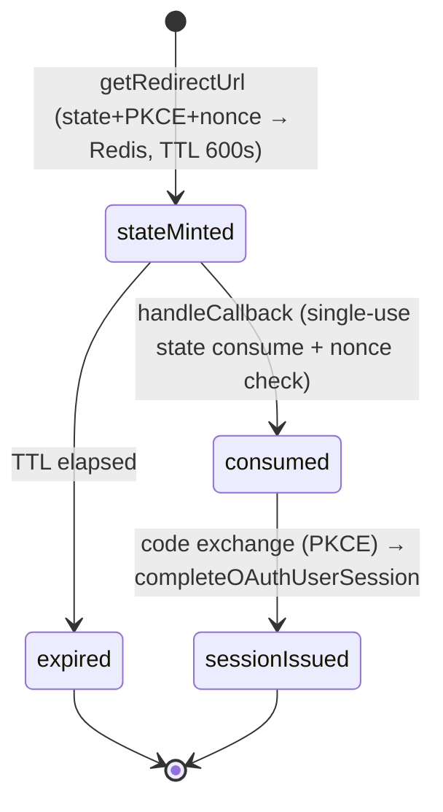

`src/domains/auth/sub-domains/auth-method/oauth/`

# OAuth (nested implementation)

Parent: [auth-method](../auth-method.overview.md)

## Purpose

Coordinates the OAuth authorize-and-callback dance for the supported providers. This is an **internal module** of auth-method, not an API resource — no controller or routes file; auth-method's routes call `oauth.service.ts` directly.

## Layout

- `oauth.service.ts` — `getRedirectUrl` (mints state + PKCE + nonce) and `handleCallback` (consumes state, exchanges code, completes the session)
- `oauth-state.ts` — CSRF `state` + browser nonce stored in Redis (`oauth:state:*`, TTL `OAUTH_STATE_TTL_SECONDS` = 600)
- `oauth-pkce.ts` — RFC 7636 PKCE verifier/challenge helpers
- `oauth-user-session.ts` — `completeOAuthUserSession`: find-or-create user, link the auth method, issue access token + session
- `providers/` — `google-oauth.provider.ts`, `github-oauth.provider.ts` (per-provider redirect URL + code exchange)
- `oauth.types.ts` — provider/callback types
- `__tests__/unit/` — state, PKCE, session-completion, and provider suites

## Key invariants

- The Redis state entry is consumed **exactly once** (single-use delete on callback); a replayed or forged callback fails with `UnauthorizedError`, as does a nonce mismatch.
- Code exchange always carries the PKCE verifier; an unsupported provider name fails with `NotImplementedError` before any redirect is minted.

## Lifecycle

