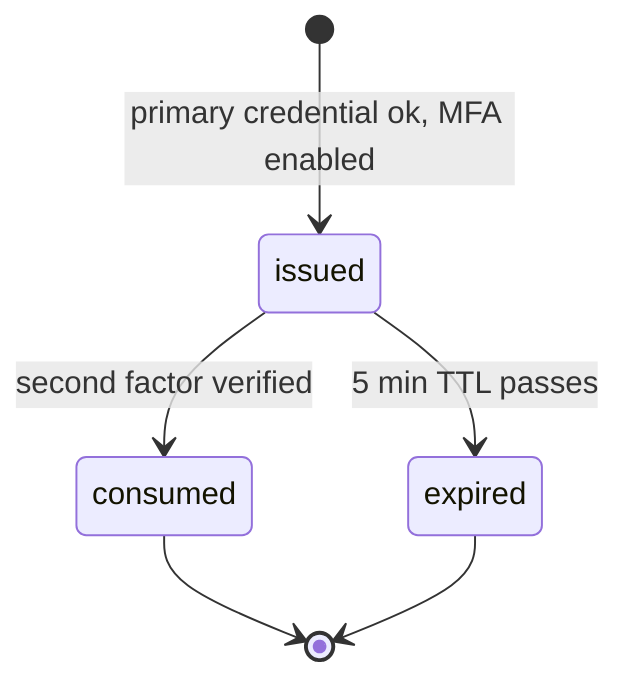

`src/domains/auth/sub-domains/auth-mfa-session/`

# MFA challenge ticket store

Parent: [auth](../../auth.overview.md)

## Purpose

Redis-backed store for the short-lived "user has proven primary credential, awaiting second factor" tickets that bridge primary auth and second-factor verification. Used by both [auth-mfa](../auth-mfa/auth-mfa.overview.md) (TOTP) and [auth-webauthn](../auth-webauthn/auth-webauthn.overview.md) (passkey) sub-domains.

## Key invariants

- **TTL exactly `MFA_SESSION_TTL_SECONDS`** (5 min). Tickets cannot be refreshed — a slow user must restart login.
- **Single-use**: verifying the second factor consumes the ticket; replay yields 401.
- **Bound to one user + IP**: the ticket value records the user public id and originating IP; submission from a different IP is rejected.

## Lifecycle

## Failure modes

- **Submission from a different IP** → 401.
- **Submission after TTL** → 401 `errors:mfaSessionExpired`.
- **Reuse of consumed ticket** → 401.

## Policy constants

- `MFA_SESSION_TTL_SECONDS = 300`
