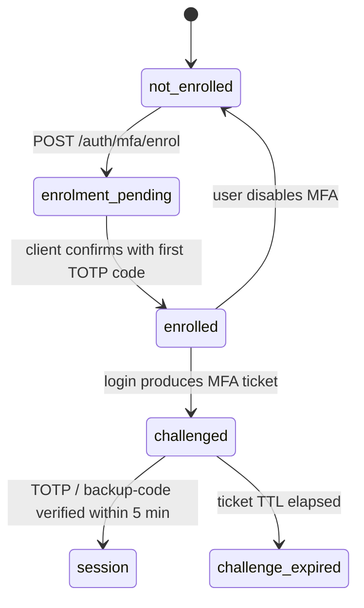

`src/domains/auth/sub-domains/auth-mfa/`

# Auth MFA

Parent: [auth](../../OVERVIEW.md)

## Purpose

TOTP-based multi-factor authentication: enrolment (generate secret, return provisioning URL + QR code data), verification (during login), backup codes (single-use one-shot codes for recovery), and disable. Backed by [otplib](https://github.com/yeojz/otplib) for TOTP arithmetic and the [auth/sub-domains/mfa](src/domains/auth/sub-domains/mfa/) sub-domain for the in-flight challenge ticket store.

## Key invariants

- **Secret is encrypted at rest** in the `auth_mfa_secrets` table (or hashed if the secret is non-recoverable). Backup codes are stored as `sha256(raw)` and one-shot.
- **Enrolment requires a fresh primary credential**: enabling MFA from settings requires a recent password verification (anti-takeover).
- **Two-step login**: primary credential → MFA challenge ticket (Redis, `MFA_SESSION_TTL_SECONDS = 300`) → second-factor submission → session.
- **Backup-code consumption is atomic**: same `UPDATE ... RETURNING` pattern as verification tokens.

## Lifecycle

## Failure modes

- **TOTP code outside drift window** → 401; client retries.
- **Backup code reuse** → 401 (atomic consume returned no row).
- **MFA ticket expired** (5 min) → 401 `errors:mfaSessionExpired`; client must restart login.
- **Disable MFA without recent primary credential** → 403; user must re-authenticate first.

## Policy constants

- `MFA_SESSION_TTL_SECONDS = 300`
