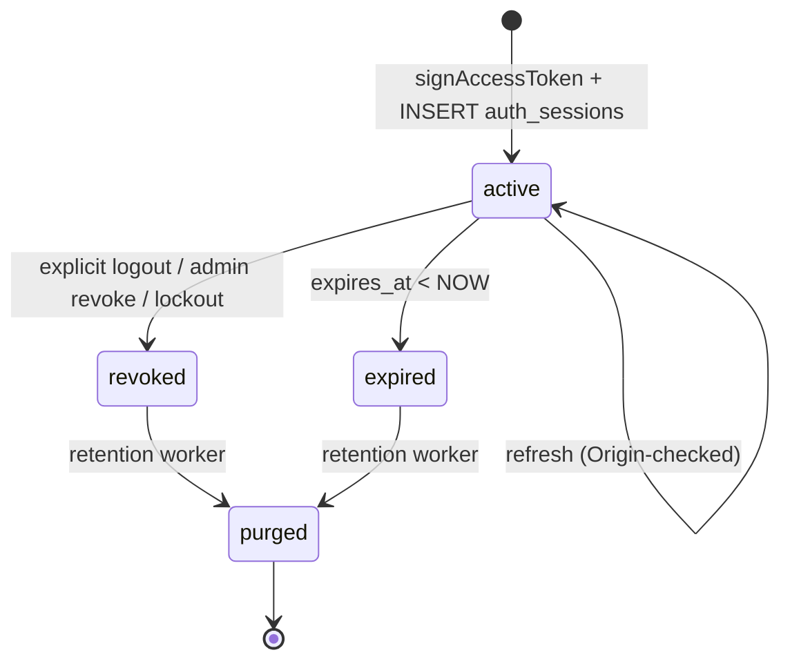

`src/domains/auth/sub-domains/auth-session/`

# Auth session

Parent: [auth](../../auth.overview.md)

## Purpose

Session lifecycle: create on successful authentication, validate on every authenticated request, revoke on logout / admin-revoke / expiry, and prune on retention. The sub-domain owns the `auth_sessions` table, the JWT-hash-keyed cache used by the auth middleware, and the retention worker that purges expired sessions.

## Key invariants

- **One JWT per session**: `auth_sessions.token_hash = sha256(jwt)` is unique. A second `signAccessToken` call for the same user produces a fresh row, not an alias of an existing one.
- **Revocation propagation ≤ 60 s**: the auth middleware's positive cache uses `SESSION_TOKEN_CACHE_TTL_SECONDS = 60`. A revoked session keeps working at most one minute past revocation.
- **Origin-checked refresh**: the refresh path requires the `session_id` cookie + matching `Origin` header (CSRF defence). See [docs/reference/security/csrf-and-session-cookies.md](docs/reference/security/csrf-and-session-cookies.md).
- **Session retention**: rows past `expires_at + retention window` are hard-deleted by the [auth-session retention worker](src/domains/auth/sub-domains/auth-session/workers/).

## Lifecycle

## Events

This sub-domain neither emits nor consumes domain events. Session lifecycle is reflected in audit log writes via the broader auth flow.

## Failure modes

- **JWT verification fails** (signature, expiry, issuer/audience claims) → 401.
- **Session row not found** (revoked or pruned) → 401; the cache miss falls through to Postgres and confirms.
- **Concurrent revocation while the same JWT is in flight** → bounded by `SESSION_TOKEN_CACHE_TTL_SECONDS`; the in-flight request may succeed but the next request after the cache expires fails.

## Policy constants

- `SESSION_TOKEN_CACHE_TTL_SECONDS = 60`
- `ACCESS_TOKEN_EXPIRY_SECONDS = 900`
- `AUTH_SESSION_MAX_AGE_DAYS` (env-tunable; controls the long-form session expiry)
