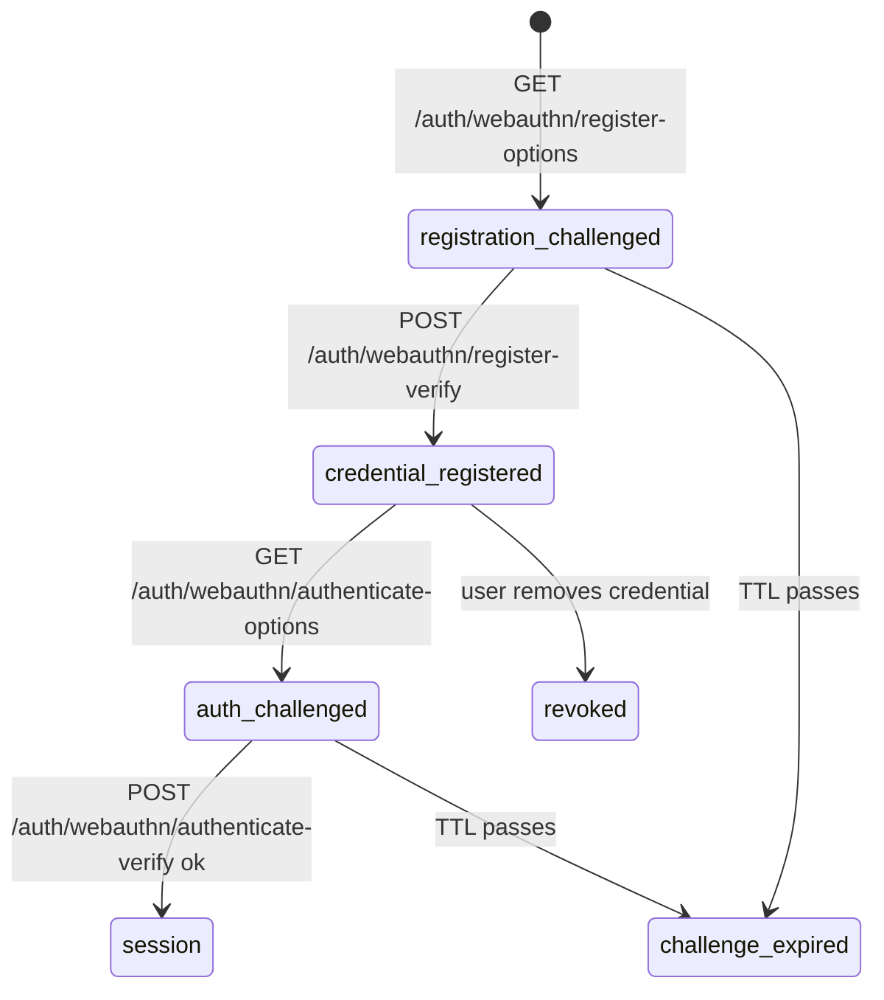

`src/domains/auth/sub-domains/auth-webauthn/`

# Auth WebAuthn

Parent: [auth](../../OVERVIEW.md)

## Purpose

WebAuthn / passkey enrolment and authentication ceremonies, backed by [@simplewebauthn/server](https://simplewebauthn.dev). Stores per-user credential records keyed by credential id and exposes the standard four-step flow: registration challenge, registration response, authentication challenge, authentication response.

## Key invariants

- **Challenges are server-generated and short-lived**: stored in Redis with `WEBAUTHN_CHALLENGE_TTL_SECONDS = 300` (5 min). Reuse of a challenge is rejected.
- **Credential ids are unique per user**: enrolling the same authenticator twice replaces the row (or is rejected, depending on UX policy).
- **Counter regression detection**: WebAuthn responses include a usage counter; a counter that does not increase indicates a cloned credential and is rejected.
- **Origin + RPID checked**: the relying-party id (`WEBAUTHN_RP_ID` env) and origin must match the values registered with the authenticator.
- **Authentication options are anti-enumerating**: missing email, unknown user, and user-without-passkeys all return the same `errors:invalidEmailOrPassword` response; the public options route also requires CAPTCHA and per-email rate limiting like password login.

## Lifecycle

## Failure modes

- **Counter regression** → 401, credential flagged.
- **Origin / RPID mismatch** → 401.
- **Request `Origin` not in `ALLOWED_ORIGINS`** → 403 (`errors:originNotAllowed`), rejected before verification.
- **Challenge expired or reused** → 401.
- **Unknown credential id** → 401 (anti-enumeration: response is identical to wrong-signature case).

## Policy constants

- `WEBAUTHN_CHALLENGE_TTL_SECONDS = 300`
