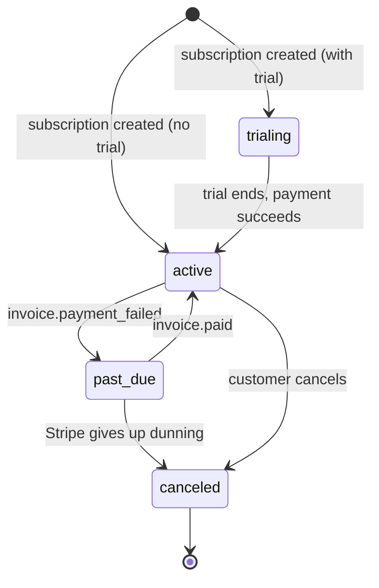

`src/domains/billing/`

# Billing

## Purpose

Owns plan catalog, subscription lifecycle, and the Stripe webhook integration. Stripe is the **source of truth** for subscription state — every state change in our database is the result of a Stripe-confirmed event. Internal endpoints that "create" or "change" a subscription proxy the call to Stripe and rely on the webhook to reconcile state shortly after.

What it owns:

- The `billing.plans`, `billing.subscriptions`, `billing.stripe_webhook_events`, and `billing.stripe_subscription_tombstones` tables.
- The Stripe client wrapper and webhook signature verification.
- Idempotent inbound webhook ingestion (the `transactional-outbox` pattern, applied inbound).
- The user-facing subscription HTTP API (`POST`/`PATCH`; cancellation is `POST .../cancel`, there is no DELETE) that proxies to Stripe.

What it does not own: invoicing UI; customer dunning emails (Stripe's own dunning handles the retries and emails); an audit trail (billing emits no audit events today).

## Key invariants

- **Stripe is authoritative**: state transitions on `subscriptions.status` are gated by Stripe webhook events. We never optimistically write `active` → `past_due` from internal logic.
- **Inbound idempotency on `event.id`**: Stripe retries are safe — a `UNIQUE (provider_event_id)` constraint on `stripe_webhook_events` rejects duplicates.
- **Stale-event rejection**: if a webhook arrives with `event.created_at` older than the row's last update, we reject the change so out-of-order delivery doesn't roll state backwards.
- **Network I/O outside RLS contexts**: Stripe API calls **must not** run inside `withOrganizationDatabaseContext` (would hold a pool checkout across a remote round trip). Enforced by `pnpm test:global` (`rls-context-network-isolation.global.test.ts`).
- **One subscription per organization**: enforced at the service layer; many concurrent attempts to create a second subscription resolve to a single Stripe subscription via the forwarded idempotency key.
- **No Stripe-vs-DB plan divergence**: a Stripe-backed subscription cannot change to a plan that has no Stripe price id for its billing cycle — `changePlan` fails closed (`422 planNotAvailableForBillingCycle`) rather than updating the local plan while Stripe keeps billing the old price. Only a genuinely local-only subscription (no `provider_subscription_id`) may change to a price-less plan. Every mutating Stripe call (create / change-plan / cancel / cancel-now / **offboarding cancel** / resume) carries a stable idempotency key so retries dedup.

## Sub-domains

| Sub-domain | Purpose |
| --- | --- |
| [plan](src/domains/billing/sub-domains/plan/) | Plan catalog (price, features, limits). Public read; admin-only write. |
| [subscription](src/domains/billing/sub-domains/subscription/) | Subscription lifecycle bound to a Stripe customer + Stripe subscription. |
| [stripe-webhook](src/domains/billing/sub-domains/stripe-webhook/) | Inbound webhook ingestion, signature verification, idempotent persistence, reclaim worker. |

## Patterns used

This domain implements the contracts documented in [src/PATTERNS.md](src/PATTERNS.md):

- `tenant-isolation` / `rls-context` — subscriptions are organization-scoped; reads/writes run inside `withOrganizationDatabaseContext`. The `subscriptions_tenant_isolation` policy carries an explicit `WITH CHECK` pinned to the active-org GUC (the `USING` arm keeps the retention bypass for SELECT/DELETE), so no write — including a retention-context one — can land a foreign `organization_id`. Stripe webhook side effects resolve their tenant from the **database mapping** (subscription id, then customer id) whenever one exists, overriding attacker-influencable Stripe metadata; metadata is only the last-resort binding for a first-contact Dashboard-origin subscription, backstopped by the WITH CHECK.
- `idempotency` — every mutating subscription endpoint requires `X-Idempotency-Key`; the same key is forwarded to Stripe.
- `transactional-outbox` — applied **inbound** to Stripe webhooks (claim row, process, mark processed; reclaim if stuck).
- `soft-delete` does **not** apply to subscriptions or plans (immutable billing ledger).

## Cross-domain flows

- `subscription-change-flow` — Stripe-driven reconciliation of subscription state.
- `dunning-flow` — Stripe-driven `past_due` → recovery or cancellation (Stripe handles the dunning emails).

## Lifecycle

## Events

- Emits: none — subscription state changes are persisted directly from verified Stripe webhooks; no in-process domain events are published.
- Consumes: Stripe webhook events (verified, deduplicated, persisted, then dispatched to the appropriate `subscription` sub-domain method).

## External integrations

- **Stripe** — subscriptions, invoices, customer portal links, webhooks. Wrapped by [src/infrastructure/payment/stripe.client.ts](src/infrastructure/payment/stripe.client.ts) which adds an `opossum` circuit breaker + Sentry instrumentation.

## Failure modes

- **Stripe API timeout (user-initiated path)** → 502 to the client; subscription state is unchanged in DB; the Stripe webhook arrives later and reconciles.
- **Invalid Stripe signature** → 400; Stripe retries with backoff.
- **Worker crash mid-processing** → row stays in `processing`; reclaim worker (`stripe-webhook-event-reclaim.processor`) restarts after `STRIPE_WEBHOOK_STUCK_PROCESSING_LEASE_MINUTES = 15`.
- **DLQ** — `stripe-webhook-event-reclaim` and `stripe-webhook-event-retention` queues each have a sibling `<name>-dlq` for final-retry failures.

## Policy constants

See [src/POLICIES.md](src/POLICIES.md) for the full rationale:

- `STUCK_SENDING_LEASE_MINUTES = 15`
- `STRIPE_WEBHOOK_STUCK_PROCESSING_LEASE_MINUTES = 15`
- `IDEMPOTENCY_RESPONSE_CACHE_TTL_SECONDS = 86 400` (mirrors Stripe's replay window)

## Related runbooks

- [Stripe webhook replay](docs/deployment/runbooks/stripe-webhook-replay.md) (when present)
