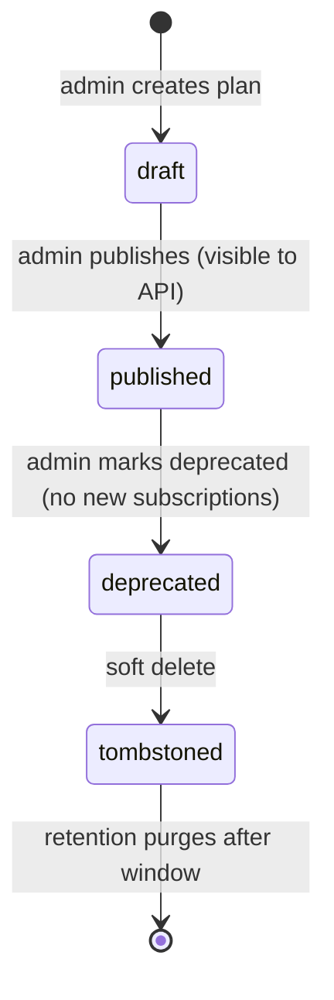

`src/domains/billing/sub-domains/plan/`

# Plan

Parent: [billing](../../billing.overview.md)

## Purpose

Plan catalog: the set of subscription plans offered to organizations, with price, feature flags, limits, and the Stripe `price_id` each plan maps to. The catalog is read-mostly (cached at the edge) and rarely changes; writes are admin-only.

## Key invariants

- **Dual Stripe price ids**: a plan carries `stripe_price_monthly_id` and `stripe_price_yearly_id` (varchar, nullable) — one plan maps to a monthly **and** a yearly Stripe price. A cycle with no price id is not Stripe-billable (e.g. a free plan, or a plan offered on only one cycle); changing a Stripe-backed subscription to such a plan is rejected (`422`, see `billing.overview.md`).
- **Public read endpoint cached by HTTP**: `Cache-Control: max-age=300, stale-while-revalidate=60` aligned with `CATALOG_CACHE_*` constants.
- **Hard delete forbidden**: plans soft-delete only (subscriptions reference them by FK).
- **Identified by `public_id`** (Paddle-style prefixed id), not a slug — the `plans` table has no slug column.

## Lifecycle

## External integrations

- **Stripe** — every published plan must have a corresponding Stripe price. The admin write path validates the price exists.

## Failure modes

- **Stripe `price_id` doesn't exist** → 400 on plan create/update.
- **Plan referenced by an active subscription** → 409 on delete; admin must migrate subscribers first.

## Policy constants

- `CATALOG_CACHE_MAX_AGE_SECONDS = 300`
- `CATALOG_CACHE_STALE_WHILE_REVALIDATE_SECONDS = 60`
