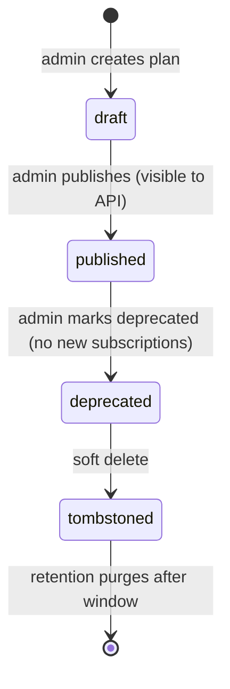

`src/domains/billing/sub-domains/plan/`

# Plan

Parent: [billing](../../billing.overview.md)

## Purpose

Plan catalog: the set of subscription plans offered to organizations, with price, feature flags, limits, and the Stripe `price_id` each plan maps to. The catalog is read-mostly (cached at the edge) and rarely changes; writes are admin-only.

## Key invariants

- **`stripe_price_id` is unique per plan**: a single plan maps to exactly one Stripe price.
- **Public read endpoint cached by HTTP**: `Cache-Control: max-age=300, stale-while-revalidate=60` aligned with `CATALOG_CACHE_*` constants.
- **Hard delete forbidden**: plans soft-delete only (subscriptions reference them by FK).
- **Slug is URL-safe** and unique; matches `SLUG_REGEX`.

## Lifecycle

## External integrations

- **Stripe** — every published plan must have a corresponding Stripe price. The admin write path validates the price exists.

## Failure modes

- **Stripe `price_id` doesn't exist** → 400 on plan create/update.
- **Plan referenced by an active subscription** → 409 on delete; admin must migrate subscribers first.
- **Slug collision** → 409.

## Policy constants

- `CATALOG_CACHE_MAX_AGE_SECONDS = 300`
- `CATALOG_CACHE_STALE_WHILE_REVALIDATE_SECONDS = 60`
