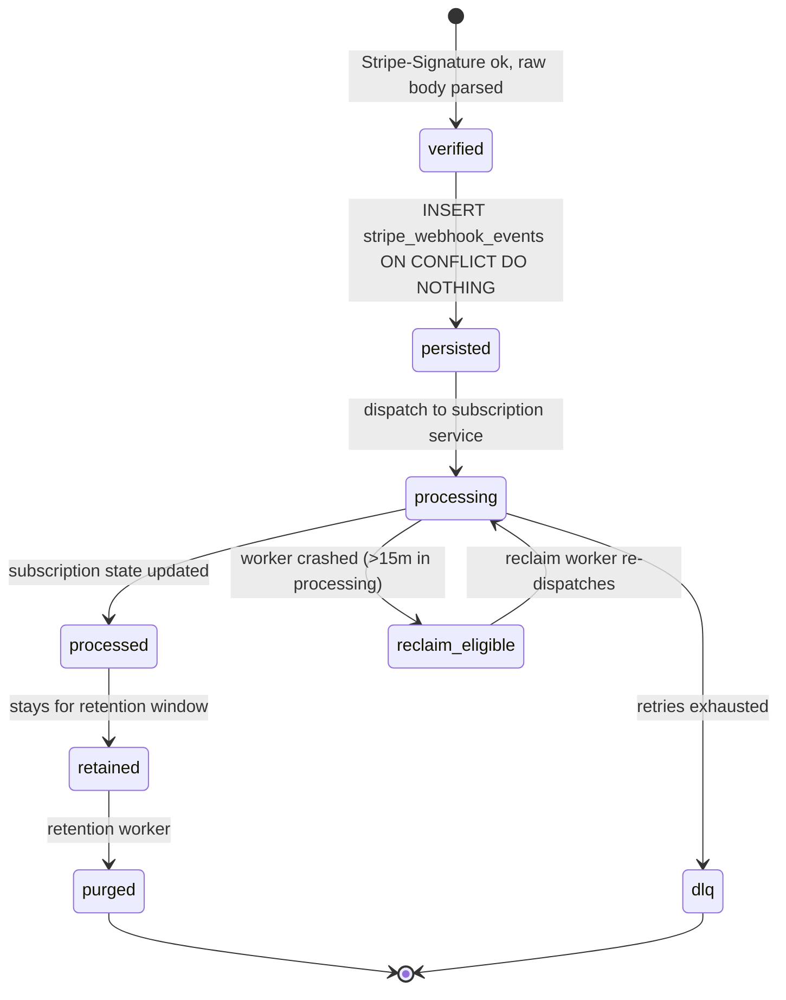

`src/domains/billing/sub-domains/stripe-webhook/`

# Stripe webhook

Parent: [billing](../../OVERVIEW.md)

## Purpose

Inbound endpoint for every Stripe billing event. Verifies the `Stripe-Signature` header against `STRIPE_WEBHOOK_SECRET`, persists the event idempotently keyed on `event.id`, dispatches the work to the appropriate `subscription` sub-domain method, and reclaims rows stuck in `processing` after worker crashes.

The receiver is registered at two paths sharing the same handler:

- `POST /api/v1/billing/webhook` — canonical; new Stripe Dashboard endpoints must use this URL.
- `POST /api/v1/billing/stripe/webhook` — deprecated alias retained while live Stripe configurations migrate.

## Key invariants

- **Raw body for signature verification**: the route disables JSON parsing on the body so the signature can be verified byte-for-byte.
- **Idempotent on `event.id`**: `stripe_webhook_events.provider_event_id UNIQUE`. Stripe retries are no-ops once we've persisted an event.
- **Stale-event protection**: subscription sync uses strict `<` on `last_stripe_event_created_at` so same-second stale updates cannot overwrite newer state; cancellation still uses `<=` so a terminal delete at the same timestamp wins.
- **Reclaim window**: rows in `processing` longer than `STRIPE_WEBHOOK_STUCK_PROCESSING_LEASE_MINUTES = 15` may be reclaimed for retry by the reclaim worker.
- **Per-source DLQ**: `stripe-webhook-event-reclaim-dlq` and `stripe-webhook-event-retention-dlq` capture final-retry failures.

## Lifecycle

## Events

- Consumes: every Stripe webhook type currently registered (subscription, invoice, customer). Subscribed via `STRIPE_WEBHOOK_SECRET` configuration on the Stripe side.

## External integrations

- **Stripe** — inbound only.

## Failure modes

- **Invalid signature** → 400; Stripe retries.
- **Duplicate `event.id`** → 200 (idempotent no-op); the unique constraint deduplicates.
- **Worker crash mid-processing** → row stays `processing`; reclaim worker recovers after 15 min.
- **Subscription dispatch failure** → row stays `processing`, retried; final failure → DLQ + Sentry.

## Policy constants

- `STRIPE_WEBHOOK_STUCK_PROCESSING_LEASE_MINUTES = 15`
- `STUCK_SENDING_LEASE_MINUTES = 15`

## Related runbooks

- Stripe webhook replay procedure (when present in [docs/deployment/runbooks/](docs/deployment/runbooks/))
