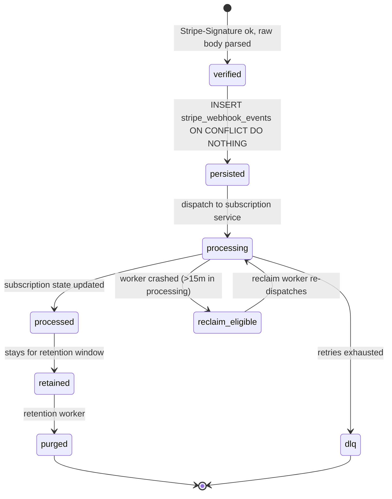

`src/domains/billing/sub-domains/stripe-webhook/`

# Stripe webhook

Parent: [billing](../../billing.overview.md)

## Purpose

Inbound endpoint for every Stripe billing event. Verifies the `Stripe-Signature` header against `STRIPE_WEBHOOK_SECRET`, persists the event idempotently keyed on `event.id`, dispatches the work to the appropriate `subscription` sub-domain method, and reclaims rows stuck in `processing` after worker crashes.

The receiver is registered at the canonical path:

- `POST /api/v1/billing/webhook` — Stripe Dashboard endpoints and the Stripe CLI (`stripe listen --forward-to`) must use this URL.

## Key invariants

- **Raw body for signature verification**: the route disables JSON parsing on the body so the signature can be verified byte-for-byte.
- **Idempotent on `event.id`**: `stripe_webhook_events.provider_event_id UNIQUE`. Stripe retries are no-ops once we've persisted an event.
- **Stale-event protection**: subscription sync uses strict `<` on `last_stripe_event_created_at` so same-second stale updates cannot overwrite newer state; cancellation still uses `<=` so a terminal delete at the same timestamp wins.
- **Tenant scope is database-authoritative when a mapping exists**: the owning organization for a subscription-lifecycle event is resolved from the locally-persisted subscription row (by provider subscription id) or, for a not-yet-mapped `customer.subscription.created`, from the customer mapping (`resolve_organization_public_id_for_stripe_customer`). When either mapping resolves, Stripe `metadata.organization_id` is reduced to a **cross-check** — a disagreement throws and the database value wins, so an attacker with Stripe-side write access who stamps `metadata.organization_id` on an existing customer's subscription cannot redirect its events to another tenant. Metadata is the binding of **last resort** only for a genuinely first-contact Dashboard-origin subscription whose customer is also unknown locally (the fallback-INSERT path); the `subscriptions_tenant_isolation` WITH CHECK is the backstop there — a metadata value naming a non-existent org resolves to no GUC id and the write fails closed.
- **Subscription writes are RLS-confined**: the `subscriptions_tenant_isolation` policy declares an explicit `WITH CHECK` pinned to the active-org GUC (no retention bypass on the write side), so every webhook-driven INSERT/UPDATE must land in the resolved tenant.
- **Reclaim window**: rows in `processing` longer than `STRIPE_WEBHOOK_STUCK_PROCESSING_LEASE_MINUTES = 15` may be reclaimed for retry by the reclaim worker. The reclaim scan and the failed-count gauge use the partial index `idx_stripe_webhook_events_reclaimable` (`WHERE processing_status IN ('failed','processing')`); the failed-count tally is capped at `STRIPE_WEBHOOK_FAILED_COUNT_CAP = 10000` so a prolonged Stripe outage cannot turn the gauge refresh into an unbounded scan.
- **Catch-up sweep**: the `stripe-webhook-event-catchup` worker polls `events.list` over the last `STRIPE_WEBHOOK_EVENT_CATCHUP_WINDOW_MINUTES` and re-ingests events absent from the ledger entirely — the durable backstop for webhooks dropped while the API was down longer than the signature-tolerance window (`STRIPE_WEBHOOK_TOLERANCE_SECONDS`). Reclaim retries known-but-failed rows; catch-up recovers never-seen events.
- **Per-source DLQ**: `stripe-webhook-event-reclaim-dlq` and `stripe-webhook-event-retention-dlq` capture final-retry failures.

## Lifecycle

## Events

- Consumes: every Stripe webhook type currently registered (subscription, invoice, customer). Subscribed via `STRIPE_WEBHOOK_SECRET` configuration on the Stripe side.

## External integrations

- **Stripe** — inbound only.

## Failure modes

- **Invalid signature** → 400; Stripe retries.
- **Duplicate `event.id`** → 200 (idempotent no-op); the unique constraint deduplicates.
- **Worker crash mid-processing** → row stays `processing`; reclaim worker recovers after 15 min.
- **Subscription dispatch failure** → row stays `processing`, retried; final failure → DLQ + Sentry.

## Policy constants

- `STRIPE_WEBHOOK_STUCK_PROCESSING_LEASE_MINUTES = 15`
- `STUCK_SENDING_LEASE_MINUTES = 15`
- `STRIPE_WEBHOOK_FAILED_COUNT_CAP = 10000`

## Related runbooks

- Stripe webhook replay procedure (when present in [docs/deployment/runbooks/](docs/deployment/runbooks/))
