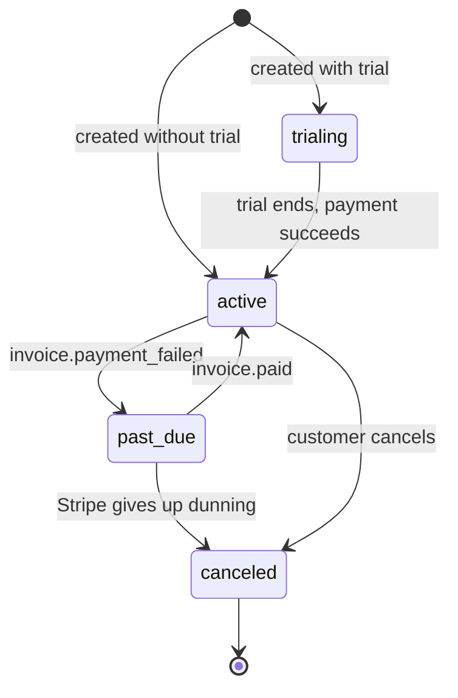

`src/domains/billing/sub-domains/subscription/`

# Subscription

Parent: [billing](../../billing.overview.md)

## Purpose

The organization's active subscription record. One row per organization, bound to a Stripe customer and Stripe subscription. State changes always flow Stripe webhook → service → DB → emit event; we never write subscription state to DB without a Stripe-confirmed event behind it.

## Key invariants

- **One subscription per organization**: enforced at the service layer; concurrent create attempts resolve to a single Stripe subscription via the forwarded idempotency key.
- **State changes are Stripe-driven**: `subscriptions.status` only transitions in response to a webhook event whose `event.created_at` is newer than the row's last update.
- **Stale-event rejection**: out-of-order webhooks are rejected so state cannot roll backward.
- **Network I/O outside RLS contexts**: Stripe API calls run **outside** `withOrganizationDatabaseContext`. The service interleaves: `withOrganizationDatabaseContext(read)` → Stripe call → `withOrganizationDatabaseContext(write)`.
- **Immutable ledger semantics**: subscription rows do not soft-delete. Cancellation transitions to `canceled`; the row stays for forensic + invoice-history value.

## Lifecycle

## Seats (REQ-4)

- The public subscription response carries `seats_total` (`subscription.seats ?? plan.included_seats`, `null` = unlimited) and `seats_used` (count of ACTIVE + INVITED memberships, resolved cross-domain via the tenancy membership service).
- **Seat enforcement** lives in tenancy's `MembershipService.create`: it calls back into `SubscriptionService.reserveSeatCeilingForMemberAdd` (a `SELECT ... FOR UPDATE` on the active subscription row) and rejects the add with `409 seat_limit_reached` when `used >= ceiling`. No-op when the org has no active subscription or the plan is unlimited.
- **Stripe quantity sync** is out-of-band: member add/remove and change-plan enqueue a `subscription-seat-sync` job (`queues/` + `workers/`); the worker pushes the member count to Stripe (`updateSubscriptionQuantity`) and persists `subscriptions.seats`. The `customer.subscription.updated` webhook also reconciles `seats` from the Stripe item quantity. A Stripe outage never fails member management.
- **Cross-domain DI**: membership↔subscription is a true cycle (billing reads `seats_used` from tenancy; tenancy enforces the limit via billing), broken by late-wiring `SubscriptionService` into `MembershipService.wireSeatEnforcement` in the composition root.

## Events

- Emits: none — subscription state transitions are persisted directly from Stripe webhook events; no in-process domain events are published.

## External integrations

- **Stripe** — wrapped by [src/infrastructure/payment/stripe.client.ts](src/infrastructure/payment/stripe.client.ts) with circuit breaker + Sentry instrumentation.

## Failure modes

- **Stripe API failure on a user-initiated mutation (`create` / `cancel` / `resume`)** → the provider adapter is **fail-closed**: it logs and throws `ServiceUnavailableError` (503, `errors:paymentProviderUnavailable`) *before* any local write, so subscription state in DB is unchanged (no row created, no `cancel_at_period_end` / `status` flip). The Stripe webhook reconciles once Stripe recovers.
- **Stripe `Idempotency-Key` reuse with different payload** → Stripe returns 400; we surface as 400 to the client.
- **Webhook event timestamp older than the row** → service rejects the change (logs at info), Stripe retry will eventually pass with the latest event.

## Policy constants

- `IDEMPOTENCY_RESPONSE_CACHE_TTL_SECONDS = 86 400`
