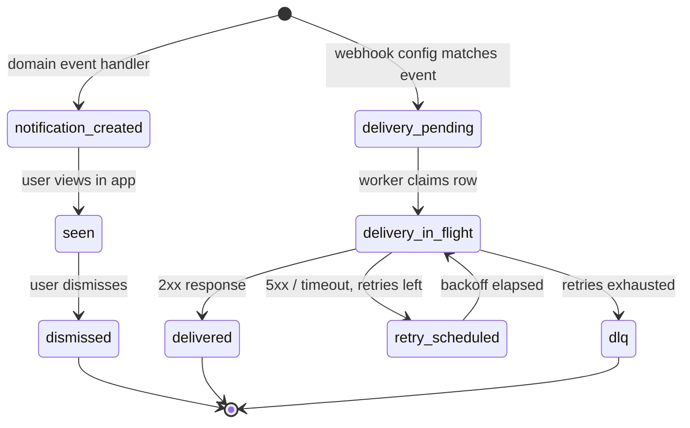

`src/domains/notify/`

# Notify

## Purpose

Two delivery surfaces: **in-app notifications** (rows users see in the UI) and **outbound webhook delivery** (HTTPS calls from this platform to customer-configured webhook endpoints). Plus the cross-domain glue that turns billing / membership / auth domain events into notifications and webhook payloads.

What it owns:

- The `notify.notifications` table and its delivery worker.
- The `notify.webhooks`, `notify.webhook_delivery`, and `notify.webhook_delivery_attempt` tables (the outbound webhook outbox + retry log).
- The webhook delivery worker, retry policy, DLQ, and request-id forwarding.
- The cross-domain event listeners that turn `BILLING_EVENT.*`, `MEMBER_INVITATION_EVENT.*`, etc., into notifications and webhook deliveries.

What it does not own: outbound email — that belongs to the [src/infrastructure/mail/](src/infrastructure/mail/) module. Notify enqueues mail jobs but does not send them itself.

## Key invariants

- **At-least-once outbound webhook delivery**: each webhook configuration produces a `webhook_delivery` row inside the originating transaction. The delivery worker claims it atomically, retries with exponential backoff, and lands final failures in DLQ.
- **Per-attempt audit**: every HTTP attempt produces a `webhook_delivery_attempt` row capturing status, latency, response headers (truncated), and error class. The full attempt history is queryable.
- **Request-id forwarding**: outbound deliveries include the originating `X-Request-Id` so customers can correlate their server logs with our audit log.
- **Tenant-scoped**: webhook configurations belong to organizations; deliveries fire only to URLs that organization owns.
- **No payload injection from other tenants**: the event payload always derives from the originating organization's data, never merged across tenants.

## Sub-domains

| Sub-domain | Purpose |
| --- | --- |
| [notification](src/domains/notify/sub-domains/notification/) | In-app notification rows: create, list, mark-read, delete. Cursor-paginated read API. |
| [webhook](src/domains/notify/sub-domains/webhook/) | Customer-configured webhook endpoints + the outbound delivery system (queue, worker, attempt log, DLQ). Includes nested `webhook-event` resource. |

## Patterns used

This domain implements the contracts documented in [src/PATTERNS.md](src/PATTERNS.md):

- `transactional-outbox` — `webhook_delivery` is the outbox; the delivery worker is the dispatcher.
- `tenant-isolation` / `rls-context` — every read and write scoped to the active organization (or the worker's pinned org context).
- `idempotency` — webhook configuration writes accept `X-Idempotency-Key`.
- `audit-emission` — webhook configuration changes record audit rows.
- `soft-delete` — webhook configurations and delivery rows tombstone with `deleted_at` (subject to retention windows).

## Cross-domain flows

The notify domain is the **listener** at the end of every cross-domain flow that produces user-visible side effects:

- `subscription-change-flow`, `dunning-flow` — billing events → in-app notifications + outbound webhook deliveries.
- `organization-invitation-flow` — invitation create/accept events may notify org admins via in-app + webhook.
- `signup-flow`, `login-flow` — auth events do **not** flow through notify (mail is direct via the mail outbox).

## Lifecycle

## Events

- Emits: `NOTIFY_EVENT.WEBHOOK_DELIVERY_REQUESTED` (internal — used by the outbox dispatcher).
- Consumes: `BILLING_EVENT.SUBSCRIPTION_CREATED`, `_UPDATED`, `_PAST_DUE`, `_ACTIVE`, `_CANCELED`, `MEMBER_INVITATION_EVENT.*`, and any future domain events that should produce a notification or webhook.

The cross-domain handlers register through the `domainContainersPlugin` path (in [src/domains/notify/events/](src/domains/notify/events/)) because they need `WebhookRepository` from DI — see [CLAUDE.md "Domain events"](CLAUDE.md).

## External integrations

- Customer webhook endpoints (HTTP/HTTPS). Outbound calls use the standard Node fetch + a circuit breaker via `opossum` to protect us from a long-tail of bad customer endpoints.

## Failure modes

- **Customer endpoint returns 5xx / times out** → retry with exponential backoff up to N attempts; final failure → DLQ. Each attempt logged.
- **Worker crash mid-delivery** → BullMQ stalls the job; another worker picks it up after `BULLMQ_WEBHOOK_LOCK_DURATION_MS = 60 000`.
- **Customer endpoint slow but eventually responds** → bounded by the per-attempt timeout (env-tunable); latency logged on the attempt row.
- **Notification fan-out failure** → notification is best-effort relative to the originating event; failure does not roll back the originating transaction.

## Policy constants

See [src/POLICIES.md](src/POLICIES.md):

- `BULLMQ_WEBHOOK_LOCK_DURATION_MS = 60 000`
- `BULLMQ_RETENTION_LOCK_DURATION_MS = 120 000` (used by retention sweepers on attempt logs)
