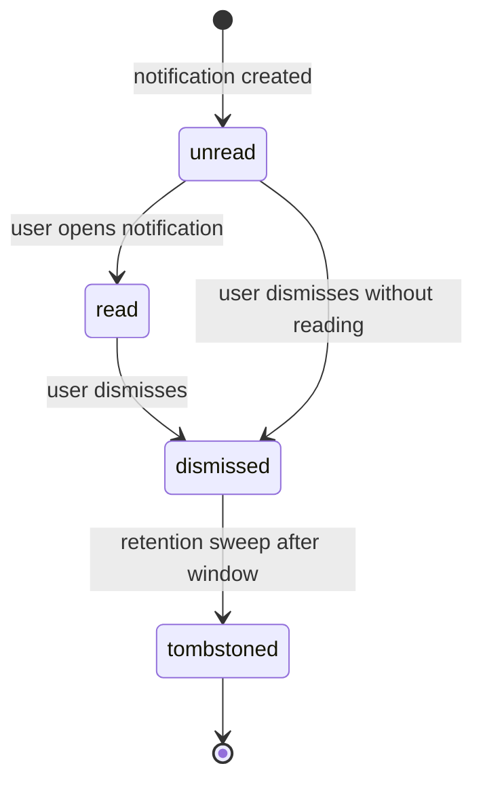

`src/domains/notify/sub-domains/notification/`

# Notification

Parent: [notify](../../notify.overview.md)

## Purpose

In-app notification rows: the user-visible feed. Rows are created via `createAndDispatchNotification` (persist the row + enqueue channel dispatch); users mark them read or dismiss them via the API. There is no cross-domain event handler creating notifications today.

## Key invariants

- **No insert-time dedupe key**: the `notifications` table has no `source_event_id` column and no `(user, …)` uniqueness, so creating the same logical notification twice yields two rows. Idempotency is enforced **downstream** (dispatch + email), not at insert.
- **Idempotent dispatch enqueue**: the dispatch job uses `jobId = notification-<id>`, so a recovery/redelivery re-enqueue of the same persisted notification is a BullMQ no-op within the retention window — one notification row never fans out (or emails) twice.
- **Bounded mark-all-read**: `markAllReadForUser` marks the unread backlog in `NOTIFICATION_MARK_ALL_READ_BATCH_SIZE`-row batches (looping until drained), so a huge backlog cannot become one unbounded, long-held write that stalls concurrent inserts for that user; the returned count is summed from each statement's `RETURNING` (never a separate pre-count).
- **Email outcome is honest**: the worker reports `email:outbox_pending` (not `email:queued`) when the mail-outbox row persisted but its BullMQ enqueue failed — the mail-outbox sweeper re-enqueues it and the `mail_outbox_pending` gauge tracks the depth.
- **Tenant-scoped**: notifications belong to a `(user, organization)` pair. Reads are scoped through the standard tenant context.
- **Read state is monotonic**: `unread → read → dismissed`. Marking a dismissed notification "unread" is not allowed.
- **Best-effort fan-out**: a notification fan-out failure does not roll back the originating transaction (it's a downstream side effect).

## Lifecycle

## Events

- Consumes: no domain events — notification rows are created via `createAndDispatchNotification` (persist + enqueue channel dispatch), then delivered asynchronously by the `notification` BullMQ worker.

## Failure modes

- **Worker crash during fan-out** → BullMQ retries the dispatch job (keyed `notification-<id>`), which re-reads the **same** persisted row rather than inserting a new one; the email channel's mail-outbox `dedupeKey` collapses duplicate sends. (The in-app row is created once by the handler, not by the dispatch worker.)
- **Recipient user soft-deleted** → notification is skipped, logged at info.
