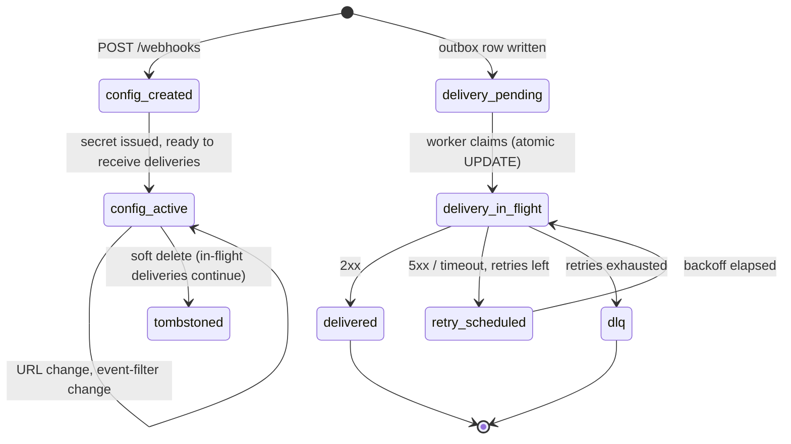

`src/domains/notify/sub-domains/webhook/`

# Webhook

Parent: [notify](../../notify.overview.md)

## Purpose

Customer-configured outbound webhook endpoints + the entire delivery pipeline: per-organization webhook configurations (URL, secret, event filter), the `webhook_delivery` outbox, the delivery worker with exponential backoff and DLQ, and the per-attempt audit log (`webhook_delivery_attempt`). The nested [webhook-event](src/domains/notify/sub-domains/webhook/webhook-event/) resource models the catalog of event types customers can subscribe to.

## Key invariants

- **At-least-once delivery**: `webhook_delivery` is an outbox row written inside the originating transaction. The worker claims it atomically and retries on failure.
- **Enqueue after commit**: the `WEBHOOK_DELIVERY_REQUESTED` handler calls `runEnqueueAfterCommit` so BullMQ jobs are not published until `eventBus.flushOnCommit` runs (HTTP `onResponse` after the request transaction commits). Workers and scripts without an HTTP onCommit scope enqueue immediately.
- **Per-attempt audit**: every HTTP attempt produces a `webhook_delivery_attempt` row capturing status, latency, error class, response headers (truncated). The full attempt history is forensically queryable.
- **Request-id propagation**: outbound deliveries carry the originating `X-Request-Id` so customers can correlate their server logs with our audit.
- **HMAC signature on every payload**: each delivery is signed with the per-webhook secret; customers verify signature in their handler.
- **Exponential backoff**: BullMQ-managed; final failure → DLQ + Sentry. Attempts capped per the policy in [src/POLICIES.md](src/POLICIES.md).
- **Tenant-scoped**: webhook configurations belong to organizations; deliveries fire only to URLs that organization owns.
- **Secrets never logged in URLs**: structured logs and circuit-breaker events record origin, path, and a short hash of the full URL — never query strings, fragments, or embedded credentials.

## Lifecycle

## Events

- Consumes: `NOTIFY_EVENT.WEBHOOK_DELIVERY_REQUESTED` (internal) — emitted by the outbox dispatcher and consumed by the delivery enqueuer. Webhook payloads derive from the originating organization's data.

## External integrations

- **Customer webhook endpoints** (HTTP/HTTPS). Outbound calls use the standard Node fetch + a circuit breaker via `opossum` to protect us from a long-tail of bad endpoints.

## Failure modes

- **Customer endpoint slow but responsive** → bounded by per-attempt timeout (env-tunable); latency captured.
- **Customer endpoint returns 5xx / times out** → exponential backoff retries; final failure → DLQ. Customer can also rotate the URL while deliveries are in flight.
- **Worker crash mid-delivery** → BullMQ stalls the job; another worker picks it up after `BULLMQ_WEBHOOK_LOCK_DURATION_MS = 60 000`.
- **Webhook secret rotation while a delivery is in flight** → in-flight payload uses the secret it was signed with; subsequent attempts use the new secret.

## Policy constants

- `BULLMQ_WEBHOOK_LOCK_DURATION_MS = 60 000`
- `BULLMQ_RETENTION_LOCK_DURATION_MS = 120 000` (used by attempt-log retention sweep)
