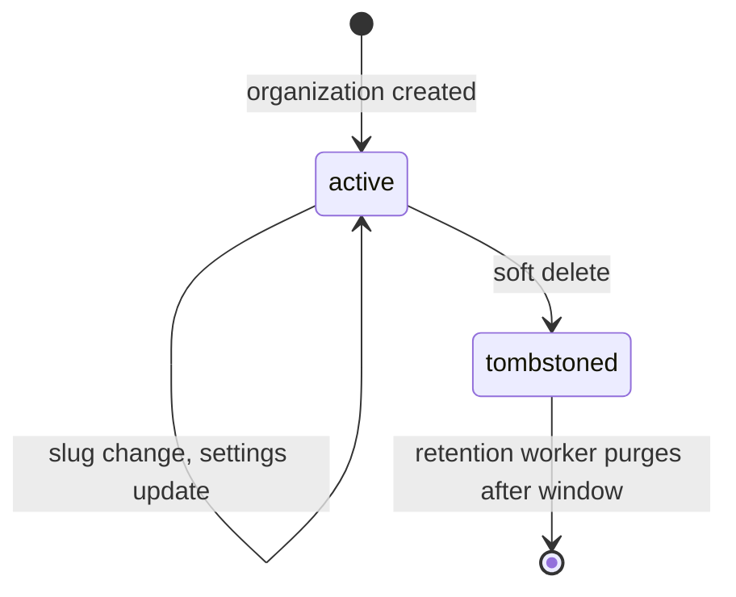
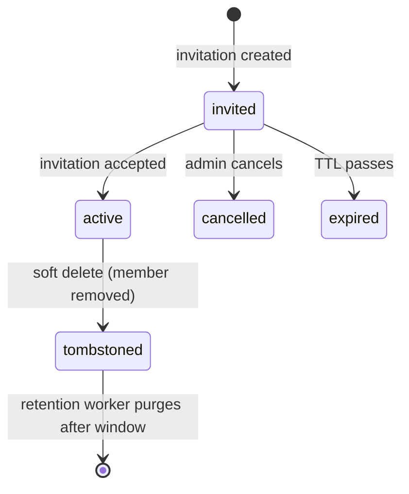

`src/domains/tenancy/`

# Tenancy

## Purpose

Multi-tenant primitives for the platform: organizations, memberships, member roles + permissions, invitations, and organization API keys. This domain owns the **enforcement** of the `tenant-isolation` pattern at every layer (HTTP middleware, RLS GUC, permission check) and is the canonical resolver for "is user X allowed to do action Y in organization Z".

What it owns:

- The `tenancy.organizations`, `tenancy.memberships`, `tenancy.member_roles`, `tenancy.permissions`, `tenancy.member_invitations`, and `tenancy.organization_api_keys` tables (plus settings + notification policy children).
- Organization slug uniqueness, x-organization-id format (URL-safe public ids).
- The Redis-backed permission cache (`PERMISSION_CACHE_DEFAULT_TTL_SECONDS = 300`) and the `requireOrganizationPermission` Fastify preHandler.
- The invitation token issuance (parallel construction to magic-link tokens).

What it does not own: identity proof (lives in [auth](src/domains/auth/)), user profile (lives in [user](src/domains/user/)), audit trail (lives in [audit](src/domains/audit/)).

## Key invariants

- **Header + path agreement**: `X-Organization-Id` header and `/organizations/:id/` path segment must agree when both are present (mismatch = 400). Otherwise the platform could permission-check one org while RLS GUC is set to another.
- **Permission cache invalidation on every write**: any change to a user's role / permissions / membership invalidates the per-`(user, organization)` cache key in Redis before the response is returned.
- **Public-id only at the API boundary**: every URL and JSON payload uses the URL-safe public id. The internal numeric id never leaves the database layer.
- **Invitation tokens are one-shot**: atomic `UPDATE ... RETURNING` consumes the invitation on accept; second attempt sees `status=accepted`.
- **No cross-org membership reads from the wrong context**: workers must use `runTenantScopedWorkerJob` (with `organizationPublicId` in the job payload) and the proper RLS context; HTTP code goes through `tenant.middleware`.

## Sub-domains

| Sub-domain | Purpose |
| --- | --- |
| [organization](src/domains/tenancy/sub-domains/organization/) | Organization lifecycle (create, slug change, delete) and child resources: `organization-settings`, `organization-notification-policy`, `organization-api-key`. |
| [membership](src/domains/tenancy/sub-domains/membership/) | Member lifecycle: who is in which organization with which role. Includes nested `member-invitation` resource (token issuance + accept). |
| [member-roles](src/domains/tenancy/sub-domains/member-roles/) | Per-organization role definitions and the join table `member-role-permission`. |
| [permission](src/domains/tenancy/sub-domains/permission/) | Permission resolution: `authorization.service.ts` (Redis-cached) + `permission-cache.service.ts`. The single resolver consulted by `requireOrganizationPermission`. |

## Patterns used

This domain is the **owner** of `tenant-isolation` and `rls-context`; every other domain uses it. See [src/PATTERNS.md](src/PATTERNS.md):

- `tenant-isolation` — the defining domain. Every read/write either runs through HTTP `tenant.middleware` or worker `withOrganizationContext`.
- `rls-context` — same; this domain emits the GUC that RLS policies on every other table consume.
- `audit-emission` — every membership change, role change, and invitation event records an audit row.
- `idempotency` — invitation create + organization API key issuance accept `X-Idempotency-Key`.
- `soft-delete` — organizations, memberships, member roles, and invitations tombstone with `deleted_at`. Tombstone retention workers purge after the window.
- `transactional-outbox` — invitation emails flow through `event-bus` → mail outbox → mail processor.

## Cross-domain flows

- `organization-invitation-flow` — domain owner.
- `signup-flow` — invitee may complete signup before accepting the invitation.
- `subscription-change-flow` / `dunning-flow` — `billing` writes are scoped per-organization through this domain's tenant context.

## Lifecycle

Organization lifecycle:

Membership lifecycle:

## Events

- Emits: `MEMBER_INVITATION_EVENT.CREATED`, `MEMBER_INVITATION_EVENT.RESENT` (each handler enqueues mail).
- Consumes: nothing — tenancy is the source of organization-scope events others react to.

## Failure modes

- **Header / path x-organization-id mismatch** → 400.
- **Permission cache miss while a process is recomputing** → SETNX lock holds for `PERMISSION_CACHE_RECOMPUTE_LOCK_TTL_SECONDS = 15`; other processes wait or recompute on lock expiry.
- **Permission cache invalidation gap on multi-process deploy** → bounded by `PERMISSION_CACHE_DEFAULT_TTL_SECONDS = 300` (revoked permissions auto-expire within 5 min).
- **Invitation token replay** → atomic accept consumes the row exactly once.

## Policy constants

See [src/POLICIES.md](src/POLICIES.md):

- `PERMISSION_CACHE_DEFAULT_TTL_SECONDS = 300`
- `PERMISSION_CACHE_RECOMPUTE_LOCK_TTL_SECONDS = 15`
- `ORGANIZATION_API_KEY_RAW_SECRET_BYTE_LENGTH = 32`
- `ORGANIZATION_API_KEY_PREFIX_DISPLAY_LENGTH = 8`
- `SLUG_REGEX` (organization slug format constraint)
