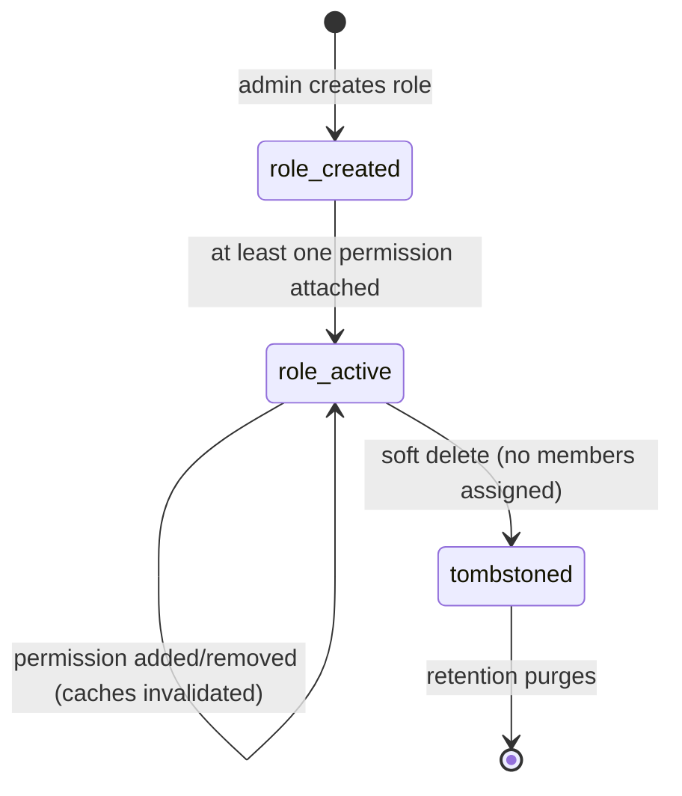

`src/domains/tenancy/sub-domains/member-roles/`

# Member roles

Parent: [tenancy](../../OVERVIEW.md)

## Purpose

Per-organization role definitions and the role ↔ permission join table. A `member_role` is a named bundle of permissions an organization owner can assign to memberships (e.g. "Owner", "Admin", "Viewer"). The nested [member-role-permission](src/domains/tenancy/sub-domains/member-roles/member-role-permission/) resource is the join table that ties roles to the catalog of permission constants.

## Key invariants

- **Roles are organization-scoped**: every role row carries `organization_id`; cross-org reads are forbidden by RLS.
- **Permission catalog is global, role assignments are scoped**: the permission constants (`TENANCY_PERMISSIONS`, `BILLING_PERMISSIONS`, etc.) are platform-defined; what a role grants is per-organization.
- **Updating a role's permissions invalidates every member's cache**: role-permission replacement and role deletion bump the organization permission cache version (`invalidateOrganizationPermissions`), orphaning every `(user, org)` cache key in the org in O(1) — a role change can affect many members, so the whole org namespace is invalidated rather than enumerating holders.
- **Built-in roles are uneditable** (when present): the seed creates "Owner" / "Admin" / "Member" with fixed permission sets that admins can clone but not edit in place.

## Lifecycle

## Failure modes

- **Personal organization** → 422 on create-role (`errors:personalOrganizationNoRoles`); custom roles are a team-org feature (the org `capabilities.can_manage_roles` is `false`).
- **Soft-deleting a role with active members** → 409; admin must reassign members first.
- **Granting a permission constant that doesn't exist** → 400.
- **Concurrent role-permission writes** → second write merges; the organization permission cache version is bumped so every affected member re-resolves.
