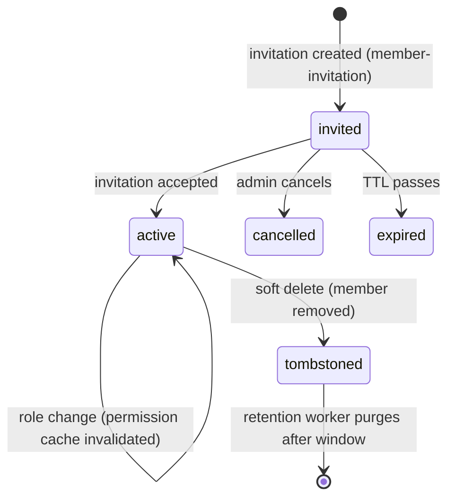

`src/domains/tenancy/sub-domains/membership/`

# Membership

Parent: [tenancy](../../OVERVIEW.md)

## Purpose

The link between users and organizations: who is in which organization with which role. Includes the nested [member-invitation](src/domains/tenancy/sub-domains/membership/member-invitation/) resource for inviting users (signed-up or not) to an organization.

## Key invariants

- **Unique `(user_id, organization_id)`**: a user has at most one membership per organization (soft-delete + re-add reuses the same logical row).
- **Membership change invalidates the permission cache**: every create / update / soft-delete invalidates the `(user, org)` Redis key before responding.
- **Invitations are one-shot**: atomic accept consumes the row exactly once.
- **Invitation tokens are hashed at rest**: same construction as magic-link / verification tokens (`sha256(raw)`).

## Lifecycle

## Events

- Emits: `MEMBER_INVITATION_EVENT.CREATED`, `MEMBER_INVITATION_EVENT.RESENT` (each handler enqueues mail).

## External integrations

- **Resend** (via mail outbox) for invitation emails.

## Failure modes

- **Invitee already a member** → 409 `errors:invitationAlreadyMember`.
- **Disposable email blocked on invite** → 400 `errors:disposableEmail`.
- **Invitation token expired** → 401 `errors:invitationTokenExpired`.
- **Invitation accepted twice** → 409 (atomic accept consumed the row on the first call).
- **Invitation cancelled before accept** → 410 `errors:invitationCancelled`.
