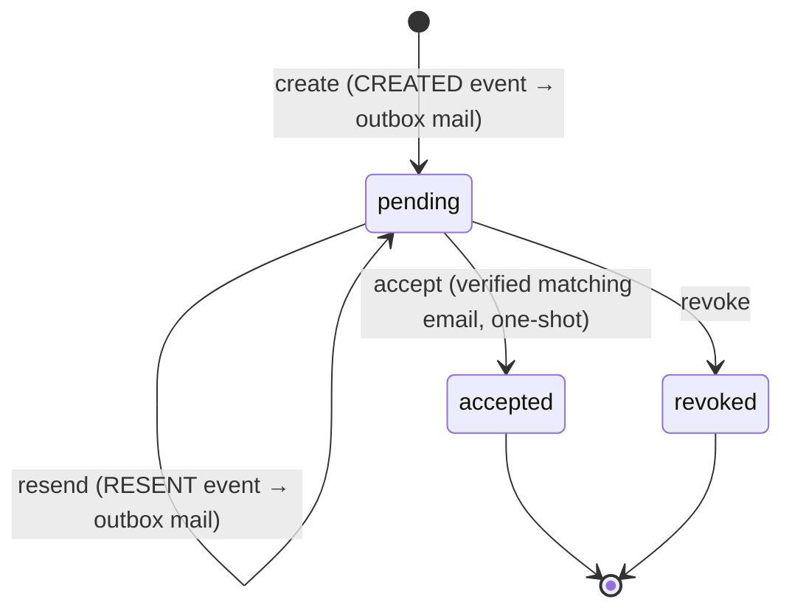

`src/domains/tenancy/sub-domains/membership/member-invitation/`

# Member invitations (nested resource)

Parent: [membership](../membership.overview.md)

## Purpose

Issues and manages organization member invitations — the invitation half of add-member-by-email. Emits domain events whose handlers enqueue the invitation email through the transactional mail outbox.

## Layout

- `member-invitation.controller.ts` / `member-invitation.service.ts` — thin HTTP + application layer (create, resend, revoke, accept)
- `member-invitation.token.ts` — token generation + hashing (raw token emailed, hash stored)
- `member-invitation.repository.ts` / `member-invitation.schema.ts` — persistence
- `member-invitation.dto.ts` / `member-invitation.validator.ts` / `member-invitation.serializer.ts` / `member-invitation.types.ts` — request/response shaping
- `events/` — `MEMBER_INVITATION_EVENT.CREATED` / `.RESENT` types, emit helpers, and handlers (registered in `register-event-handlers.ts`; they call `recordOutboxEmail()` post-commit, carrying `requestId`)
- `seed/` — seed contribution
- `__tests__/unit/` — validator/serializer/service and `unit/events/` handler suites

## Key invariants

- Invitation tokens are stored only as `sha256(raw)` — the raw token exists solely in the emailed link.
- Accept is atomic and one-shot, and is gated on a **verified** email that matches the invitation; a suspended member cannot self-restore via accept (activation requires status `INVITED`).
- Event handlers only enqueue mail via the outbox — they never fail the originating HTTP request.

## Lifecycle

