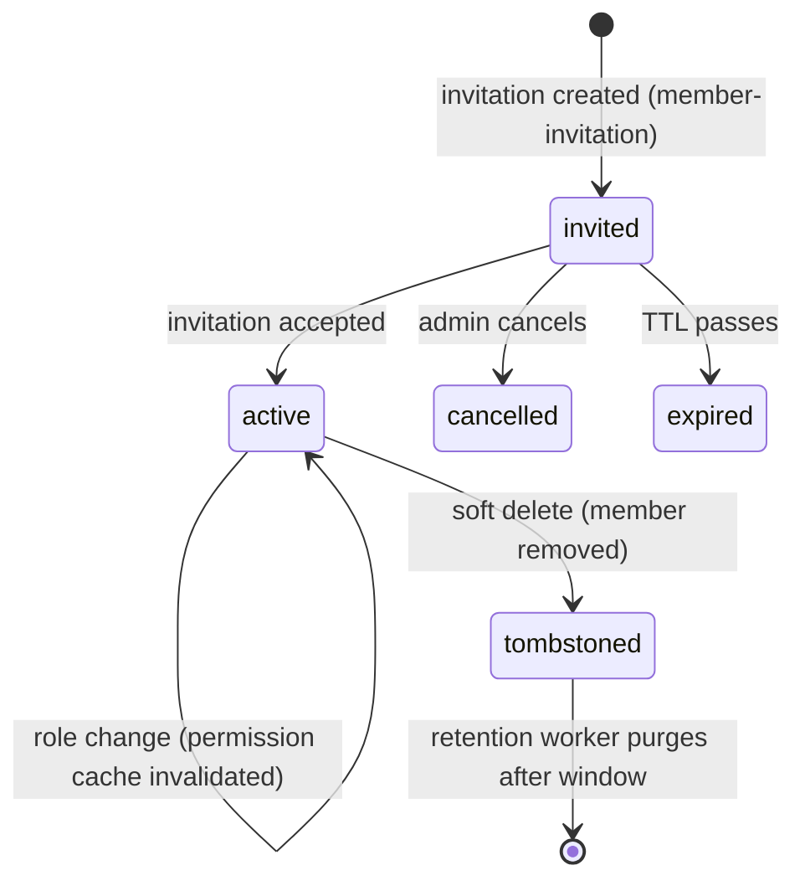

`src/domains/tenancy/sub-domains/membership/`

# Membership

Parent: [tenancy](../../tenancy.overview.md)

## Purpose

The link between users and organizations: who is in which organization with which role. Includes the nested [member-invitation](src/domains/tenancy/sub-domains/membership/member-invitation/) resource for inviting users (signed-up or not) to an organization.

## Response shape

`GET /organization/memberships` (and `/:membership_id`) embed each member's `user` summary (`id`, `email`, `first_name`, `last_name`, presigned `avatar_url`) and `role` summary (`id`, `name`) alongside the flat `user_id`/`role_id` public ids, so a members table renders without an N+1 per-row fetch. User summaries are resolved via the `auth.resolve_user_summaries_by_ids` SECURITY DEFINER function (auth.users is FORCE RLS, unreachable by a plain join under org-only context). `INVITED` rows also carry `invitation: { id, expires_at }` (the live pending invite) so the frontend can Resend/Revoke straight from the row; `ACTIVE`/`SUSPENDED` rows have `invitation: null`.

## Key invariants

- **Unique `(user_id, organization_id)`**: a user has at most one membership per organization (soft-delete + re-add reuses the same logical row).
- **Membership change invalidates the permission cache**: every create / update / soft-delete invalidates the `(user, org)` Redis key before responding.
- **Invitations are one-shot**: atomic accept consumes the row exactly once.
- **Accept is gated on proven email control**: the accept route requires authentication, an email **matching** the invitee, **and a verified email** (`403 errors:invitationRequiresVerifiedEmail` otherwise) — magic-link / OAuth onboarding verify the address, and an email/password signup-claim must enter the emailed code first. This stops a forwarded invite token (or an unverified password-claim of the invited address) from joining the org.
- **Initial activation is invitation-driven only**: accepting an invitation atomically flips the linked membership to `ACTIVE` and stamps `joined_at` in the same transaction as `accepted_at`. A manager `PATCH /memberships/:id` **cannot** set a never-joined (`joined_at IS NULL`) membership to `ACTIVE` — that returns `403 errors:membershipActivationRequiresInvitationAccept`. Reactivating a previously-active member (`SUSPENDED -> ACTIVE`, which already has `joined_at`) stays allowed so admin suspend/reactivate flows keep working. This keeps onboarding consent/audit unambiguous: a membership only becomes active when its invitee accepts.
- **Invitation tokens are hashed at rest**: same construction as magic-link / verification tokens (`sha256(raw)`).

## Lifecycle

## Events

- Emits: `MEMBER_INVITATION_EVENT.CREATED`, `MEMBER_INVITATION_EVENT.RESENT` (each handler enqueues mail).

## External integrations

- **Resend** (via mail outbox) for invitation emails.

## Failure modes

- **Invitee already a member** (ACTIVE or live INVITED) → 409 `errors:membershipAlreadyExists` (add-member-by-email path).
- **Disposable email blocked on invite** → 400 `errors:disposableEmail`.
- **Revoke** removes the auto-created INVITED membership too (soft-delete) so the members table shows no ghost invitee.
- **Invitation token expired** → 401 `errors:invitationTokenExpired`.
- **Invitation accepted twice** → 409 (atomic accept consumed the row on the first call).
- **Invitation cancelled before accept** → 410 `errors:invitationCancelled`.
