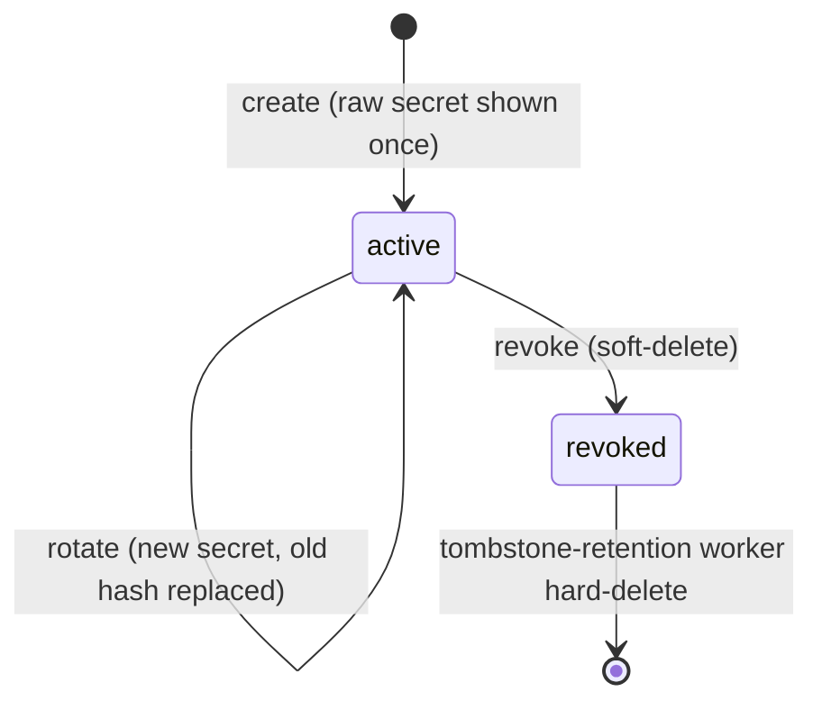

`src/domains/tenancy/sub-domains/organization/organization-api-key/`

# Organization API keys (nested resource)

Parent: [organization](../organization.overview.md)

## Purpose

Lifecycle service for organization-scoped API keys — create, list, rotate, revoke, and authenticate-by-prefix (the `X-Api-Key` middleware resolves keys through this sub-domain).

## Layout

- `organization-api-key.controller.ts` / `organization-api-key.service.ts` — thin HTTP + application layer (create/rotate/revoke/authenticate)
- `organization-api-key.repository.ts` / `organization-api-key.schema.ts` — persistence (hash + display prefix, soft-delete)
- `organization-api-key.dto.ts` / `organization-api-key.validator.ts` / `organization-api-key.serializer.ts` / `organization-api-key.types.ts` — request/response shaping
- `workers/` — tombstone-retention worker (hard-deletes soft-deleted keys after the retention window)
- `seed/` — seed contribution
- `__tests__/unit/` — service/validator/serializer/worker unit suites

## Key invariants

- The raw secret (`ak_…`, 32 random bytes) is returned **once** at create/rotate; only its `sha256` hash is stored, with an 8-char display prefix for identification — there is no way to re-read a secret.
- Key scopes are constrained by the caller's own grants: `assertCallerCanGrantPermissionCodes` rejects granting permission codes the caller cannot grant.
- Revocation is soft-delete; hard deletion happens only via the tombstone-retention worker in `workers/`.

## Lifecycle

