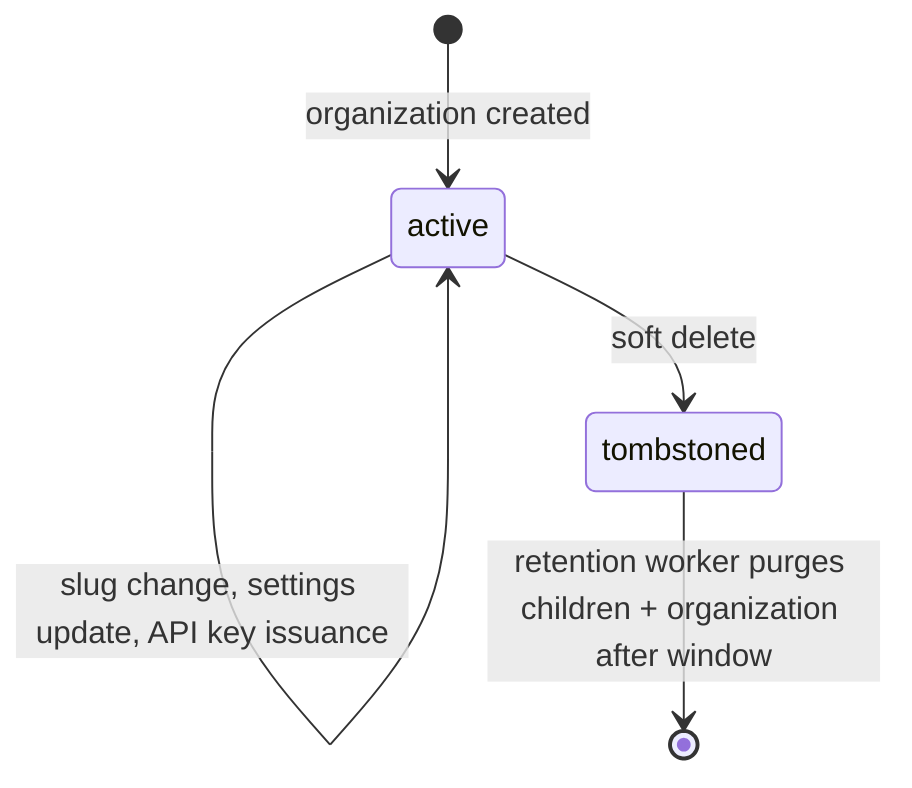

`src/domains/tenancy/sub-domains/organization/`

# Organization

Parent: [tenancy](../../tenancy.overview.md)

## Purpose

The top-level tenancy aggregate. Owns the `organizations` table (id, public id, slug, name, status, settings JSON, billing customer id) and the child resources that share its lifecycle: [organization-settings](src/domains/tenancy/sub-domains/organization/organization-settings/), [organization-notification-policy](src/domains/tenancy/sub-domains/organization/organization-notification-policy/), and [organization-api-key](src/domains/tenancy/sub-domains/organization/organization-api-key/).

## Key invariants

- **Slug is unique among LIVE teams only**: `idx_organizations_slug` is a **partial** unique index (`WHERE deleted_at IS NULL`), so a soft-deleted team releases its slug immediately for reuse instead of burning it until tombstone-retention. Matches `SLUG_REGEX`, lowercased, no leading/trailing/consecutive hyphens. Personal orgs carry a NULL slug and are not constrained here.
- **Public id is the API contract**: 21-char URL-safe; the internal numeric id never appears in URLs or JSON.
- **Slug change is rare and audited**: changing the slug rewrites organization-scoped URLs for clients; recorded with `WARNING` severity in audit.
- **Organization soft-delete cascades to child resources**: settings, API keys, and notification policy tombstone with the organization. Memberships are handled separately.

## Lifecycle

## Events

This sub-domain neither emits nor consumes domain events directly. State changes are reflected through audit-emission only.

## Failure modes

- **Slug collision** on create or rename → 409.
- **API key prefix collision** (cosmetic) → service rotates the prefix and retries.
- **Soft-delete with active subscription** → 409; admin must cancel the subscription first.

## Policy constants

- `SLUG_REGEX`
- `ORGANIZATION_API_KEY_RAW_SECRET_BYTE_LENGTH = 32`
- `ORGANIZATION_API_KEY_PREFIX_DISPLAY_LENGTH = 8`
