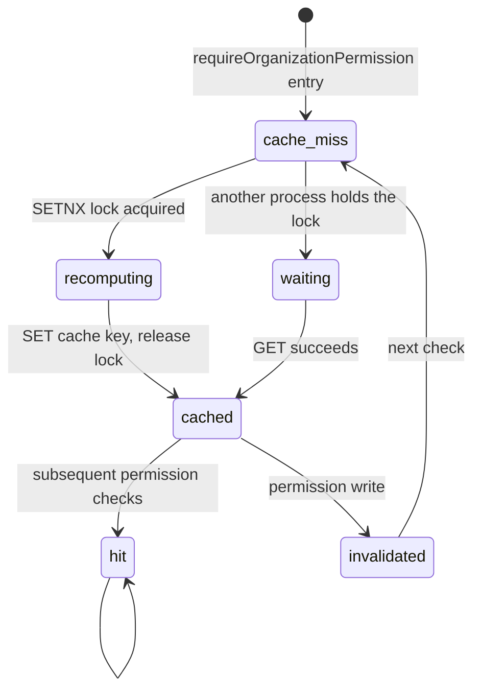

`src/domains/tenancy/sub-domains/permission/`

# Permission

Parent: [tenancy](../../tenancy.overview.md)

## Purpose

Resolves "is user X allowed to perform permission P in organization O?" — backed by a Redis cache for read performance and a SETNX lock to prevent thundering-herd recomputes. The three services here (`authorization.service`, `permission-cache.service`, `permission.service`) back the `requireOrganizationPermission(...)` Fastify preHandler used across the API.

## Key invariants

- **Single resolver**: `authorization.service.ts` is the only path that answers permission checks. Routes never read permissions directly from Postgres.
- **Cache TTL ≤ 5 min**: `PERMISSION_CACHE_DEFAULT_TTL_SECONDS = 300`. Revoked permissions auto-expire within five minutes even if the explicit invalidation is missed (multi-process drift safety net).
- **Explicit invalidation on every permission write**: any change to a user's role / membership / role-permission assignment invalidates the `(user, org)` cache key before responding.
- **SETNX lock on recompute**: while a process recomputes a missed entry, others wait or recompute on lock expiry (`PERMISSION_CACHE_RECOMPUTE_LOCK_TTL_SECONDS = 15`).
- **Permission set is per-`(user, organization)`**, not per-role. A user with two organizations gets two cache entries.
- **ORG-only RLS on recompute**: `findPermissionCodesForUserInOrganization` resolves `public_id` → internal id via `auth.resolve_user_id_by_public_id` (SECURITY DEFINER), not a direct `auth.users` join — permission checks run with `app.current_organization_id` set but not `app.current_user_id`, and joining `auth.users` would return zero rows under `core_be_app`.

## Lifecycle

## Failure modes

- **Lock holder crashes** → lock auto-expires after 15 s; another process recomputes.
- **Postgres slow during recompute** → callers under SETNX wait briefly; if the lock expires, they recompute themselves.
- **Permission cache desync after multi-region failover** → bounded by 5-min TTL; revocation in flight cannot persist longer.

## Policy constants

- `PERMISSION_CACHE_DEFAULT_TTL_SECONDS = 300`
- `PERMISSION_CACHE_RECOMPUTE_LOCK_TTL_SECONDS = 15`
