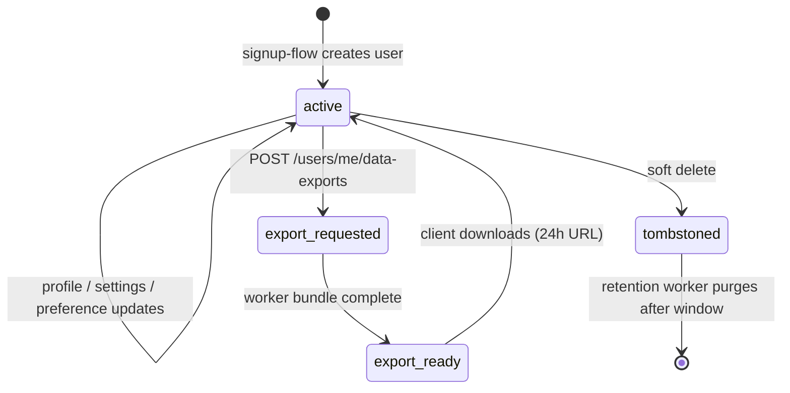

`src/domains/user/`

# User

## Purpose

User profile, settings, notification preferences, and GDPR data export. The domain owns the canonical `users` row (the platform's identity record) and three child resources for personalization and compliance. It is deliberately separate from [auth](src/domains/auth/) — auth proves a user's identity, user holds what we know about them.

What it owns:

- The `users` table (email, status, profile fields, `deleted_at` for soft-delete).
- The `user_settings`, `user_notification_preferences`, and `user_data_export` resource tables.
- The GDPR export pipeline that produces a downloadable bundle of every row this user owns across the platform.
- The `GET /api/v1/users/me` and the user profile / settings / preferences APIs.

What it does not own: credentials (lives in [auth](src/domains/auth/)), organization membership (lives in [tenancy](src/domains/tenancy/)), audit history (lives in [audit](src/domains/audit/)).

## Key invariants

- **One email = one user**: `users.email` is unique; case-insensitive lookups.
- **Soft delete preserves history**: setting `deleted_at` removes the user from API queries; foreign-key references in audit, billing, and tenancy remain intact for forensic value.
- **GDPR export caps**: `GDPR_EXPORT_MAX_ROWS_PER_TABLE = 1 000` per table per export. Exceeding the cap truncates with a metadata note rather than failing.
- **Cross-domain reads in `user-data-export` are documented exceptions**: the export pipeline reads schemas across domains directly (this is the only place the dependency rules permit it). See [CLAUDE.md "Dependency Rules"](CLAUDE.md).
- **Settings / preferences default-on**: a missing row implies the platform default (server returns the default in serialization), not "feature disabled".

## Sub-domains

| Sub-domain | Purpose |
| --- | --- |
| [user-settings](src/domains/user/sub-domains/user-settings/) | Per-user feature toggles and presentation preferences. |
| [user-notification-preferences](src/domains/user/sub-domains/user-notification-preferences/) | Per-user opt-in/opt-out for the notification + email channels. |
| [user-data-export](src/domains/user/sub-domains/user-data-export/) | GDPR export: bundle every row this user owns into an S3 object, presign a 24 h download URL, deliver via email. |

The root `user.service.ts` is also a public service (`UserService`) consumed by other domains for canonical user lookups (`findByEmail`, `findByPublicId`, `requireUserRecordByPublicId`).

## Patterns used

This domain implements the contracts documented in [src/PATTERNS.md](src/PATTERNS.md):

- `tenant-isolation` does **not** apply to the user record itself (users are global identities). It does apply when reading user-scoped data inside an organization context (handled by other domains).
- `rls-context` — `user-data-export` runs inside `withUserDatabaseContext` so RLS attributes the export to the right user.
- `soft-delete` — users tombstone with `deleted_at`; retention purges after the window.
- `audit-emission` — profile changes, settings changes, and export requests record audit rows.
- `transactional-outbox` — export-ready notifications flow through the mail outbox.

## Cross-domain flows

- `signup-flow` — magic-link verify creates the `users` row (via `UserService.findOrCreate`).
- `organization-invitation-flow` — accepting an invitation requires an existing user; if none, signup-flow runs first.
- `user-data-export` is itself a flow but is single-domain (runs end-to-end inside this domain plus mail + S3 infra).

## Lifecycle

## Events

- Emits: nothing today (export completion is signalled via direct mail enqueue inside the worker rather than an event).
- Consumes: nothing.

## External integrations

- **S3** — GDPR export bundles are written to S3; presigned download URL TTL = `USER_DATA_EXPORT_PRESIGNED_DOWNLOAD_EXPIRY_SECONDS = 86 400` (24 h, the legal cap).
- **Resend** (via mail outbox) — export-ready email.

## Failure modes

- **Export with > GDPR_EXPORT_MAX_ROWS_PER_TABLE rows in one table** → truncated with a metadata note in the bundle; logged at `info`.
- **S3 write failure during export** → BullMQ retries the worker job; final failure → DLQ.
- **User soft-delete while an export is in flight** → export still completes (the read path is `withUserDatabaseContext` on the user public id; soft-delete does not revoke history reads).
- **Settings row missing** → API returns the platform default; no error.

## Policy constants

See [src/POLICIES.md](src/POLICIES.md):

- `GDPR_EXPORT_MAX_ROWS_PER_TABLE = 1 000`
- `USER_DATA_EXPORT_PRESIGNED_DOWNLOAD_EXPIRY_SECONDS = 86 400`
