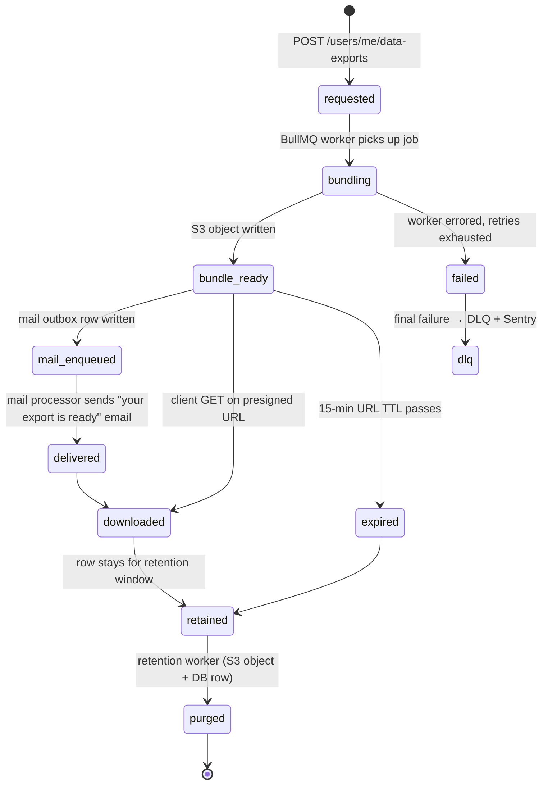

`src/domains/user/sub-domains/user-data-export/`

# User data export

Parent: [user](../../OVERVIEW.md)

## Purpose

GDPR data export pipeline. A user requests an export; a BullMQ worker bundles every row this user owns across the platform into a single S3 object, presigns a 15-minute download URL (sec-U6), and emails the link via the mail outbox. The bundle includes a `metadata.json` describing what was exported and what was truncated.

## Key invariants

- **Cross-domain reads via services only**: {@link UserDataExportService} calls `list*ForUserDataExport` on auth-session, membership, notification, and audit services (wired in `domain-containers.plugin.ts` / `worker-containers.ts`). It uses its own `UserDataExportRepository` for export job rows only.
- **Per-table row cap**: `GDPR_EXPORT_MAX_ROWS_PER_TABLE = 1 000`. Exceeding the cap truncates with a metadata note rather than failing the export.
- **15-minute download URL TTL** (`USER_DATA_EXPORT_PRESIGNED_DOWNLOAD_EXPIRY_SECONDS = 900`): shortened from 24 h to 15 min in sec-U6 to collapse the stolen-token replay window. Every mint is audited as `user.data_export.url_minted` so post-hoc forensics retain the trail even when the URL has expired. AWS SigV4 caps presigned URLs at 7 days; the prior 24 h ceiling reflected legacy posture and has been superseded.
- **One export per request**: the worker writes a single `user_data_export` row tracking job state; concurrent requests by the same user create a new row each time.
- **No retroactive deletion of completed exports**: a soft-deleted user can still hold a completed export bundle in S3 until retention purges it (forensic / regulatory value).

## Lifecycle

## External integrations

- **S3** — bundle written to a per-user prefix; presigned download URL issued.
- **Resend** (via mail outbox) — "your export is ready" email.

## Failure modes

- **S3 write failure** → BullMQ retries the worker job; final failure → DLQ + Sentry; user does not receive the email.
- **One table exceeds 1 000 rows** → bundle includes the first 1 000 rows + a metadata note; logged at info; user receives the export.
- **User soft-deleted while export is in flight** → export still completes (read path is `withUserDatabaseContext` on the user public id; soft-delete does not revoke history reads).
- **Mail enqueue failure** → does not fail the export; the bundle exists in S3 and the status route can re-mint a fresh 15-minute presigned URL on demand (every mint is audited), but the user won't receive the original email link.

## Policy constants

- `GDPR_EXPORT_MAX_ROWS_PER_TABLE = 1 000`
- `USER_DATA_EXPORT_PRESIGNED_DOWNLOAD_EXPIRY_SECONDS = 900` (15 minutes — sec-U6)
